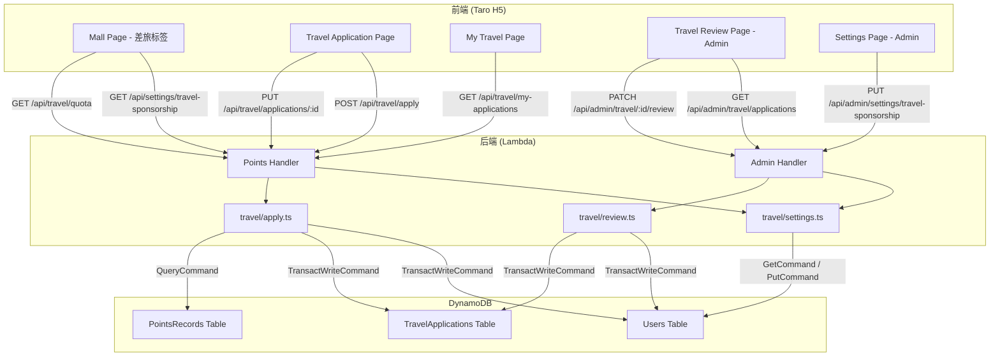

# 设计文档：Speaker 差旅赞助系统

## Overview

本功能为拥有 Speaker 角色的用户提供差旅赞助申请能力。Speaker 基于历史累计获得积分（earnTotal）申请国内或国际差旅赞助，不消耗积分余额。SuperAdmin 配置差旅门槛和功能开关，并审批差旅申请。

### 关键设计决策

1. **配额预扣机制**：申请提交时预扣 earn 配额（travelEarnUsed += threshold），驳回时归还。这避免了并发申请导致超额的问题，同时保证 pending 状态的申请也占用配额。
2. **Settings 复用 Users 表**：差旅赞助设置使用 Users 表的 `settingKey = "travel-sponsorship"` 记录，与现有 feature-toggles 模式一致（`userId = "feature-toggles"`），避免新建表。
3. **travelEarnUsed 存储在用户记录**：在 Users 表的用户记录中新增 `travelEarnUsed` 字段（Number，默认 0），利用 DynamoDB 原子更新保证并发安全。
4. **DynamoDB 事务保证原子性**：提交申请（创建记录 + 预扣配额）和驳回申请（更新状态 + 归还配额）均使用 TransactWriteCommand，确保操作的原子性。
5. **路由集成**：用户端差旅路由集成到 Points Lambda（已有 Users 表和 PointsRecords 表权限），管理端路由通过 Admin Lambda 的 `{proxy+}` 代理模式自动捕获。
6. **编辑重新提交**：被驳回的申请可编辑后重新提交，复用同一 applicationId，通过事务原子性地更新字段、重置状态为 pending、重新预扣配额。

## Architecture



### 请求流程

1. **查询差旅设置（公开）**：GET `/api/settings/travel-sponsorship` → Points Handler（无需认证）→ `getTravelSettings()` → 读取 Users 表 settingKey 记录 → 返回配置
2. **更新差旅设置**：PUT `/api/admin/settings/travel-sponsorship` → Admin Handler → 验证 SuperAdmin → `updateTravelSettings()` → 写入 Users 表 → 返回更新后设置
3. **查询差旅配额**：GET `/api/travel/quota` → Points Handler → 验证 Speaker → 查询 PointsRecords 求和 earnTotal → 读取用户 travelEarnUsed → 计算可用次数 → 返回配额信息
4. **提交差旅申请**：POST `/api/travel/apply` → Points Handler → 验证 Speaker + 功能开关 + 输入 + 配额 → TransactWrite（创建申请 + 预扣配额）→ 返回申请记录
5. **审批差旅申请**：PATCH `/api/admin/travel/{id}/review` → Admin Handler → 验证 SuperAdmin → approve: UpdateCommand / reject: TransactWrite（更新状态 + 归还配额）→ 返回更新后记录
6. **编辑重新提交**：PUT `/api/travel/applications/{id}` → Points Handler → 验证申请归属 + rejected 状态 + 输入 + 配额 → TransactWrite（更新申请 + 预扣配额）→ 返回更新后记录

## Components and Interfaces

### Backend Module: `packages/backend/src/travel/settings.ts`

```typescript
/** 差旅赞助设置 */
export interface TravelSponsorshipSettings {
  travelSponsorshipEnabled: boolean;
  domesticThreshold: number;
  internationalThreshold: number;
}

/** 完整设置记录（含元数据） */
export interface TravelSponsorshipSettingsRecord extends TravelSponsorshipSettings {
  settingKey: string;
  updatedAt: string;
  updatedBy: string;
}

/** 更新设置输入 */
export interface UpdateTravelSettingsInput {
  travelSponsorshipEnabled: boolean;
  domesticThreshold: number;
  internationalThreshold: number;
  updatedBy: string;
}

/** 更新设置结果 */
export interface UpdateTravelSettingsResult {
  success: boolean;
  settings?: TravelSponsorshipSettingsRecord;
  error?: { code: string; message: string };
}

/** 读取差旅赞助设置（公开，无需认证） */
export async function getTravelSettings(
  dynamoClient: DynamoDBDocumentClient,
  usersTable: string,
): Promise<TravelSponsorshipSettings>;

/** 验证并更新差旅赞助设置（仅 SuperAdmin） */
export async function updateTravelSettings(
  input: UpdateTravelSettingsInput,
  dynamoClient: DynamoDBDocumentClient,
  usersTable: string,
): Promise<UpdateTravelSettingsResult>;

/** 验证更新请求体 */
export function validateTravelSettingsInput(
  body: Record<string, unknown> | null,
): { valid: true } | { valid: false; error: { code: string; message: string } };
```

### Backend Module: `packages/backend/src/travel/apply.ts`

```typescript
/** 差旅类别 */
export type TravelCategory = 'domestic' | 'international';

/** 社区角色选项（表单信息，非系统角色） */
export type CommunityRole = 'Hero' | 'CommunityBuilder' | 'UGL';

/** 差旅申请状态 */
export type TravelApplicationStatus = 'pending' | 'approved' | 'rejected';

/** 差旅申请记录 */
export interface TravelApplication {
  applicationId: string;
  userId: string;
  applicantNickname: string;
  category: TravelCategory;
  communityRole: CommunityRole;
  eventLink: string;
  cfpScreenshotUrl: string;
  flightCost: number;
  hotelCost: number;
  totalCost: number;
  status: TravelApplicationStatus;
  earnDeducted: number;
  rejectReason?: string;
  reviewerId?: string;
  reviewerNickname?: string;
  reviewedAt?: string;
  createdAt: string;
  updatedAt: string;
}

/** 提交差旅申请输入 */
export interface SubmitTravelApplicationInput {
  userId: string;
  userNickname: string;
  category: TravelCategory;
  communityRole: CommunityRole;
  eventLink: string;
  cfpScreenshotUrl: string;
  flightCost: number;
  hotelCost: number;
}

/** 提交差旅申请结果 */
export interface SubmitTravelApplicationResult {
  success: boolean;
  application?: TravelApplication;
  error?: { code: string; message: string };
}

/** 差旅配额信息 */
export interface TravelQuota {
  earnTotal: number;
  travelEarnUsed: number;
  domesticAvailable: number;
  internationalAvailable: number;
  domesticThreshold: number;
  internationalThreshold: number;
}

/** 查询差旅配额 */
export async function getTravelQuota(
  userId: string,
  dynamoClient: DynamoDBDocumentClient,
  tables: { usersTable: string; pointsRecordsTable: string },
): Promise<TravelQuota>;

/** 提交差旅申请 */
export async function submitTravelApplication(
  input: SubmitTravelApplicationInput,
  dynamoClient: DynamoDBDocumentClient,
  tables: { usersTable: string; pointsRecordsTable: string; travelApplicationsTable: string },
): Promise<SubmitTravelApplicationResult>;

/** 验证差旅申请请求体 */
export function validateTravelApplicationInput(
  body: Record<string, unknown> | null,
): { valid: true; data: SubmitTravelApplicationInput } | { valid: false; error: { code: string; message: string } };

/** 查看我的差旅申请 */
export interface ListMyTravelApplicationsOptions {
  userId: string;
  status?: TravelApplicationStatus;
  pageSize?: number;
  lastKey?: string;
}

export interface ListMyTravelApplicationsResult {
  success: boolean;
  applications?: TravelApplication[];
  lastKey?: string;
  error?: { code: string; message: string };
}

export async function listMyTravelApplications(
  options: ListMyTravelApplicationsOptions,
  dynamoClient: DynamoDBDocumentClient,
  travelApplicationsTable: string,
): Promise<ListMyTravelApplicationsResult>;

/** 编辑重新提交差旅申请 */
export interface ResubmitTravelApplicationInput {
  applicationId: string;
  userId: string;
  userNickname: string;
  category: TravelCategory;
  communityRole: CommunityRole;
  eventLink: string;
  cfpScreenshotUrl: string;
  flightCost: number;
  hotelCost: number;
}

export interface ResubmitTravelApplicationResult {
  success: boolean;
  application?: TravelApplication;
  error?: { code: string; message: string };
}

export async function resubmitTravelApplication(
  input: ResubmitTravelApplicationInput,
  dynamoClient: DynamoDBDocumentClient,
  tables: { usersTable: string; pointsRecordsTable: string; travelApplicationsTable: string },
): Promise<ResubmitTravelApplicationResult>;

/** 计算可用差旅次数 */
export function calculateAvailableCount(
  earnTotal: number,
  travelEarnUsed: number,
  threshold: number,
): number;
```

### Backend Module: `packages/backend/src/travel/review.ts`

```typescript
/** 审批差旅申请输入 */
export interface ReviewTravelApplicationInput {
  applicationId: string;
  reviewerId: string;
  reviewerNickname: string;
  action: 'approve' | 'reject';
  rejectReason?: string;
}

/** 审批差旅申请结果 */
export interface ReviewTravelApplicationResult {
  success: boolean;
  application?: TravelApplication;
  error?: { code: string; message: string };
}

/** 审批差旅申请 */
export async function reviewTravelApplication(
  input: ReviewTravelApplicationInput,
  dynamoClient: DynamoDBDocumentClient,
  tables: { usersTable: string; travelApplicationsTable: string },
): Promise<ReviewTravelApplicationResult>;

/** 查看所有差旅申请（管理端） */
export interface ListAllTravelApplicationsOptions {
  status?: TravelApplicationStatus;
  pageSize?: number;
  lastKey?: string;
}

export interface ListAllTravelApplicationsResult {
  success: boolean;
  applications?: TravelApplication[];
  lastKey?: string;
  error?: { code: string; message: string };
}

export async function listAllTravelApplications(
  options: ListAllTravelApplicationsOptions,
  dynamoClient: DynamoDBDocumentClient,
  travelApplicationsTable: string,
): Promise<ListAllTravelApplicationsResult>;
```

### Points Handler Routes (additions to `packages/backend/src/points/handler.ts`)

| Method | Path | Handler | Permission |
|--------|------|---------|------------|
| GET | `/api/settings/travel-sponsorship` | `handleGetTravelSettings` | 公开（无需认证） |
| GET | `/api/travel/quota` | `handleGetTravelQuota` | Speaker |
| POST | `/api/travel/apply` | `handleSubmitTravelApplication` | Speaker |
| GET | `/api/travel/my-applications` | `handleListMyTravelApplications` | Speaker |
| PUT | `/api/travel/applications/{id}` | `handleResubmitTravelApplication` | Speaker（仅自己的 rejected 申请） |

### Admin Handler Routes (additions to `packages/backend/src/admin/handler.ts`)

| Method | Path | Handler | Permission |
|--------|------|---------|------------|
| PUT | `/api/admin/settings/travel-sponsorship` | `handleUpdateTravelSettings` | SuperAdmin |
| GET | `/api/admin/travel/applications` | `handleListAllTravelApplications` | SuperAdmin |
| PATCH | `/api/admin/travel/{id}/review` | `handleReviewTravelApplication` | SuperAdmin |

### Frontend Pages

| Page | Path | Description |
|------|------|-------------|
| Mall Page (修改) | `/pages/index/index` | 新增"差旅"筛选标签和差旅卡片视图 |
| TravelApplyPage | `/pages/travel-apply/index` | 差旅申请表单（新建 + 编辑重新提交） |
| MyTravelPage | `/pages/my-travel/index` | 我的差旅申请列表和详情 |
| AdminTravelPage | `/pages/admin/travel` | 差旅审批管理页面（SuperAdmin） |
| Settings Page (修改) | `/pages/admin/settings` | 新增差旅赞助配置区域 |
| Admin Dashboard (修改) | `/pages/admin/index` | 新增"差旅审批"导航卡片 |

### Shared Types (additions to `packages/shared/src/types.ts`)

```typescript
/** 差旅类别 */
export type TravelCategory = 'domestic' | 'international';

/** 社区角色选项 */
export type CommunityRole = 'Hero' | 'CommunityBuilder' | 'UGL';

/** 差旅申请状态 */
export type TravelApplicationStatus = 'pending' | 'approved' | 'rejected';

/** 差旅申请记录 */
export interface TravelApplication {
  applicationId: string;
  userId: string;
  applicantNickname: string;
  category: TravelCategory;
  communityRole: CommunityRole;
  eventLink: string;
  cfpScreenshotUrl: string;
  flightCost: number;
  hotelCost: number;
  totalCost: number;
  status: TravelApplicationStatus;
  earnDeducted: number;
  rejectReason?: string;
  reviewerId?: string;
  reviewerNickname?: string;
  reviewedAt?: string;
  createdAt: string;
  updatedAt: string;
}

/** 差旅赞助设置 */
export interface TravelSponsorshipSettings {
  travelSponsorshipEnabled: boolean;
  domesticThreshold: number;
  internationalThreshold: number;
}

/** 差旅配额信息 */
export interface TravelQuota {
  earnTotal: number;
  travelEarnUsed: number;
  domesticAvailable: number;
  internationalAvailable: number;
  domesticThreshold: number;
  internationalThreshold: number;
}
```

### Shared Error Codes (additions to `packages/shared/src/errors.ts`)

```typescript
// 新增错误码
INSUFFICIENT_EARN_QUOTA: 'INSUFFICIENT_EARN_QUOTA',       // 400 - 累计获得积分不足
APPLICATION_NOT_FOUND: 'APPLICATION_NOT_FOUND',             // 404 - 差旅申请不存在
APPLICATION_ALREADY_REVIEWED: 'APPLICATION_ALREADY_REVIEWED', // 400 - 该申请已被审批
INVALID_APPLICATION_STATUS: 'INVALID_APPLICATION_STATUS',   // 400 - 仅被驳回的申请可编辑
TRAVEL_SPEAKER_ONLY: 'TRAVEL_SPEAKER_ONLY',                 // 403 - 仅 Speaker 可访问
```

## Data Models

### TravelApplications Table (新建)

| Attribute | Type | Description |
|-----------|------|-------------|
| applicationId (PK) | String | ULID，唯一标识一条差旅申请 |
| userId | String | 申请人 userId |
| applicantNickname | String | 申请人昵称 |
| category | String | 差旅类别：`domestic` / `international` |
| communityRole | String | 社区角色选项：`Hero` / `CommunityBuilder` / `UGL` |
| eventLink | String | 活动链接 URL |
| cfpScreenshotUrl | String | CFP 接受截图 URL |
| flightCost | Number | 机票费用（非负数） |
| hotelCost | Number | 酒店费用（非负数） |
| totalCost | Number | 总费用（flightCost + hotelCost） |
| status | String | 申请状态：`pending` / `approved` / `rejected` |
| earnDeducted | Number | 本次预扣的 earn 配额值 |
| rejectReason | String | 驳回原因（可选，1~500 字符） |
| reviewerId | String | 审批人 userId（可选） |
| reviewerNickname | String | 审批人昵称（可选） |
| reviewedAt | String | 审批时间 ISO 8601（可选） |
| createdAt | String | 创建时间 ISO 8601 |
| updatedAt | String | 更新时间 ISO 8601 |

**GSI 1**: `userId-createdAt-index` (PK: `userId`, SK: `createdAt`) — 用于查询用户自己的申请列表，按时间倒序。

**GSI 2**: `status-createdAt-index` (PK: `status`, SK: `createdAt`) — 用于管理端按状态筛选申请列表，按时间倒序。

**表配置**: PAY_PER_REQUEST 计费模式，与现有表一致。

### Users Table (现有，新增字段)

| Attribute | Type | Description |
|-----------|------|-------------|
| travelEarnUsed | Number | 差旅已用 earn 配额，默认 0。记录用户已用于差旅申请（pending + approved）的累计 earn 配额 |

### Users Table - Settings Record (现有表，新增记录)

使用 `settingKey = "travel-sponsorship"` 作为分区键（与 feature-toggles 使用 `userId = "feature-toggles"` 的模式类似，但差旅设置使用 `settingKey` 字段名以区分）。

**注意**：由于 Users 表的分区键是 `userId`，差旅设置记录实际使用 `userId = "travel-sponsorship"` 存储，与 feature-toggles 使用 `userId = "feature-toggles"` 的模式完全一致。

| Attribute | Type | Description |
|-----------|------|-------------|
| userId (PK) | String | 固定值 `"travel-sponsorship"` |
| travelSponsorshipEnabled | Boolean | 功能总开关 |
| domesticThreshold | Number | 国内差旅积分门槛（正整数） |
| internationalThreshold | Number | 国际差旅积分门槛（正整数） |
| updatedAt | String | 最后更新时间 ISO 8601 |
| updatedBy | String | 最后更新人 userId |

### PointsRecords Table (现有，查询使用)

查询用户所有 `type = "earn"` 的记录并求和 `amount`，得到 `earnTotal`。使用 `userId-createdAt-index` GSI 按 userId 查询。

### CDK 配置变更

```typescript
// database-stack.ts - 新增 TravelApplications 表
this.travelApplicationsTable = new dynamodb.Table(this, 'TravelApplicationsTable', {
  tableName: 'PointsMall-TravelApplications',
  partitionKey: { name: 'applicationId', type: dynamodb.AttributeType.STRING },
  billingMode: dynamodb.BillingMode.PAY_PER_REQUEST,
  removalPolicy: cdk.RemovalPolicy.DESTROY,
});

this.travelApplicationsTable.addGlobalSecondaryIndex({
  indexName: 'userId-createdAt-index',
  partitionKey: { name: 'userId', type: dynamodb.AttributeType.STRING },
  sortKey: { name: 'createdAt', type: dynamodb.AttributeType.STRING },
});

this.travelApplicationsTable.addGlobalSecondaryIndex({
  indexName: 'status-createdAt-index',
  partitionKey: { name: 'status', type: dynamodb.AttributeType.STRING },
  sortKey: { name: 'createdAt', type: dynamodb.AttributeType.STRING },
});

// api-stack.ts - 新增环境变量和权限
// Points Lambda: 新增 TRAVEL_APPLICATIONS_TABLE 环境变量 + 读写权限
// Admin Lambda: 已有 PointsMall-* 通配符权限，自动覆盖新表
//               新增 TRAVEL_APPLICATIONS_TABLE 环境变量

// api-stack.ts - 新增路由
// 用户端路由（集成到 Points Lambda）:
//   GET  /api/travel/quota
//   POST /api/travel/apply
//   GET  /api/travel/my-applications
//   PUT  /api/travel/applications/{id}
//   GET  /api/settings/travel-sponsorship（公开，无需认证）
//
// 管理端路由（通过 Admin Lambda {proxy+} 自动捕获）:
//   GET   /api/admin/travel/applications
//   PATCH /api/admin/travel/{id}/review
//   PUT   /api/admin/settings/travel-sponsorship
```

## Correctness Properties

*A property is a characteristic or behavior that should hold true across all valid executions of a system — essentially, a formal statement about what the system should do. Properties serve as the bridge between human-readable specifications and machine-verifiable correctness guarantees.*

### Property 1: Travel settings validation accepts valid inputs and rejects invalid inputs

*For any* request body object, the `validateTravelSettingsInput` function should accept it if and only if: `travelSponsorshipEnabled` is a boolean, `domesticThreshold` is a positive integer ≥ 1, and `internationalThreshold` is a positive integer ≥ 1. All other inputs should be rejected with error code `INVALID_REQUEST`.

**Validates: Requirements 1.6, 1.7**

### Property 2: Travel settings round-trip preserves data

*For any* valid travel settings input (travelSponsorshipEnabled as boolean, domesticThreshold and internationalThreshold as positive integers), writing the settings via `updateTravelSettings` and then reading them via `getTravelSettings` should return the same `travelSponsorshipEnabled`, `domesticThreshold`, and `internationalThreshold` values.

**Validates: Requirements 1.2, 1.8, 2.1**

### Property 3: Quota calculation correctness

*For any* non-negative integers `earnTotal`, `travelEarnUsed`, and non-negative integer `threshold`, the function `calculateAvailableCount(earnTotal, travelEarnUsed, threshold)` should return `floor((earnTotal - travelEarnUsed) / threshold)` when `threshold > 0` and `earnTotal >= travelEarnUsed`, return `0` when `threshold === 0`, and return `0` when `travelEarnUsed > earnTotal`.

**Validates: Requirements 3.1, 3.3, 3.4**

### Property 4: Travel application validation accepts valid inputs and rejects invalid inputs

*For any* request body object, the `validateTravelApplicationInput` function should accept it if and only if: `category` is `"domestic"` or `"international"`, `communityRole` is `"Hero"`, `"CommunityBuilder"`, or `"UGL"`, `eventLink` is a valid URL, `cfpScreenshotUrl` is a non-empty string, `flightCost` is a non-negative number, and `hotelCost` is a non-negative number. All other inputs should be rejected with error code `INVALID_REQUEST`.

**Validates: Requirements 4.4, 4.5, 7.4**

### Property 5: Submission creates application record and deducts quota atomically

*For any* valid travel application submission where the user has sufficient quota, after `submitTravelApplication` succeeds: (a) a TravelApplication record exists with status `"pending"` and `earnDeducted` equal to the corresponding category's threshold, (b) the user's `travelEarnUsed` has increased by exactly the threshold value, and (c) `totalCost` equals `flightCost + hotelCost`.

**Validates: Requirements 4.8, 4.9, 15.2**

### Property 6: Approval preserves quota

*For any* pending travel application, after `reviewTravelApplication` with action `"approve"` succeeds, the application status should be `"approved"`, the `reviewerId` and `reviewedAt` fields should be set, and the user's `travelEarnUsed` should remain unchanged (the pre-deducted quota stays consumed).

**Validates: Requirements 5.6**

### Property 7: Rejection returns quota

*For any* pending travel application with `earnDeducted = D`, after `reviewTravelApplication` with action `"reject"` succeeds, the application status should be `"rejected"`, and the user's `travelEarnUsed` should have decreased by exactly `D`.

**Validates: Requirements 5.7, 15.3**

### Property 8: User isolation in list queries

*For any* set of travel applications belonging to multiple users, when user A calls `listMyTravelApplications`, the result should contain only applications where `userId === A`. No application belonging to a different user should appear in the result.

**Validates: Requirements 6.1**

### Property 9: Status filter returns only matching records in descending time order

*For any* set of travel applications with mixed statuses, when querying with a specific status filter, all returned applications should have that status. Additionally, the returned applications should be sorted by `createdAt` in descending order (most recent first).

**Validates: Requirements 6.2, 6.3, 8.4, 8.5**

### Property 10: Pagination pageSize is clamped to valid range

*For any* requested pageSize value, the effective pageSize used in the query should be clamped to the range [1, 100], defaulting to 20 when not specified. Specifically: if pageSize is undefined, use 20; if pageSize < 1, use 1; if pageSize > 100, use 100; otherwise use the requested value.

**Validates: Requirements 6.4, 8.6**

### Property 11: Resubmission correctly recalculates quota

*For any* rejected travel application with original `earnDeducted = D_old` and original category `C_old`, when resubmitted with new category `C_new` (where `C_new` may equal `C_old`): (a) if `C_new !== C_old`, the user's `travelEarnUsed` should change by `(threshold[C_new] - D_old)` relative to before the resubmission (note: D_old was already returned on rejection, so the net effect is `+threshold[C_new]`), (b) if `C_new === C_old`, the user's `travelEarnUsed` should increase by `threshold[C_new]` (since D_old was returned on rejection), (c) the application status should be `"pending"` with updated `earnDeducted = threshold[C_new]`.

**Validates: Requirements 7.5, 7.6, 7.8**

### Property 12: travelEarnUsed non-negative invariant

*For any* sequence of travel application submissions, approvals, and rejections, the user's `travelEarnUsed` should never become negative. Specifically, a rejection that would cause `travelEarnUsed` to go below 0 should be prevented by a DynamoDB ConditionExpression.

**Validates: Requirements 15.4**

## Error Handling

### 新增错误码

| Error Code | HTTP Status | Message | Trigger |
|------------|-------------|---------|---------|
| `INSUFFICIENT_EARN_QUOTA` | 400 | 累计获得积分不足，无法申请差旅赞助 | 提交/重新提交时可用差旅次数 < 1 |
| `APPLICATION_NOT_FOUND` | 404 | 差旅申请不存在 | 审批或编辑不存在的 applicationId |
| `APPLICATION_ALREADY_REVIEWED` | 400 | 该申请已被审批 | 审批非 pending 状态的申请 |
| `INVALID_APPLICATION_STATUS` | 400 | 仅被驳回的申请可以编辑重新提交 | 编辑非 rejected 状态的申请 |
| `TRAVEL_SPEAKER_ONLY` | 403 | 仅 Speaker 角色可访问差旅赞助 | 非 Speaker 访问差旅配额/申请接口 |

### 复用现有错误码

| Error Code | HTTP Status | Trigger |
|------------|-------------|---------|
| `FORBIDDEN` | 403 | 非 SuperAdmin 访问管理端接口 |
| `FEATURE_DISABLED` | 403 | travelSponsorshipEnabled 为 false 时提交申请 |
| `INVALID_REQUEST` | 400 | 请求体缺少必填字段或格式无效 |

### 事务失败处理

- **提交申请事务失败**：TransactWriteCommand 失败时，DynamoDB 自动回滚所有操作（申请记录不会创建，travelEarnUsed 不会增加）。返回 500 错误。
- **驳回申请事务失败**：同上，申请状态不会更新，travelEarnUsed 不会减少。返回 500 错误。
- **重新提交事务失败**：同上，申请记录不会更新，travelEarnUsed 不会变化。返回 500 错误。
- **并发冲突**：使用 ConditionExpression 检测并发修改。如果条件检查失败（如申请已被其他管理员审批），返回对应的业务错误码。

### 前端错误处理

- **API 请求失败**：显示 Toast 提示具体错误消息（从 response body 中提取）
- **网络错误**：显示通用错误提示"操作失败，请稍后重试"
- **权限不足（403）**：显示对应的权限提示信息
- **功能未开放（FEATURE_DISABLED）**：显示功能未开放提示，隐藏申请入口
- **配额不足（INSUFFICIENT_EARN_QUOTA）**：显示积分不足提示，引导用户查看配额详情
- **乐观更新回滚**：设置页面的开关控件在 API 失败时恢复到更新前的状态

## Testing Strategy

### 单元测试

使用 Vitest 进行单元测试，覆盖以下场景：

**travel/settings.ts**:
1. `getTravelSettings` — 记录存在时返回正确值，记录不存在时返回默认值
2. `updateTravelSettings` — 有效输入写入成功，无效输入返回错误
3. `validateTravelSettingsInput` — 各种有效/无效输入的边界测试

**travel/apply.ts**:
1. `calculateAvailableCount` — 各种 earnTotal/travelEarnUsed/threshold 组合
2. `getTravelQuota` — 正确计算 earnTotal 和可用次数
3. `submitTravelApplication` — 成功提交、配额不足、功能关闭等场景
4. `validateTravelApplicationInput` — 各种有效/无效输入
5. `listMyTravelApplications` — 分页、状态筛选、排序
6. `resubmitTravelApplication` — 成功重新提交、状态校验、配额重算

**travel/review.ts**:
1. `reviewTravelApplication` — 批准（travelEarnUsed 不变）、驳回（travelEarnUsed 减少）、重复审批
2. `listAllTravelApplications` — 分页、状态筛选、排序

**Handler 路由测试**:
1. Points Handler — 新增路由的请求转发和响应格式
2. Admin Handler — 新增路由的权限校验和请求转发

### 属性测试（Property-Based Testing）

使用 **fast-check** 库进行属性测试，每个属性测试运行最少 100 次迭代。

每个属性测试必须以注释标注对应的设计文档属性：
- 标签格式：`Feature: speaker-travel-sponsorship, Property {number}: {property_text}`

属性测试覆盖 12 个核心属性：
1. 差旅设置验证的完备性（接受有效输入，拒绝无效输入）
2. 差旅设置读写往返一致性
3. 配额计算公式正确性
4. 差旅申请验证的完备性
5. 提交申请后记录创建和配额预扣的正确性
6. 批准申请后配额保持不变
7. 驳回申请后配额归还的正确性
8. 用户隔离（仅返回自己的申请）
9. 状态筛选和时间排序的正确性
10. 分页 pageSize 范围钳制
11. 重新提交时配额重算的正确性
12. travelEarnUsed 非负不变量

### 集成测试

- CDK 合成测试：验证 TravelApplications 表定义、GSI 配置、IAM 权限、环境变量
- Admin Handler 路由测试：验证新增管理端路由通过 `{proxy+}` 正确路由
- Points Handler 路由测试：验证新增用户端路由的请求转发

### i18n 测试

- 验证所有 5 种语言文件（zh、en、ja、ko、zh-TW）包含差旅赞助相关的翻译键
- 翻译键类别：差旅标签页、差旅卡片、申请表单、状态标签、审批页面、设置页面、成功/错误提示、我的差旅页面
