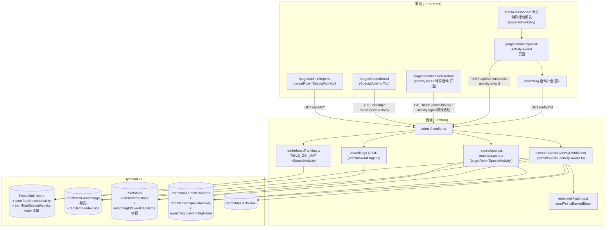
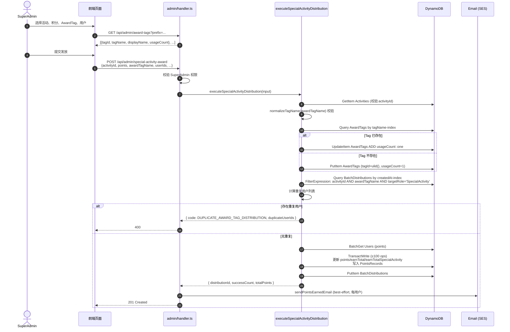

# 设计文档：特殊活动积分颁发

## Overview

本设计为 SuperAdmin 提供一个独立的"特殊活动积分颁发"页面，并在数据层引入一种新的积分类型 `特殊活动积分`，与现有的 `Speaker / UserGroupLeader / Volunteer` 三类身份分严格隔离。设计遵循以下核心原则：

1. **独立发放路径**：新增独立函数 `executeSpecialActivityDistribution`，**不复用** `executeBatchDistribution`，从源头确保特殊活动积分不会污染身份分累计字段（`earnTotalSpeaker / earnTotalLeader / earnTotalVolunteer`）。
2. **新积分类型字段**：在 Users 表新增 `earnTotalSpecialActivity` 字段并配套 GSI `earnTotalSpecialActivity-index`，用于排行榜与报表的独立维度统计。
3. **AwardTag 元数据系统**：新增独立表 `PointsMall-AwardTags`（结构与 `PointsMall-ContentTags` 同构但完全隔离），用于支撑奖项标签的自动补全、热门标签、显式创建与受限删除；DistributionRecord 与 PointsRecord 同时持久化 `awardTagId / awardTagName`，作为后续报表按 Tag 维度聚合的索引键。
4. **去重粒度细化**：将原有 `(activityId, targetRole)` 去重键扩展为 `(activityId, awardTagName)`，允许同一活动按不同奖项 Tag 多次发放，但同 Tag 下同一用户只能获得一次。
5. **复用现有基础设施**：发放历史复用 `GET /api/admin/batch-points/history`（按 `targetRole=SpecialActivity` 过滤），邮件复用 `sendPointsEarnedEmail`，前端页面布局复用 `quarterly-award` 模式。
6. **CDK 部署节奏**：遵守"DynamoDB 单次部署只能在同一张表上新增一个 GSI"的硬约束，分批次部署 GSI。

### 设计权衡与依据

| 决策 | 备选方案 | 选择理由 |
| --- | --- | --- |
| 独立 `executeSpecialActivityDistribution` | 在 `executeBatchDistribution` 中加 `targetRole === 'SpecialActivity'` 分支 | 现有函数已涵盖 speakerType / skillClaims / volunteerLimit / pointsValidation 等大量身份分专用分支，复用反而增加耦合并扩大回归面；独立函数仅写 3 个字段，逻辑路径清晰可证。 |
| 独立 `PointsMall-AwardTags` 表 | 与 `ContentTags` 共表（用 `tagType` 区分） | 需求第 14 条明确要求隔离；共表会让 ContentTags 的合并/删除/列出 API 必须新增过滤条件，回归面更大；隔离表换来零耦合。 |
| `(activityId, awardTagName)` 去重 | `(activityId, awardTagId)` 去重 | tagId 是 ULID，归一化前后可能映射到同一逻辑标签；以归一化 `awardTagName` 作键与"创建/查询/删除"使用的归一化键保持一致。 |
| 复用 `BatchDistributions / PointsRecords` 表 | 新增 `SpecialActivityAwards` 表 | 历史接口、报表导出、积分明细均已基于这两张表运转；复用即可零改造接入；新增字段 `targetRole='SpecialActivity'` 不影响现有筛选。 |

## Architecture

### 系统组件图



### 发放流程时序图



### 关键设计点

- **事务粒度**：与 `executeBatchDistribution` 保持一致，每次发放使用单个 `TransactWriteCommand`（≤100 个操作），保证 Users 增量与 PointsRecords 写入的原子性。当 `userIds.length * 2 > 100` 时返回 `BATCH_TOO_LARGE`（同现有约束）。
- **AwardTag 计数原子性**：发放主事务**不**包含 AwardTag 的 usageCount 更新（避免跨表条件检查带来事务复杂度），而是在主事务前用独立的 `UpdateCommand ADD usageCount :one` / `PutCommand`（ConditionExpression `attribute_not_exists(tagId)`）完成。理由：tag 计数是统计指标，最终一致即可；若主事务失败（罕见），usageCount 仅多算一次（不影响功能正确性，可被后台校对脚本修复）。
- **去重查询**：复用 `getAwardedUserIds` 的查询模式（`createdAt-index` GSI + FilterExpression），但过滤条件改为 `activityId = :aid AND awardTagName = :tag AND targetRole = 'SpecialActivity'`。
- **邮件通知**：在 handler 层而非 `executeSpecialActivityDistribution` 内部调用 `sendPointsEarnedEmail`，保持核心函数纯净（与 `handleQuarterlyAward` 的现有模式一致），单用户邮件失败不阻塞流程。

## Components and Interfaces

### 后端模块

| 模块文件 | 职责 |
| --- | --- |
| `packages/backend/src/admin/special-activity-award.ts`（新建） | 导出 `executeSpecialActivityDistribution`、`validateSpecialActivityInput`、`getAwardedUserIdsByTag` 等纯函数 |
| `packages/backend/src/admin/award-tags.ts`（新建） | 导出 `searchAwardTags`、`getHotAwardTags`、`createAwardTag`、`deleteAwardTag`、`upsertAwardTagUsage` |
| `packages/backend/src/admin/handler.ts`（修改） | 增加 `POST /api/admin/special-activity-award`、`GET/POST /api/admin/award-tags`、`GET /api/admin/award-tags/hot`、`DELETE /api/admin/award-tags/{tagId}` 路由分支 |
| `packages/backend/src/leaderboard/ranking.ts`（修改） | `VALID_ROLES`、`ROLE_GSI_MAP` 增加 `SpecialActivity` 条目 |
| `packages/backend/src/reports/query.ts` 与 `export.ts`（修改） | `targetRole` 校验增加 `'SpecialActivity'`；`UserRankingRecord` 增加可选字段 `earnTotalSpecialActivity`；导出列增加"特殊活动积分" |

### 前端模块

| 模块文件 | 职责 |
| --- | --- |
| `packages/frontend/src/pages/admin/special-activity-award.tsx`（新建） | 颁发主页面；模仿 `quarterly-award.tsx` 布局 |
| `packages/frontend/src/pages/admin/special-activity-award.scss`（新建） | 样式（仅使用 `--space-*` / `--radius-*` / `--text-*` 等 CSS 变量） |
| `packages/frontend/src/components/AwardTagPicker/`（新建） | 通用 AwardTag 自动补全 + 新建组件，支持 onChange 回调 |
| `packages/frontend/src/pages/admin/index.tsx`（修改） | 在 `ADMIN_LINKS` 中追加 `special-activity-award` 卡片（category=`operations`、`superAdminOnly: true`） |
| `packages/frontend/src/app.config.ts`（修改） | `pages` 数组追加 `'pages/admin/special-activity-award'` |
| `packages/frontend/src/pages/leaderboard/index.tsx`（修改） | `RoleFilter` 与 `ROLE_TABS` 增加 `SpecialActivity` |
| `packages/frontend/src/pages/admin/batch-history.tsx`（修改） | `activityType` 筛选增加"特殊活动" |
| `packages/frontend/src/pages/admin/reports.tsx`（修改） | `targetRole` 筛选增加"特殊活动" |
| `packages/shared/src/types.ts`（修改） | `DistributionRecord` 与 `PointsRecord` 扩展可选字段 `awardTagId / awardTagName`；`DistributionRecord.targetRole` 类型增加 `'SpecialActivity'` |

### Backend API Contract

#### 1. `POST /api/admin/special-activity-award`（SuperAdmin only）

**Request Body**:
```json
{
  "activityId": "01HXXX...",
  "points": 50,
  "awardTagName": "主讲奖",
  "userIds": ["u1", "u2", "..."],
  "awardDate": "2025-03-15"
}
```

| 字段 | 类型 | 必填 | 说明 |
| --- | --- | --- | --- |
| `activityId` | string | 是 | 必须存在于 Activities 表 |
| `points` | integer ≥ 1 | 是 | 每人积分数 |
| `awardTagName` | string | 是 | 用户原文（后端归一化），1~30 字符 |
| `userIds` | string[] | 是 | 非空数组，每元素为非空字符串 |
| `awardDate` | string `YYYY-MM-DD` | 是 | 发放日期 |

**Success Response (201)**:
```json
{
  "distributionId": "01HXXX...",
  "successCount": 12,
  "totalPoints": 600,
  "awardTagId": "01HYYY...",
  "awardTagName": "主讲奖"
}
```

**Error Responses**:
| HTTP | code | message |
| --- | --- | --- |
| 400 | `INVALID_REQUEST` | 字段缺失/类型错误对应消息 |
| 400 | `INVALID_REQUEST` | `awardTagName 必填` |
| 400 | `INVALID_REQUEST` | `奖项标签长度必须为 1~30 个字符` |
| 400 | `INVALID_REQUEST` | `奖项标签包含非法字符` |
| 400 | `ACTIVITY_NOT_FOUND` | `关联活动不存在` |
| 400 | `DUPLICATE_AWARD_TAG_DISTRIBUTION` | `以下用户已在此活动的该奖项标签下获得过特殊活动积分`，附 `duplicateUserIds: string[]` |
| 400 | `BATCH_TOO_LARGE` | `事务操作数超过 DynamoDB 上限 100` |
| 403 | `FORBIDDEN` | `需要超级管理员权限` |
| 500 | `INTERNAL_ERROR` | 通用错误 |

#### 2. `GET /api/admin/award-tags?prefix=...&limit=10`（SuperAdmin only）

按归一化 prefix 在 `tagName-index` GSI 上 `begins_with` 模糊匹配，按 `usageCount` 降序返回前 N（默认 10、上限 50）条。

**Response**:
```json
{ "tags": [{ "tagId": "...", "tagName": "主讲奖", "displayName": "主讲奖", "usageCount": 8, "createdAt": "...", "updatedAt": "..." }] }
```

`prefix` 长度归一化后 < 1 时返回空数组。

#### 3. `GET /api/admin/award-tags/hot`（SuperAdmin only）

按 `usageCount` 降序返回前 10 条（用于初次打开时的下拉默认建议）。

#### 4. `POST /api/admin/award-tags`（SuperAdmin only，显式创建）

**Request Body**:
```json
{ "displayName": "主讲奖" }
```

后端归一化为 `tagName`，写入 `PointsMall-AwardTags`，`createdBy = event.user.userId`。

**Errors**:
- 400 `INVALID_REQUEST` 校验失败
- 409 `TAG_ALREADY_EXISTS` 归一化后 tagName 已存在

#### 5. `DELETE /api/admin/award-tags/{tagId}`（SuperAdmin only）

仅当 `usageCount === 0` 时允许删除。使用 `ConditionExpression: usageCount = :zero` 保证原子性。

**Errors**:
- 400 `TAG_IN_USE` `该奖项 Tag 已被使用，无法删除`
- 404 `TAG_NOT_FOUND`

#### 6. 复用接口
- `GET /api/admin/batch-points/history?activityType=特殊活动` —— 现有接口，需要在前端拼接查询参数；后端已支持 `FilterExpression` 透传 activityType（如未支持则在 `listDistributionHistory` 增加 activityType 可选过滤）。
- `GET /api/admin/batch-points/history/{distributionId}` —— 现有接口，无需改动。
- `GET /api/leaderboard/ranking?role=SpecialActivity` —— 仅需在 `ROLE_GSI_MAP` 中追加映射。
- `GET /api/admin/users?pageSize=50&lastKey=...` —— 现有接口，前端按 `status==='active'` 过滤展示。

## Data Models

### Users 表（修改）

| 字段 | 类型 | 说明 |
| --- | --- | --- |
| `earnTotalSpecialActivity` | Number | **新增**。累计获得特殊活动积分。`if_not_exists` 初值 0。 |

**新增 GSI** `earnTotalSpecialActivity-index`：
- Partition Key: `pk` (String，固定值 `'ALL'`，与现有身份分 GSI 共用同一 partition pattern)
- Sort Key: `earnTotalSpecialActivity` (Number)
- Projection: KEYS_ONLY 不够（前端需要 nickname/roles），与现有 `earnTotalSpeaker-index` 等保持一致使用 ALL（默认）

> **注意**：用户在没有 `pk` 字段时（例如 SuperAdmin / OrderAdmin 等管理员账号）不会出现在该 GSI 中，与现有身份分 GSI 行为一致。新发放写入时通过 `if_not_exists(earnTotalSpecialActivity, :zero) + :pv` 保证字段存在；用户首次接收特殊活动积分时若没有 `pk` 字段，需要在 SET 表达式中同时 `if_not_exists(pk, :ALL)`，参考 `register.ts` 的初始化模式。

### AwardTags 表（新建）

**表名**：`PointsMall-AwardTags`
**主键**：`tagId` (String, ULID)

| 字段 | 类型 | 说明 |
| --- | --- | --- |
| `tagId` | String (ULID) | 主键 |
| `tagName` | String | 归一化名（trim + 折叠空白 + 小写） |
| `displayName` | String | 用户原文（保留原始大小写与空白形态以便展示） |
| `usageCount` | Number | 累计被发放使用次数 |
| `createdAt` | String (ISO 8601) | 创建时间 |
| `updatedAt` | String (ISO 8601) | 最近更新时间（每次 usageCount 变化时同步） |
| `createdBy` | String | 创建者 userId |

**GSI** `tagName-index`：
- Partition Key: `tagName` (String)
- Projection: ALL

### BatchDistributions 表（扩展）

在现有 `DistributionRecord` 上新增可选字段（向后兼容）：

| 字段 | 类型 | 说明 |
| --- | --- | --- |
| `targetRole` | 类型扩展 | 现有 union 增加字面量 `'SpecialActivity'` |
| `activityType` | string | 字符串值新增 `'特殊活动'`（既有字段，类型不变） |
| `awardTagId` | string? | 仅 `targetRole === 'SpecialActivity'` 时存在 |
| `awardTagName` | string? | 仅 `targetRole === 'SpecialActivity'` 时存在（归一化） |
| `awardTagDisplayName` | string? | 历史展示用，存归一化前的原文 |

```typescript
// packages/shared/src/types.ts (修改)
export interface DistributionRecord {
  distributionId: string;
  distributorId: string;
  distributorNickname: string;
  targetRole: 'UserGroupLeader' | 'Speaker' | 'Volunteer' | 'SpecialActivity';
  // ... 既有字段保持不变
  awardTagId?: string;
  awardTagName?: string;
  awardTagDisplayName?: string;
}
```

> 设计上**不**修改 `speakerType`、`skillClaims` 等字段；特殊活动发放不写入这些字段。

### PointsRecords 表（扩展）

`PointsRecord` 同样新增可选字段：

| 字段 | 类型 | 说明 |
| --- | --- | --- |
| `targetRole` | string? | 已有字段，新增字面量 `'SpecialActivity'` |
| `awardTagId` | string? | 同上 |
| `awardTagName` | string? | 同上（归一化） |
| `source` | string | 格式：`特殊活动:{活动主题}|{UG名称}|{活动日期}|{tagName}`（tagName 用归一化值） |

### 字段写入矩阵（关键）

| 字段 | `executeBatchDistribution`（身份分） | `executeSpecialActivityDistribution`（本设计） |
| --- | --- | --- |
| `points` | ✅ | ✅ |
| `earnTotal` | ✅ | ✅ |
| `earnTotalSpeaker` | ✅（Speaker） | ❌ |
| `earnTotalLeader` | ✅（UserGroupLeader） | ❌ |
| `earnTotalVolunteer` | ✅（Volunteer） | ❌ |
| `earnTotalSpecialActivity` | ❌ | ✅ |
| `pk = 'ALL'`（GSI 分区） | ✅（if_not_exists） | ✅（if_not_exists） |


## Correctness Properties

*A property is a characteristic or behavior that should hold true across all valid executions of a system—essentially, a formal statement about what the system should do. Properties serve as the bridge between human-readable specifications and machine-verifiable correctness guarantees.*

下列属性已在 prework 阶段完成"测试性分类与去重反思"。每条属性均为通用量化（"对任意"输入成立），用于支撑后续 PBT 实现。

### Property 1: AwardTag 名校验规则的完备性

*For any* 输入字符串 `s`，`validateAwardTagName(s)` 返回 `true` 当且仅当 `normalizeTagName(s)` 同时满足：长度落在 [1, 30]、不包含禁止符号集合 `<>"'/\\|*?:&` 中的任何字符、且仅由中文 / 英文（含大小写）/ 数字 / 空格组成。

**Validates: Requirements 3.7, 3.8, 3.9, 6.15, 6.16, 14.9**

### Property 2: 归一化幂等性与 displayName 不可变性

*For any* 输入字符串 `s`：(a) `normalizeTagName(normalizeTagName(s)) === normalizeTagName(s)`（幂等）；(b) 给定通过 `POST /api/admin/award-tags` 创建的 tag，`createAwardTag` 写入 DynamoDB 的 `displayName` 字段恰等于请求 body 中传入的 `displayName` 原文（不做大小写转换、不做空白折叠）。

**Validates: Requirements 3.10, 6.9, 14.8, 14.10**

### Property 3: 用户搜索过滤包含语义

*For any* 用户列表 `users` 与查询字符串 `q`，`filterUsersBySearch(users, q)` 返回的每个用户都满足 `nickname.toLowerCase().includes(q.toLowerCase())` 或 `email.toLowerCase().includes(q.toLowerCase())`，且空查询返回原列表。

**Validates: Requirements 4.2**

### Property 4: 提交按钮门控等价于必填条件合取

*For any* 表单状态 `(selectedActivity, points, awardTagName, userIds, awardDate)`，`canSubmit(state) === true` 当且仅当 `selectedActivity != null && points >= 1 && validateAwardTagName(awardTagName) && userIds.length >= 1 && /^\d{4}-\d{2}-\d{2}$/.test(awardDate)`。

**Validates: Requirements 2.4, 3.11, 3.12, 4.5**

### Property 5: 发放只写三字段且增量精确

*For any* 合法发放输入 `(activityId, points P, userIds U)`（U 已去重、与去重检查通过），在 mock DDB 上执行 `executeSpecialActivityDistribution` 后，对每个 `u ∈ U`：(a) `users[u].points` 增加 P；(b) `users[u].earnTotal` 增加 P；(c) `users[u].earnTotalSpecialActivity` 增加 P；(d) `users[u].earnTotalSpeaker / earnTotalLeader / earnTotalVolunteer` 三个字段保持调用前的取值不变（包括缺失情况）。

**Validates: Requirements 6.1, 6.2, 6.3, 6.6, 7.1, 7.2, 9.1, 9.2**

### Property 6: 写入记录字段契约

*For any* 合法发放输入，发放成功后：(a) 每条新写入的 `PointsRecord` 满足 `targetRole === 'SpecialActivity'`、`source === '特殊活动:' + topic + '|' + ug + '|' + date + '|' + normalizedTagName`、`awardTagId` 与 `awardTagName` 与本次发放使用的 tag 一致、`type === 'earn'`、`amount === points`；(b) 新写入的 `DistributionRecord` 满足 `targetRole === 'SpecialActivity'`、`activityType === '特殊活动'`、`awardTagId / awardTagName` 与上述一致、不包含 `speakerType` 字段。

**Validates: Requirements 6.4, 6.5, 6.7, 6.8, 7.3, 7.4, 7.5, 7.6**

### Property 7: 去重粒度为 (activityId, awardTagName, userId) 三元组

*For any* 已发放过的三元组 `(a, t, u)`（即 PointsRecords 中存在 `targetRole='SpecialActivity' AND activityId=a AND awardTagName=t AND userId=u` 的记录），后续以相同 `(a, t)` 提交并包含 `u` 的发放调用必返回 `DUPLICATE_AWARD_TAG_DISTRIBUTION` 错误（`duplicateUserIds` 包含 `u`）；同时，对相同的 `(a, u)` 但不同的 `t' ≠ t`，发放调用应成功（不被去重逻辑阻断），并对相同 `(a, t)` 但不同的 `u' ∉ 已发放集合` 的发放调用应成功。

**Validates: Requirements 8.1, 8.3, 8.4**

### Property 8: AwardTag upsert 计数与唯一性

*For any* 归一化 tag 名 `t` 与序列 `[op_1, op_2, ..., op_n]`（其中每个 `op_i` 为发放调用或显式 `POST /api/admin/award-tags` 调用），执行序列后：(a) AwardTags 表中 `tagName === t` 的记录有且仅有一条；(b) 该记录的 `usageCount` 等于序列中**发放调用**的次数（显式 POST 不增加 usageCount，但若发起时 tag 不存在则创建 `usageCount=0` 的记录）；(c) 任何对已存在 tagName 的显式 `POST /api/admin/award-tags` 调用返回 `TAG_ALREADY_EXISTS`。

**Validates: Requirements 6.10, 14.4, 14.5, 14.12**

### Property 9: AwardTag 删除受限

*For any* AwardTag 记录 `tag`，调用 `DELETE /api/admin/award-tags/{tagId}` 的结果满足：当 `tag.usageCount > 0` 时返回 `TAG_IN_USE` 错误且记录保持存在；当 `tag.usageCount === 0` 时记录被删除且响应为 200。

**Validates: Requirements 14.6, 14.7**

### Property 10: 无效输入拒绝

*For any* 含有以下任一缺陷的发放请求：`userIds` 为空数组、`points` 不是正整数、`activityId` 在 Activities 表中不存在、`awardTagName` 缺失或为空、`awardTagName` 归一化后长度不在 [1,30]、`awardTagName` 包含禁止字符——`POST /api/admin/special-activity-award` 必返回对应的 4xx 状态码与正确的 `code`（`INVALID_REQUEST` 或 `ACTIVITY_NOT_FOUND`），且**不**对 Users 表 / PointsRecords 表 / BatchDistributions 表 / AwardTags 表的 usageCount 产生任何写入。

**Validates: Requirements 6.11, 6.12, 6.13, 6.14, 6.15, 6.16**

## Error Handling

### 错误码总览

| 错误码 | HTTP | 触发场景 | 客户端建议处理 |
| --- | --- | --- | --- |
| `INVALID_REQUEST` | 400 | 请求体字段缺失/类型错误/格式错误（含 awardTagName 长度、字符、空字符） | 在表单展示具体错误消息 |
| `ACTIVITY_NOT_FOUND` | 400 | activityId 不存在 | 提示活动已被删除或同步失败，建议刷新活动列表 |
| `DUPLICATE_AWARD_TAG_DISTRIBUTION` | 400 | (activityId, awardTagName) 下已发放过的用户被再次包含 | 在用户列表中高亮 `duplicateUserIds`，提示先取消勾选 |
| `BATCH_TOO_LARGE` | 400 | 单次事务操作数 > 100（即 userIds.length > 50） | 前端在客户端预先校验 `selectedIds.size <= 50`，超出时提示分批发放 |
| `TAG_IN_USE` | 400 | 删除已被使用的 tag | 提示标签使用中无法删除 |
| `TAG_ALREADY_EXISTS` | 409 | 显式创建已存在的 tag | 自动回退为复用已存在 tag（搜索接口已能命中） |
| `TAG_NOT_FOUND` | 404 | 删除不存在的 tagId | 静默忽略或提示数据已变更 |
| `FORBIDDEN` | 403 | 非 SuperAdmin 调用 | 重定向至 admin/index |
| `INTERNAL_ERROR` | 500 | DDB / SES 异常 | 通用错误提示，建议稍后重试 |

### 错误处理策略

1. **校验顺序**：`权限 → 请求体格式 → 字段语义（含 normalize/validate）→ 活动存在性 → 去重检查 → 事务执行`；任何一步失败立即返回，不继续向后执行。
2. **AwardTag upsert 失败**：upsert 在主事务**之前**完成。若 upsert 抛错（如条件检查失败的并发场景），返回 `INTERNAL_ERROR`，主事务不执行；usageCount 不会被多算（PutItem 用 `attribute_not_exists(tagId)`、UpdateItem 用 `attribute_exists(tagId)` 双向幂等）。
3. **TransactWrite 失败**：捕获 `TransactionCanceledException`、记录详细 `CancellationReasons` 日志，返回 `INTERNAL_ERROR`；前端可重试（重复 upsert 不会双倍计数因为 usageCount 已在前一步加过——但若主事务最终失败，usageCount 多算 1，这是有意识接受的最终一致折衷，由后台校对脚本修正）。
4. **邮件失败**：`sendPointsEarnedEmail` 内部已包裹 try/catch；handler 在 for 循环中再包一层以确保单个用户失败不阻塞其他用户邮件与最终 201 响应。
5. **去重检查的一致性**：使用 `getAwardedUserIdsByTag(activityId, awardTagName)` 通过 `createdAt-index` GSI 查询。GSI 是最终一致读，存在极短窗口内并发发放可能漏判。该窗口宽度通常 < 1s，对人工触发的 SuperAdmin 操作可接受；若未来需更强保证可改为：在 PointsRecords 上新增 `(activityId#awardTagName, userId)` GSI 并在事务中 `ConditionExpression: attribute_not_exists`。

## Testing Strategy

### 总体策略

特殊活动颁发功能既包含**纯函数逻辑**（输入校验、归一化、过滤、源字符串构造、发放字段计算）也包含**外部副作用**（DynamoDB 写入、邮件、CDK 部署）。采用三层测试金字塔：

1. **属性测试（PBT，jest + fast-check）**：覆盖纯函数与可注入 mock DDB 的核心业务流程（Property 1–10）。每个属性测试 ≥ 100 次随机生成，用于发现边界与组合 bug。
2. **示例单元测试（jest）**：覆盖 UI 交互、handler 路由分发、邮件副作用调用、错误响应格式等不适合 PBT 的逻辑。
3. **集成 / 快照测试**：CDK synth 快照（验证 GSI 与新表存在），以及最少 1 条 happy-path 集成测试覆盖完整链路。

### Property-Based Testing 配置

- **库**：`fast-check`（与现有项目一致，参见 `packages/backend/src/admin/batch-points.property.test.ts`）。
- **迭代次数**：每条属性 `numRuns: 100`（默认即可）。
- **每条 PBT 测试必须包含注释**，格式：`// Feature: special-activity-award, Property {N}: {property text}`，便于追溯设计文档。
- **生成器**：
  - `awardTagNameArb`：fc.string + 自定义滤镜，覆盖纯有效、含禁止符号、长度边界（0、1、30、31）、纯空白、混合中英数字。
  - `userListArb`：fc.array(userArb, { minLength: 0, maxLength: 50 })，覆盖空、单元素、上限。
  - `pointsArb`：`fc.oneof(fc.integer({min: 1, max: 100000}), fc.integer({max: 0}), fc.float())`，覆盖正整数与无效值。
  - `mockDDBArb`：使用现有 batch-points 测试中的 in-memory mock 模式。

### Property → Test 文件映射

| Property | 测试文件 | 测试函数名（建议） |
| --- | --- | --- |
| P1 | `award-tags.property.test.ts` | `validateAwardTagName 完备性` |
| P2 | `award-tags.property.test.ts` | `normalizeTagName 幂等性 + displayName 不可变` |
| P3 | `users-search.property.test.ts`（复用现有 `batch-points` 模块） | `filterUsersBySearch 包含语义` |
| P4 | `special-activity-award.frontend.property.test.tsx` | `canSubmit 等价于必填条件合取` |
| P5 | `special-activity-award.property.test.ts` | `executeSpecialActivityDistribution 字段隔离与增量` |
| P6 | `special-activity-award.property.test.ts` | `PointsRecord/DistributionRecord 字段契约` |
| P7 | `special-activity-award.property.test.ts` | `(activityId, awardTagName, userId) 去重粒度` |
| P8 | `award-tags.property.test.ts` | `upsert usageCount 计数与唯一性` |
| P9 | `award-tags.property.test.ts` | `删除受限属性` |
| P10 | `special-activity-award.property.test.ts` | `无效输入拒绝且零副作用` |

### 示例测试覆盖

- **handler 路由**：构造 GET/POST/DELETE 各端点的 SuperAdmin / 普通用户请求，断言路径分发与 statusCode。
- **AwardTag 自动补全 UI**：测试空 prefix、命中、未命中三种状态的下拉项。
- **邮件**：mock SES，发放 N 个用户其中第 k 个抛错，断言剩余 N-1 次仍调用、最终响应仍为 201。
- **dashboard 卡片可见性**：测试普通 Admin 不可见、SuperAdmin 可见。

### 集成测试

- **CDK synth 快照**：在 `packages/cdk/test/` 中新增断言，验证：(a) `PointsMall-Users` 表存在 `earnTotalSpecialActivity-index` GSI；(b) `PointsMall-AwardTags` 表存在；(c) AwardTags 表存在 `tagName-index` GSI。
- **happy-path E2E**（仅 1 条）：本地 LocalStack 或 staging 环境跑一次完整发放，验证用户字段、PointsRecord、DistributionRecord、AwardTags 计数全部按预期变化。

### 不适合 PBT 的部分（明确说明）

- **CDK 基础设施**：使用快照测试，原因见 PBT 适用性章节。
- **邮件 SES 调用**：用 mock 验证调用次数与参数。
- **重定向 / Toast 等 UI 副作用**：用例化即可。
- **Activities 表查询**：单一 GetItem，无变化空间。

## CDK 与部署计划

### CDK 改动文件

`packages/cdk/lib/database-stack.ts`：

1. 在 `usersTable.addGlobalSecondaryIndex(...)` 区块新增：
   ```typescript
   this.usersTable.addGlobalSecondaryIndex({
     indexName: 'earnTotalSpecialActivity-index',
     partitionKey: { name: 'pk', type: dynamodb.AttributeType.STRING },
     sortKey: { name: 'earnTotalSpecialActivity', type: dynamodb.AttributeType.NUMBER },
   });
   ```
2. 新增 `awardTagsTable` 定义（结构与 `contentTagsTable` 同构）：
   ```typescript
   this.awardTagsTable = new dynamodb.Table(this, 'AwardTagsTable', {
     tableName: 'PointsMall-AwardTags',
     partitionKey: { name: 'tagId', type: dynamodb.AttributeType.STRING },
     billingMode: dynamodb.BillingMode.PAY_PER_REQUEST,
     removalPolicy: cdk.RemovalPolicy.DESTROY,
   });
   this.awardTagsTable.addGlobalSecondaryIndex({
     indexName: 'tagName-index',
     partitionKey: { name: 'tagName', type: dynamodb.AttributeType.STRING },
   });
   ```
3. 新增 CfnOutput `AwardTagsTableName / Arn` 并在 LambdaStack 中绑定 `AWARD_TAGS_TABLE` 环境变量与 IAM 权限。
4. `packages/cdk/lib/lambda-stack.ts`（或等价文件）：admin Lambda 增加 `awardTagsTable.grantReadWriteData(adminLambda)`、环境变量注入 `AWARD_TAGS_TABLE`。

### 部署节奏（关键约束）

DynamoDB CloudFormation 的硬约束："单次部署只能在同一张表上新增一个 GSI"。本次改动涉及：

| 项 | 所属表 | 是否必须独立部署批次 |
| --- | --- | --- |
| `earnTotalSpecialActivity-index` | `PointsMall-Users` | ✅（Users 表本批次唯一新增 GSI） |
| `PointsMall-AwardTags` 表（含 `tagName-index` 是创建新表的初始 GSI） | `PointsMall-AwardTags` | 与 Users 表 GSI **可同批次**（新表创建不冲突） |

**部署顺序**：

1. **批次 1（基础设施）**：合并部署
   - Users 表 `earnTotalSpecialActivity-index` GSI（**确保 Users 表本次更新中此为唯一 GSI 新增**）
   - 新建 `PointsMall-AwardTags` 表 + `tagName-index` GSI（创建新表附带 GSI 不算"新增 GSI 到已有表"，不冲突）
   - 等待 GSI `Backfilling → ACTIVE` 完成（视数据量分钟级到小时级）
2. **批次 2（业务代码）**：部署 Lambda 代码
   - 新增 `executeSpecialActivityDistribution`、award-tags CRUD、handler 路由
   - 修改 `ranking.ts` 的 `ROLE_GSI_MAP` 增加 `SpecialActivity`
   - 修改 `reports/query.ts / export.ts` 支持 `targetRole='SpecialActivity'`
   - 部署前端 `special-activity-award` 页面、Dashboard 卡片、leaderboard Tab
3. **批次 3（数据回填，可选）**：现有用户 `earnTotalSpecialActivity` 字段缺失不影响读取（DynamoDB 缺失字段返回 undefined，发放时 `if_not_exists(..., 0) + :pv` 自动初始化）。**无需显式回填**。

### 回滚预案

- 若批次 2 出现严重 bug：回滚 Lambda 到批次 1 之前的版本即可。GSI 与新表保留无副作用（特殊活动数据未写入则 `earnTotalSpecialActivity` 全为缺失，对现有功能零影响）。
- 若批次 1 GSI 创建失败：单独删除该 GSI 后修复定义重新部署。

## 迁移计划（运行时数据）

| 项 | 操作 | 说明 |
| --- | --- | --- |
| Users.`earnTotalSpecialActivity` 字段 | 不需要回填 | 写入路径用 `if_not_exists`；读取路径（leaderboard、reports）对缺失字段视为 0 |
| Users.`pk='ALL'` 字段 | 已有用户应已具备 | 现有 `register.ts` 在角色分配时已写入；若发现存量数据缺 `pk`，复用现有 `earnTotal-index` 用户已具备 `pk` 的事实 |
| `BatchDistributions` 历史记录 | 无需迁移 | 历史记录中无 `targetRole='SpecialActivity'` 数据，前端按 activityType 过滤天然兼容 |
| `AwardTags` 表 | 空表启动 | 首次发放时按需创建第一条 tag |

## Admin Dashboard 集成

在 `packages/frontend/src/pages/admin/index.tsx` 的 `ADMIN_LINKS` 数组中追加：

```tsx
{
  key: 'special-activity-award',
  category: 'operations',
  icon: GiftIcon,
  titleKey: 'admin.dashboard.specialActivityAwardTitle',
  descKey: 'admin.dashboard.specialActivityAwardDesc',
  url: '/pages/admin/special-activity-award',
  superAdminOnly: true,
},
```

i18n key 与现有 `quarterlyAwardTitle / Desc` 模式一致，新增到 `packages/frontend/src/i18n/locales/zh-CN.json`（与 en-US.json）：

```json
"admin.dashboard.specialActivityAwardTitle": "特殊活动颁发",
"admin.dashboard.specialActivityAwardDesc": "为特定活动的获奖者发放特殊活动积分"
```

## 前端页面结构

`packages/frontend/src/pages/admin/special-activity-award.tsx` 整体结构（模仿 `quarterly-award.tsx`）：

```text
┌─ PageToolbar (返回 / 标题 "特殊活动积分颁发" / 占位)
├─ Form Card "发放配置"
│  ├─ 活动选择器 (ActivityPicker，复用 batch-points 的 ActivityPicker 组件)
│  ├─ 发放日期 (Picker mode='date'，默认今天)
│  ├─ 积分输入框 (Input type='number')
│  ├─ AwardTag 选择器 (AwardTagPicker，新组件)
│  │  ├─ 输入框（受控）
│  │  ├─ 下拉建议列表（debounce 300ms 调用 GET prefix）
│  │  ├─ 未命中时展示「+ 新建 "xxx"」选项
│  │  └─ 失焦时关闭下拉
│  └─ 校验提示（红色）
├─ User Selection Card "选择获奖用户"
│  ├─ 搜索框 (Input)
│  ├─ 已选数量 / 全选切换
│  ├─ 用户列表 (ScrollView，复用 batch-points 用户卡片样式)
│  │  └─ 已发放标记 (查询 GET batch-points/awarded?activityId&awardTagName)
│  └─ "加载更多" 按钮
└─ Footer
   ├─ Submit button (canSubmit 控制 disabled)
   └─ ConfirmModal (展示 活动 / 日期 / 人数 / 每人积分 / 合计 / Tag)
```

### AwardTagPicker 组件契约

```typescript
interface AwardTagPickerProps {
  value: string;              // 当前选中的 displayName（可为新建中的临时值）
  onChange: (displayName: string) => void;
  disabled?: boolean;
}
```

行为：
- 受控组件，父组件持有 displayName 状态
- 内部 debounce 300ms 触发 `GET /api/admin/award-tags?prefix=...`
- 空 prefix 时调用 `GET /api/admin/award-tags/hot` 展示热门
- 校验规则全部使用 `validateAwardTagName(displayName)` 纯函数（与后端共享归一化逻辑——可放入 `packages/shared/src/types.ts`）
- 当输入未命中已有 tag 时，下拉末尾展示 `+ 新建 "{原文}"`，点击后 `onChange(displayName)` 但不立即调用 API；实际创建在父表单提交时由后端 upsert 完成

## Leaderboard / Reports 集成改造

### `packages/backend/src/leaderboard/ranking.ts`

```typescript
const VALID_ROLES = ['all', 'Speaker', 'UserGroupLeader', 'Volunteer', 'SpecialActivity'] as const;

const ROLE_GSI_MAP: Record<string, { indexName: string; sortKeyField: string }> = {
  all:              { indexName: 'earnTotal-index',                sortKeyField: 'earnTotal' },
  Speaker:          { indexName: 'earnTotalSpeaker-index',         sortKeyField: 'earnTotalSpeaker' },
  UserGroupLeader:  { indexName: 'earnTotalLeader-index',          sortKeyField: 'earnTotalLeader' },
  Volunteer:        { indexName: 'earnTotalVolunteer-index',       sortKeyField: 'earnTotalVolunteer' },
  SpecialActivity:  { indexName: 'earnTotalSpecialActivity-index', sortKeyField: 'earnTotalSpecialActivity' }, // NEW
};
```

`isEligibleForRanking` 逻辑：SpecialActivity 排行榜不要求用户具有 Speaker/UGL/Volunteer 角色（任何活跃用户都可能获得特殊活动积分）。在 `getRanking` 中针对 `role === 'SpecialActivity'` 跳过 `filterByRole` 的角色检查（或在该函数中将 SpecialActivity 视为单独通道）。

### `packages/frontend/src/pages/leaderboard/index.tsx`

```typescript
type RoleFilter = 'all' | 'Speaker' | 'UserGroupLeader' | 'Volunteer' | 'SpecialActivity';

const ROLE_TABS: { value: RoleFilter; labelKey: string }[] = [
  { value: 'all',             labelKey: 'leaderboard.roleAll' },
  { value: 'Speaker',         labelKey: 'leaderboard.roleSpeaker' },
  { value: 'UserGroupLeader', labelKey: 'leaderboard.roleLeader' },
  { value: 'Volunteer',       labelKey: 'leaderboard.roleVolunteer' },
  { value: 'SpecialActivity', labelKey: 'leaderboard.roleSpecialActivity' }, // NEW
];
```

### `packages/backend/src/reports/query.ts` 与 `export.ts`

- `targetRole` 校验白名单中加入 `'SpecialActivity'`
- 查询过滤逻辑保持不变（已通过 `targetRole` 字段直接过滤 PointsRecords）
- `UserRankingRecord` 接口扩展可选字段 `earnTotalSpecialActivity?: number`
- `formatUserRankingForExport` 在导出列中追加 `特殊活动积分` 列
- 报表前端筛选项增加"特殊活动"

## 邮件通知集成

复用 `sendPointsEarnedEmail`（位于 `packages/backend/src/email/notifications.ts`）。在 handler 中：

```typescript
// 发放成功后
const uniqueUserIds = [...new Set(userIds)];
for (const userId of uniqueUserIds) {
  try {
    const userResult = await dynamoClient.send(
      new GetCommand({ TableName: USERS_TABLE, Key: { userId }, ProjectionExpression: 'points' }),
    );
    const currentBalance = userResult.Item?.points ?? 0;
    await sendPointsEarnedEmail(notificationCtx, userId, points, '特殊活动', currentBalance);
  } catch (emailErr) {
    console.error(`[Email] Failed to send special-activity-award email to ${userId}:`, emailErr);
  }
}
```

`source` 参数取值 `'特殊活动'`（与 `'季度贡献奖'` 模式一致）；模板复用 `points_earned`，无需新增模板。
