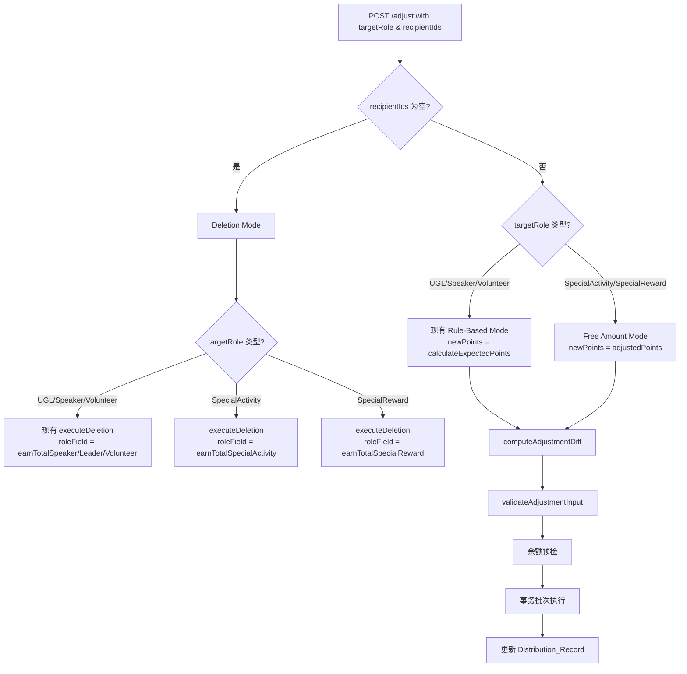

# 设计文档：特殊活动/特殊奖励发放记录调整

## Overview

本设计扩展现有的 `batch-points-adjust` 模块，使其能调整 `targetRole` 为 `SpecialActivity` 或 `SpecialReward` 的发放记录。核心变化是引入 **Free Amount Mode（自由金额模式）**：当 targetRole 为特殊类型时，每人积分由 SuperAdmin 手动指定（`adjustedPoints` 字段），不再从 `PointsRuleConfig` 自动计算。

### 设计权衡与依据

| 决策 | 备选方案 | 选择理由 |
| --- | --- | --- |
| 扩展现有 `AdjustmentInput` 接口 | 新建独立调整函数 | 特殊类型调整的流程（diff 计算→余额预检→事务批次→更新 Distribution）与现有角色调整完全一致，仅在"如何获取 newPoints"上有差异；复用可减少重复代码和回归风险 |
| `adjustedPoints` 作为可选字段 | 强制所有角色传递 points | 向后兼容：现有 UGL/Speaker/Volunteer 请求无需修改；仅特殊类型需要该字段 |
| `computeAdjustmentDiff` 内部分支 | 抽离为两个独立 diff 函数 | 逻辑差异仅在"newPoints 来源"一行，其余完全相同；内部 if/else 分支足矣 |
| 复用 `executeDeletion` 函数处理特殊类型删除 | 写独立的删除函数 | 删除逻辑一致（反转 points/earnTotal/角色字段 + 写 correction + 硬删 Distribution），仅 roleField 映射不同 |
| 前端同页面条件渲染（Free Amount Mode） | 新建独立页面 | 调整页面逻辑 80%相同（用户列表、diff 计算、确认对话框），条件隐藏角色 Tab + 显示金额输入框足矣 |

### 影响范围

- **后端**：`batch-points-adjust.ts`（接口扩展 + diff 逻辑 + validation + deletion roleField）
- **前端**：`batch-adjust.tsx`（Free Amount Mode UI）、`batch-history.tsx`（调整按钮可见性）
- **共享类型**：`AdjustmentInput.targetRole` union 扩展（已在 shared/types.ts 中包含 SpecialActivity/SpecialReward）

## Architecture

### 调整流程决策图



### Earn Record Source 前缀匹配

调整时需要定位原始 earn 记录进行原地编辑/删除。不同 targetRole 使用不同的 source 前缀：

| targetRole | source 格式 | 前缀 |
| --- | --- | --- |
| UGL/Speaker/Volunteer | `批量发放:{role}\|{ug}\|{topic}\|{date}` | `批量发放:` |
| SpecialActivity | `特殊活动:{topic}\|{ug}\|{awardDate}\|{tagName}` | `特殊活动:` |
| SpecialReward | `特殊奖励:{tagName}\|{awardDate}` | `特殊奖励:` |

调整模块通过 `buildBaseEarnSource` 函数构建完整 source 字符串来精确定位 earn 记录（而非仅用前缀匹配），与现有 UGL/Speaker/Volunteer 的 `findBaseEarnRecordId` 逻辑一致。

## Components and Interfaces

### 后端修改

#### 1. `AdjustmentInput` 接口扩展

```typescript
export interface AdjustmentInput {
  distributionId: string;
  recipientIds: string[];
  targetRole: 'UserGroupLeader' | 'Speaker' | 'Volunteer' | 'SpecialActivity' | 'SpecialReward';
  speakerType?: 'typeA' | 'typeB' | 'roundtable';
  adjustedBy: string;
  callerRoles?: string[];
  releaseSkills?: Array<{ skill: SkillType }>;
  addSkillClaims?: Array<{ skill: SkillType; userId: string }>;
  /** Free Amount Mode: 特殊类型调整时由 SuperAdmin 指定的每人积分值（正整数） */
  adjustedPoints?: number;
}
```

#### 2. `validateAdjustmentInput` 修改

新增验证逻辑（在现有 speakerType / volunteer 校验之前插入）：

```typescript
// 对 SpecialActivity / SpecialReward 的 adjustedPoints 校验
if (
  (input.targetRole === 'SpecialActivity' || input.targetRole === 'SpecialReward') &&
  input.recipientIds.length > 0
) {
  if (!input.adjustedPoints || !Number.isInteger(input.adjustedPoints) || input.adjustedPoints <= 0) {
    return {
      valid: false,
      error: { code: 'INVALID_REQUEST', message: '特殊类型调整必须提供有效的积分金额' },
    };
  }
}

// 对未知 targetRole 的校验
const VALID_TARGET_ROLES = new Set([
  'UserGroupLeader', 'Speaker', 'Volunteer', 'SpecialActivity', 'SpecialReward',
]);
if (!VALID_TARGET_ROLES.has(input.targetRole)) {
  return {
    valid: false,
    error: { code: 'INVALID_REQUEST', message: `无效的 targetRole: ${input.targetRole}` },
  };
}
```

NO_CHANGES 检测扩展（特殊类型场景）：

```typescript
// 对特殊类型，除了检查 recipientIds 是否一致，还需检查 adjustedPoints 是否与 original.points 相同
if (input.targetRole === 'SpecialActivity' || input.targetRole === 'SpecialReward') {
  const samePoints = input.adjustedPoints === original.points;
  if (sameRecipients && samePoints && !hasSkillOps) {
    return { valid: false, error: { code: 'NO_CHANGES', message: '未检测到任何变更' } };
  }
}
```

#### 3. `computeAdjustmentDiff` 修改

```typescript
export function computeAdjustmentDiff(
  original: DistributionRecord,
  input: AdjustmentInput,
  config: PointsRuleConfig,
): AdjustmentDiff {
  // ... 现有 set 计算逻辑不变 ...

  const originalPoints = original.points;

  // Free Amount Mode: 特殊类型使用 adjustedPoints，否则从 config 计算
  const isFreeAmountMode = input.targetRole === 'SpecialActivity' || input.targetRole === 'SpecialReward';
  const newPoints = isFreeAmountMode
    ? input.adjustedPoints!  // 已在 validate 中确保为正整数
    : calculateExpectedPoints(input.targetRole, input.speakerType, config);

  // ... 余下 diff 逻辑完全一致 ...
}
```

#### 4. `roleFieldMap` 扩展

在 `executeAdjustment` 和 `executeDeletion` 中扩展角色字段映射：

```typescript
const roleFieldMap: Record<string, string> = {
  Speaker: 'earnTotalSpeaker',
  UserGroupLeader: 'earnTotalLeader',
  Volunteer: 'earnTotalVolunteer',
  SpecialActivity: 'earnTotalSpecialActivity',
  SpecialReward: 'earnTotalSpecialReward',
};
```

#### 5. `buildBaseEarnSource` 扩展

新增对特殊类型的 source 构建：

```typescript
function buildBaseEarnSource(
  role: string,
  activityUG?: string,
  activityTopic?: string,
  activityDate?: string,
  original?: DistributionRecord,
): string {
  if (role === 'SpecialActivity') {
    // 格式：特殊活动:{topic}|{ug}|{awardDate}|{normalizedTagName}
    const tagName = original?.awardTagName ?? '';
    return `特殊活动:${activityTopic ?? ''}|${activityUG ?? ''}|${activityDate ?? ''}|${tagName}`;
  }
  if (role === 'SpecialReward') {
    // 格式：特殊奖励:{tagName}|{awardDate}
    const tagName = original?.rewardTagName ?? '';
    return `特殊奖励:${tagName}|${activityDate ?? ''}`;
  }
  // 现有角色格式不变
  return `批量发放:${role}|${activityUG ?? ''}|${activityTopic ?? ''}|${activityDate ?? ''}`;
}
```

#### 6. 新增 earn 记录写入（add 操作）

对新增用户的 earn 记录 Put 操作，需要根据 targetRole 携带正确的关联字段：

```typescript
// SpecialActivity 的 earn 记录需要包含 awardTagId/awardTagName
// SpecialReward 的 earn 记录需要包含 rewardTagId/rewardTagName
const earnItem: Record<string, any> = {
  recordId: ulid(),
  userId: op.userId,
  type: 'earn',
  amount: diff.newPoints,
  source: newBaseSource,
  balanceAfter: currentBalance + diff.newPoints,
  createdAt: now,
  activityId: original.activityId ?? '',
  activityType: original.activityType,
  activityUG: original.activityUG ?? '',
  activityTopic: original.activityTopic ?? '',
  activityDate: original.activityDate ?? '',
  targetRole: input.targetRole,
};

if (input.targetRole === 'SpecialActivity') {
  earnItem.awardTagId = original.awardTagId ?? '';
  earnItem.awardTagName = original.awardTagName ?? '';
}
if (input.targetRole === 'SpecialReward') {
  earnItem.rewardTagId = original.rewardTagId ?? '';
  earnItem.rewardTagName = original.rewardTagName ?? '';
}
```

#### 7. Distribution_Record 更新

更新 Distribution_Record 时，对特殊类型使用 `adjustedPoints` 作为 `points` 值：

```typescript
const newPoints = isFreeAmountMode ? input.adjustedPoints! : diff.newPoints;
// points、successCount、totalPoints 更新逻辑不变
// targetRole 对特殊类型保持不变（不允许跨类型修改）
```

#### 8. `executeDeletion` 修改

扩展 `roleFieldMap` 使 `executeDeletion` 正确映射 `SpecialActivity` → `earnTotalSpecialActivity`、`SpecialReward` → `earnTotalSpecialReward`。同时，deletion 的 correction record source 格式为：
- `发放删除:SpecialActivity|{ug}|{topic}|{date}`
- `发放删除:SpecialReward|{ug}|{topic}|{date}`

### 前端修改

#### `batch-adjust.tsx` — Free Amount Mode

1. **检测特殊类型**：根据加载的 `originalRecord.targetRole` 判断是否进入 Free Amount Mode：
   ```typescript
   const isFreeAmountMode = useMemo(() => {
     return originalRecord?.targetRole === 'SpecialActivity' || originalRecord?.targetRole === 'SpecialReward';
   }, [originalRecord]);
   ```

2. **积分金额输入框**（取代自动计算）：
   ```typescript
   const [adjustedPoints, setAdjustedPoints] = useState<number>(0);
   // 初始化为 originalRecord.points
   useEffect(() => {
     if (originalRecord && isFreeAmountMode) {
       setAdjustedPoints(originalRecord.points);
     }
   }, [originalRecord, isFreeAmountMode]);
   ```

3. **隐藏角色 Tab 和 Speaker 类型选择器**：Free Amount Mode 下条件渲染隐藏。

4. **显示只读标签**：展示 targetRole 中文名（"特殊活动"/"特殊奖励"）和关联 Tag 名称（awardTagDisplayName / rewardTagDisplayName）。

5. **积分输入校验**：仅接受大于 0 的正整数，使用 `--error` 色彩变量标示无效输入。

6. **Diff 计算适配**：Free Amount Mode 下使用 `adjustedPoints` 替代 `autoPoints` 计算前端 diff 展示。

7. **提交请求体**：Free Amount Mode 下附加 `adjustedPoints` 字段，省略 `speakerType`。

#### `batch-history.tsx` — 调整按钮可见性

在发放详情视图中，当 `targetRole` 为 `SpecialActivity` 或 `SpecialReward` 且当前用户是 SuperAdmin 时，显示"调整"按钮（与现有 UGL/Speaker/Volunteer 的逻辑一致）。

## Data Models

### AdjustmentInput 扩展

| 字段 | 类型 | 必填 | 说明 |
| --- | --- | --- | --- |
| `targetRole` | string (union 扩展) | 是 | 新增 `'SpecialActivity' \| 'SpecialReward'` |
| `adjustedPoints` | number | 特殊类型必填 | 正整数，Free Amount Mode 下的每人积分值 |

### User_Record 字段更新矩阵（调整时）

| 操作 | targetRole | points | earnTotal | earnTotalSpecialActivity | earnTotalSpecialReward | 其他 earnTotal* |
| --- | --- | --- | --- | --- | --- | --- |
| 新增用户 | SpecialActivity | +adjustedPoints | +adjustedPoints | +adjustedPoints | 不变 | 不变 |
| 移除用户 | SpecialActivity | -originalPoints | -originalPoints | -originalPoints | 不变 | 不变 |
| 保留（金额变） | SpecialActivity | +delta | +delta | +delta | 不变 | 不变 |
| 新增用户 | SpecialReward | +adjustedPoints | +adjustedPoints | 不变 | +adjustedPoints | 不变 |
| 移除用户 | SpecialReward | -originalPoints | -originalPoints | 不变 | -originalPoints | 不变 |
| 保留（金额变） | SpecialReward | +delta | +delta | 不变 | +delta | 不变 |

> `delta = adjustedPoints - originalPoints`

### Earn Record 操作矩阵

| 操作 | 行为 | source 定位方式 |
| --- | --- | --- |
| 移除用户 | DELETE earn record | `findBaseEarnRecordId` 使用完整 source 精确匹配 |
| 新增用户 | PUT 新 earn record | 使用 `buildBaseEarnSource` 构建正确格式的 source |
| 保留（金额变） | UPDATE earn record 的 `amount` | 同移除用户的定位方式，更新 amount 为 adjustedPoints |

### Distribution_Record 更新

调整后更新字段：
- `recipientIds` → 新用户列表
- `recipientDetails` → 新用户详情
- `points` → `adjustedPoints`（Free Amount Mode）
- `successCount` → 新用户数
- `totalPoints` → successCount × adjustedPoints
- `adjustedAt` → 当前时间
- `adjustedBy` → SuperAdmin userId
- **保持不变**：`targetRole`、`activityId`、`activityType`、`awardTagId/awardTagName`（SpecialActivity）、`rewardTagId/rewardTagName`（SpecialReward）


## Correctness Properties

*A property is a characteristic or behavior that should hold true across all valid executions of a system — essentially, a formal statement about what the system should do. Properties serve as the bridge between human-readable specifications and machine-verifiable correctness guarantees.*

### Property 1: Free Amount Mode 使用 adjustedPoints 作为 newPoints

*For any* 有效的调整输入，当 `targetRole` 为 `SpecialActivity` 或 `SpecialReward` 时，`computeAdjustmentDiff` 返回的 `newPoints` 值必须等于 `input.adjustedPoints`，而非 `calculateExpectedPoints(targetRole, speakerType, config)` 的结果。无论 `PointsRuleConfig` 中配置了何种积分值，结果不受其影响。

**Validates: Requirements 1.1, 1.2, 2.3, 5.1**

### Property 2: Diff 差额计算正确性

*For any* 原始发放记录 `original`（points = P）和调整输入 `input`（adjustedPoints = Q，对特殊类型），`computeAdjustmentDiff` 返回的 `userAdjustments` 满足：(a) 被移除用户的 `delta = -P`；(b) 被新增用户的 `delta = +Q`（特殊类型）或 `+calculateExpectedPoints(...)` （传统角色）；(c) 保留用户的 `delta = Q - P`（特殊类型）或 `calculateExpectedPoints(...) - P`（传统角色），当 delta ≠ 0 时才产生 userAdjustment 条目。

**Validates: Requirements 5.2, 5.3, 5.4**

### Property 3: 角色累计字段隔离与增量精确

*For any* 成功执行的特殊类型调整（mock DDB），对每个受影响用户：(a) 当 `targetRole = 'SpecialActivity'` 时，`earnTotalSpecialActivity` 变动精确等于该用户的 delta，`earnTotalSpeaker`、`earnTotalLeader`、`earnTotalVolunteer`、`earnTotalSpecialReward` 保持调用前值不变；(b) 当 `targetRole = 'SpecialReward'` 时，`earnTotalSpecialReward` 变动精确等于该用户的 delta，其余四个角色字段保持不变；(c) 对所有受影响用户，`points` 和 `earnTotal` 的变动精确等于各自的 delta。

**Validates: Requirements 3.1, 3.2, 3.3, 3.4, 4.1, 4.2, 4.3, 4.4**

### Property 4: Earn 记录原地编辑正确性

*For any* 成功执行的特殊类型调整：(a) 被移除用户的原始 earn 记录被 DELETE（通过 source 精确匹配定位）；(b) 被新增用户获得一条新 PUT 的 earn 记录，`amount = adjustedPoints`，`source` 格式与原始发放一致，且携带正确的关联字段（SpecialActivity: `awardTagId/awardTagName`；SpecialReward: `rewardTagId/rewardTagName`）；(c) 保留用户且金额变化时，原始 earn 记录的 `amount` 被 UPDATE 为 `adjustedPoints`，其余字段（`targetRole`、`activityId`、`activityUG`、`activityTopic`、`activityDate`、tag 字段）保持不变。

**Validates: Requirements 7.1, 7.2, 7.3, 7.4**

### Property 5: Distribution_Record 更新正确性

*For any* 成功执行的特殊类型调整，更新后的 Distribution_Record 满足：(a) `recipientIds` 等于调整后的用户 ID 集合；(b) `points` 等于 `adjustedPoints`；(c) `successCount` 等于新 `recipientIds.length`；(d) `totalPoints` 等于 `successCount × adjustedPoints`；(e) `targetRole`、`activityId`、`activityType`、`awardTagId/awardTagName`（SpecialActivity）或 `rewardTagId/rewardTagName`（SpecialReward）保持原始值不变；(f) 包含 `adjustedAt` 时间戳和 `adjustedBy` 字段。

**Validates: Requirements 8.1, 8.2, 8.3, 8.4, 8.5, 8.6**

### Property 6: 无效 adjustedPoints 拒绝且零副作用

*For any* 调整输入，当 `targetRole` 为 `SpecialActivity` 或 `SpecialReward`，`recipientIds` 非空，且 `adjustedPoints` 缺失、为 0、为负数或为浮点数时，`validateAdjustmentInput` 必须返回 `{ valid: false, error: { code: 'INVALID_REQUEST' } }`，且不产生任何 DynamoDB 写入操作。

**Validates: Requirements 2.4, 14.1**

### Property 7: 特殊类型的 NO_CHANGES 检测

*For any* 调整输入，当 `targetRole` 为 `SpecialActivity` 或 `SpecialReward`，`adjustedPoints` 等于 `original.points`，且 `recipientIds`（去重排序后）与 `original.recipientIds`（去重排序后）完全相同时，`validateAdjustmentInput` 必须返回 `{ valid: false, error: { code: 'NO_CHANGES' } }`。

**Validates: Requirements 5.5, 14.2**

### Property 8: 特殊类型删除模式反转正确的角色字段

*For any* 特殊类型发放记录的删除（recipientIds 为空），执行 `executeDeletion` 后：(a) 当 `targetRole = 'SpecialActivity'` 时，每个原始用户的 `points`、`earnTotal`、`earnTotalSpecialActivity` 均减少 `originalPoints`，其余角色字段不变；(b) 当 `targetRole = 'SpecialReward'` 时，每个原始用户的 `points`、`earnTotal`、`earnTotalSpecialReward` 均减少 `originalPoints`，其余角色字段不变；(c) Distribution_Record 被硬删除；(d) 返回 `{ deleted: true, distributionId, reversedCount: 原始用户数 }`。

**Validates: Requirements 12.1, 12.2, 12.4**

### Property 9: 余额预检在写入前拒绝

*For any* 调整或删除操作，若存在至少一个用户的当前 `points` 余额加上其 delta 后小于 0（调整模式）或当前余额小于 `originalPoints`（删除模式），系统必须返回 `INSUFFICIENT_BALANCE` 错误，且不执行任何 `TransactWriteCommand`。

**Validates: Requirements 12.3, 14.3**

### Property 10: 删除模式跳过 adjustedPoints 和 NO_CHANGES 校验

*For any* 调整输入，当 `recipientIds` 为空（含 `undefined` 或空数组），无论 `adjustedPoints` 值为何（缺失、0、负数均可），`validateAdjustmentInput` 必须返回 `{ valid: true, isDeletion: true }`，不返回 `INVALID_REQUEST` 或 `NO_CHANGES`。

**Validates: Requirements 14.4**

### Property 11: 事务批次不超过 25 项

*For any* 调整操作涉及 N 个用户（每用户 2 个事务项），每个 `TransactWriteCommand` 批次包含的事务项数量不超过 25（即每批次最多 12 个用户）。

**Validates: Requirements 6.2**

### Property 12: 向后兼容 — 传统角色忽略 adjustedPoints

*For any* 调整输入，当 `targetRole` 为 `UserGroupLeader`、`Speaker` 或 `Volunteer` 时，`computeAdjustmentDiff` 返回的 `newPoints` 必须等于 `calculateExpectedPoints(targetRole, speakerType, config)` 的结果，无论 `adjustedPoints` 字段是否存在或为何值。

**Validates: Requirements 15.1, 15.2**

## Error Handling

| 场景 | 错误码 | HTTP | 行为 |
| --- | --- | --- | --- |
| targetRole 不在有效集合中 | `INVALID_REQUEST` | 400 | 校验阶段立即拒绝 |
| 特殊类型缺少有效 adjustedPoints | `INVALID_REQUEST` | 400 | 校验阶段立即拒绝 |
| 无实际变更 | `NO_CHANGES` | 400 | 校验阶段拒绝 |
| 用户余额不足以扣减 | `INSUFFICIENT_BALANCE` | 400 | 预检阶段拒绝，无写入 |
| 事务批次执行失败 | `ADJUSTMENT_FAILED` | 500 | 停止后续批次 |
| Distribution_Record 更新失败 | `ADJUSTMENT_FAILED` | 500 | 用户积分已变更但记录未更新（可重试） |
| Distribution 不存在 | `DISTRIBUTION_NOT_FOUND` | 404 | 早期返回 |
| 非 SuperAdmin 调用 | `FORBIDDEN` | 403 | Handler 层拒绝 |

### 校验顺序

1. 鉴权（401）
2. 权限（403，SuperAdmin only）
3. Distribution 存在性（404）
4. `targetRole` 有效性（400）
5. `recipientIds` 为空 → 删除模式（跳过后续校验）
6. 特殊类型 `adjustedPoints` 有效性（400）
7. Speaker 的 `speakerType` 校验（400）
8. Volunteer 人数限制（400）
9. NO_CHANGES 检测（400）
10. 余额预检（400）
11. 事务执行

### 部分失败处理

与现有调整逻辑一致：若用户事务批次全部成功但 Distribution_Record 更新失败，系统处于"积分已变更但记录未更新"的中间态。这是可接受的，因为：
- 用户余额已正确调整
- SuperAdmin 可重试操作
- 日志记录了详细错误信息

## Testing Strategy

### 总体策略

采用与现有 `batch-points-adjust` 和 `special-reward-award` 功能一致的三层测试方案：

1. **属性测试（PBT，jest + fast-check）**：覆盖 diff 计算、validation 逻辑、字段隔离、批次大小等纯函数和可 mock DDB 的核心流程（Property 1–12）。每个属性测试 ≥ 100 次随机生成。
2. **示例单元测试（jest）**：覆盖前端 UI 条件渲染、确认对话框、API 请求构造、错误处理分支等。
3. **集成测试**：覆盖完整调整流程的 happy-path，验证多表一致性。

### Property-Based Testing 配置

- **库**：`fast-check`（项目现有依赖）
- **迭代次数**：每条属性 `numRuns: 100`
- **每条 PBT 测试必须包含注释**，格式：`// Feature: special-award-adjust, Property {N}: {property text}`

### 生成器设计

- `specialAdjustmentInputArb`：生成含 `targetRole ∈ {'SpecialActivity', 'SpecialReward'}`、`adjustedPoints ∈ [1, 100000]`、`recipientIds` 长度 0~50 的随机输入
- `originalDistributionArb`：生成含 `points ∈ [1, 100000]`、`recipientIds` 长度 1~50、`targetRole` 匹配、`awardTagId/awardTagName` 或 `rewardTagId/rewardTagName` 的随机原始记录
- `invalidAdjustedPointsArb`：`fc.oneof(fc.constant(undefined), fc.constant(null), fc.integer({max: 0}), fc.double({min: 0.1, max: 100, noInteger: true}))`
- `mockDDBArb`：复用现有 batch-points-adjust 测试中的 in-memory mock 模式，预置随机用户余额

### Property → Test 文件映射

| Property | 测试文件 | 测试函数名 |
| --- | --- | --- |
| P1 | `batch-points-adjust-special.property.test.ts` | `Free Amount Mode 使用 adjustedPoints` |
| P2 | `batch-points-adjust-special.property.test.ts` | `Diff 差额计算正确性` |
| P3 | `batch-points-adjust-special.property.test.ts` | `角色累计字段隔离与增量精确` |
| P4 | `batch-points-adjust-special.property.test.ts` | `Earn 记录原地编辑正确性` |
| P5 | `batch-points-adjust-special.property.test.ts` | `Distribution_Record 更新正确性` |
| P6 | `batch-points-adjust-special.property.test.ts` | `无效 adjustedPoints 拒绝且零副作用` |
| P7 | `batch-points-adjust-special.property.test.ts` | `特殊类型 NO_CHANGES 检测` |
| P8 | `batch-points-adjust-special.property.test.ts` | `特殊类型删除模式反转正确角色字段` |
| P9 | `batch-points-adjust-special.property.test.ts` | `余额预检在写入前拒绝` |
| P10 | `batch-points-adjust-special.property.test.ts` | `删除模式跳过 adjustedPoints 校验` |
| P11 | `batch-points-adjust-special.property.test.ts` | `事务批次不超过 25 项` |
| P12 | `batch-points-adjust-special.property.test.ts` | `传统角色忽略 adjustedPoints` |

### 示例测试覆盖

- **前端 Free Amount Mode**：
  - SpecialActivity 记录加载后显示积分输入框、隐藏角色 Tab
  - SpecialReward 记录加载后显示只读 rewardTag 标签
  - 积分输入框校验（0、负数、浮点数被拒绝）
  - Diff Summary 正确展示新增/移除/积分变动
  - 确认对话框展示正确的变更摘要
  - 删除模式确认对话框与调整模式不同

- **前端调整入口**：
  - batch-history 中 SpecialActivity/SpecialReward 记录对 SuperAdmin 显示"调整"按钮
  - 非 SuperAdmin 不显示"调整"按钮
  - 点击按钮正确导航并携带 distributionId

- **后端错误处理**：
  - 未知 targetRole 返回 INVALID_REQUEST
  - 事务失败返回 ADJUSTMENT_FAILED
  - Distribution 不存在返回 DISTRIBUTION_NOT_FOUND

### 不适合 PBT 的部分

- **前端 UI 渲染**（Requirements 9、10、11）：条件渲染逻辑用示例测试覆盖
- **API 路由分发**（Requirements 15.4）：handler 层的路由测试用示例即可
- **公告展示**（Requirements 13）：earn 记录的正确性已由 Property 4 保证，公告展示层无额外逻辑
