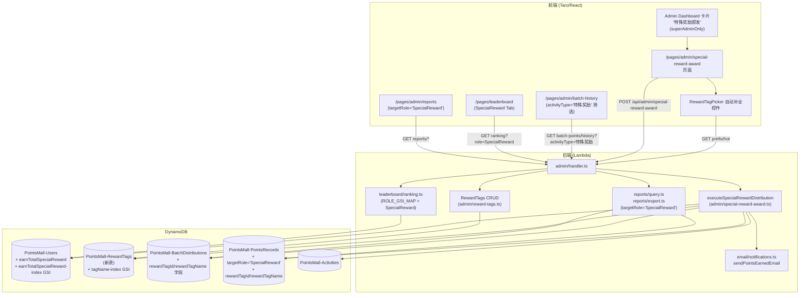
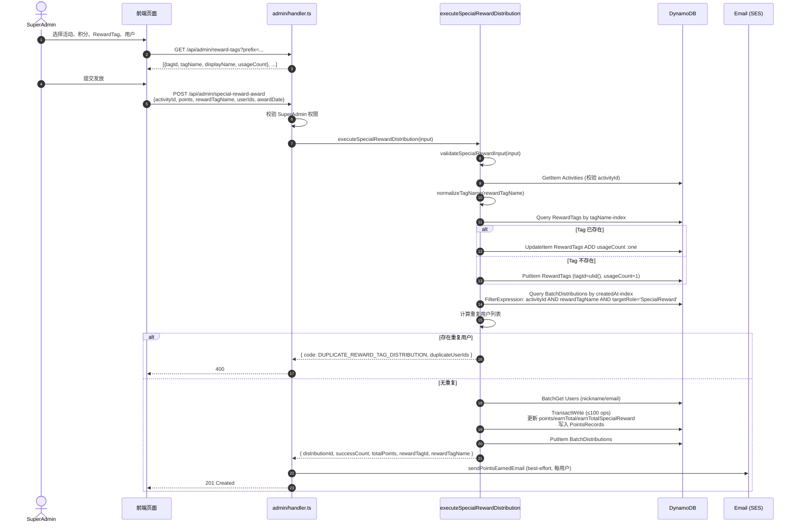

# 设计文档：特殊奖励颁发

> **变更说明（2026-06，上线后调整）：不再关联活动。** 去重粒度由 `(activityId, rewardTagName)` 改为 **`(rewardTagName, userId)`（全局）**；`executeSpecialRewardDistribution` 移除 `activityId` 入参与 Activities 表存在性校验；`getRewardedUserIdsByTag(rewardTagName)` 仅按 `rewardTagName + targetRole='SpecialReward'` 过滤；`source` 格式为 `特殊奖励:{tagName}|{发放日期}`；DistributionRecord 仅保留 `activityType='特殊奖励'` 与 `activityDate`，不写 `activityId/activityUG/activityTopic`。前端移除 ActivityPicker。下文涉及活动关联的描述以本说明为准。

## Overview

本设计为 SuperAdmin 提供一个独立的"特殊奖励颁发"页面，并在数据层引入一种**全新且完全独立的积分类型** `特殊奖励积分`，与现有的 `Speaker / UserGroupLeader / Volunteer` 三类身份分**以及特殊活动积分（SpecialActivity）**严格隔离。本功能在结构上完整对标现有的 special-activity-award 功能（积分规则、校验逻辑、发放流程、标签机制、排行榜/报表/多语言），但作为独立类别存在，可被独立追踪、排名与统计。

设计遵循以下核心原则：

1. **独立发放路径**：新增独立函数 `executeSpecialRewardDistribution`，**既不复用** `executeBatchDistribution`，**也不复用** `executeSpecialActivityDistribution`，从源头确保特殊奖励积分既不污染身份分累计字段（`earnTotalSpeaker / earnTotalLeader / earnTotalVolunteer`），也不污染特殊活动积分字段（`earnTotalSpecialActivity`）。
2. **新积分类型字段**：在 Users 表新增 `earnTotalSpecialReward` 字段并配套 GSI `earnTotalSpecialReward-index`，用于排行榜与报表的独立维度统计。
3. **RewardTag 元数据系统**：新增独立表 `PointsMall-RewardTags`（结构与 `PointsMall-AwardTags` 同构，但与 ContentTags / AwardTags 表完全隔离——不共表、不共用 API、不共用 GSI），用于支撑奖励标签的自动补全、热门标签、显式创建与受限删除；DistributionRecord 与 PointsRecord 同时持久化 `rewardTagId / rewardTagName`，作为后续报表按 Tag 维度聚合的索引键。
4. **去重粒度**：去重键为 `(activityId, rewardTagName)`，允许同一活动按不同奖励 Tag 多次发放，但同 Tag 下同一用户只能获得一次。
5. **复用现有基础设施**：发放历史复用 `GET /api/admin/batch-points/history`（按 `targetRole=SpecialReward` / `activityType=特殊奖励` 过滤），邮件复用 `sendPointsEarnedEmail`，前端页面布局复用 `special-activity-award` / `quarterly-award` 模式。
6. **CDK 部署节奏**：遵守"DynamoDB 单次部署只能在同一张表上新增一个 GSI"的硬约束。本功能仅向 Users 表新增 **1 个** GSI（`earnTotalSpecialReward-index`），并新建 `PointsMall-RewardTags` 表（新表附带初始 GSI 不冲突），故二者可同批次部署。
7. **向后兼容**：不读取、不写入 `earnTotalSpecialActivity` 字段或 `PointsMall-AwardTags` 表；现有特殊活动积分功能行为完全不变。

### 设计权衡与依据

| 决策 | 备选方案 | 选择理由 |
| --- | --- | --- |
| 独立 `executeSpecialRewardDistribution` | 给 `executeSpecialActivityDistribution` 加 `targetRole` 参数 | 复用会让特殊活动函数承载两种语义、扩大其回归面，并违反"互不混淆"的需求；独立函数仅写 3 个字段，逻辑路径清晰可证（需求架构约束 1~3、需求 16）。 |
| 独立 `PointsMall-RewardTags` 表 | 与 `AwardTags` / `ContentTags` 共表 | 需求 6（架构约束）与需求 14.1 明确要求隔离；共表会让现有 tag API 必须新增过滤条件，回归面更大；隔离表换来零耦合。 |
| `(activityId, rewardTagName)` 去重 | `(activityId, rewardTagId)` 去重 | rewardTagId 是 ULID，归一化前后可能映射到同一逻辑标签；以归一化 `rewardTagName` 作键与"创建/查询/删除"使用的归一化键保持一致（需求 8.1）。 |
| 复用 `BatchDistributions / PointsRecords` 表 | 新增专用表 | 历史接口、报表导出、积分明细均已基于这两张表运转；复用即可零改造接入；新增 `targetRole='SpecialReward'` 不影响现有筛选（需求 12、需求 16.5）。 |
| 借鉴 `award-tags.ts` 代码结构 | 从零实现 | 需求 6（架构约束）允许借鉴 AwardTags 模块的结构与归一化逻辑；归一化纯函数可复用 `@points-mall/shared` 中已有实现，存储层完全独立。 |

## Architecture

### 系统组件图



### 发放流程时序图



### 关键设计点

- **事务粒度**：与 `executeSpecialActivityDistribution` 保持一致，每次发放使用单个 `TransactWriteCommand`（≤100 个操作），保证 Users 增量与 PointsRecords 写入的原子性（需求 6.18）。当 `userIds.length * 2 > 100` 时返回 `BATCH_TOO_LARGE`。
- **RewardTag 计数原子性**：发放主事务**不**包含 RewardTag 的 usageCount 更新（避免跨表条件检查带来的事务复杂度），而是在主事务前用独立的 `UpdateCommand ADD usageCount :one`（已存在）/ `PutCommand`（`ConditionExpression: attribute_not_exists(tagId)`，不存在时）完成。理由：tag 计数是统计指标，最终一致即可；若主事务失败（罕见），usageCount 仅多算一次，可由后台校对脚本修复（需求 6.10、14.5、14.6）。
- **去重查询**：复用 `createdAt-index` GSI + FilterExpression，过滤条件为 `activityId = :aid AND rewardTagName = :tag AND targetRole = 'SpecialReward'`。
- **邮件通知**：在 handler 层而非 `executeSpecialRewardDistribution` 内部调用 `sendPointsEarnedEmail`，保持核心函数纯净（与 `handleQuarterlyAward` / special-activity-award 的现有模式一致），单用户邮件失败不阻塞流程（需求 11.4）。
- **归一化纯函数复用**：归一化与字符校验规则与 ContentTags / AwardTags 系统一致（trim + 折叠连续空白 + 小写）。复用 `@points-mall/shared` 中已有的 `normalizeAwardTagName` / `validateAwardTagName`（规则一致即可，存储相互隔离），前后端共用，保证校验语义严格一致（需求 14.9）。

## Components and Interfaces

### 后端模块

| 模块文件 | 职责 |
| --- | --- |
| `packages/backend/src/admin/special-reward-award.ts`（新建） | 导出 `executeSpecialRewardDistribution`、`validateSpecialRewardInput`、`getRewardedUserIdsByTag` 等函数 |
| `packages/backend/src/admin/reward-tags.ts`（新建） | 导出 `searchRewardTags`、`getHotRewardTags`、`createRewardTag`、`deleteRewardTag`、`upsertRewardTagUsage`（借鉴 `award-tags.ts` 结构，操作 `PointsMall-RewardTags` 表） |
| `packages/backend/src/admin/handler.ts`（修改） | 增加 `POST /api/admin/special-reward-award`、`GET/POST /api/admin/reward-tags`、`GET /api/admin/reward-tags/hot`、`DELETE /api/admin/reward-tags/{tagId}` 路由分支 |
| `packages/backend/src/leaderboard/ranking.ts`（修改） | `VALID_ROLES`、`ROLE_GSI_MAP`、`RankingQueryOptions.role` 增加 `SpecialReward` 条目；`getRanking` 对 `role === 'SpecialReward'` 跳过身份角色检查 |
| `packages/backend/src/reports/query.ts` 与 `export.ts`（修改） | `targetRole` 白名单增加 `'SpecialReward'`；`UserRankingRecord` 增加可选字段 `earnTotalSpecialReward`；导出列增加"特殊奖励积分" |

### 前端模块

| 模块文件 | 职责 |
| --- | --- |
| `packages/frontend/src/pages/admin/special-reward-award.tsx`（新建） | 颁发主页面；模仿 `special-activity-award.tsx` 布局 |
| `packages/frontend/src/pages/admin/special-reward-award.config.ts`（新建） | 页面配置（`navigationBarTitleText`） |
| `packages/frontend/src/pages/admin/special-reward-award.scss`（新建） | 样式（仅使用 `--space-*` / `--radius-*` / `--text-*` 等设计系统 CSS 变量） |
| `packages/frontend/src/components/RewardTagPicker/`（新建） | 通用 RewardTag 自动补全 + 新建组件，支持 onChange 回调 |
| `packages/frontend/src/pages/admin/index.tsx`（修改） | 在 `ADMIN_LINKS` 中追加 `special-reward-award` 卡片（category=`operations`、`superAdminOnly: true`、奖杯/奖章类 SVG 图标，区别于特殊活动卡片图标） |
| `packages/frontend/src/app.config.ts`（修改） | `pages` 数组追加 `'pages/admin/special-reward-award'` |
| `packages/frontend/src/pages/leaderboard/index.tsx`（修改） | `RoleFilter` 与 `ROLE_TABS` 增加 `SpecialReward` |
| `packages/frontend/src/pages/admin/batch-history.tsx`（修改） | `activityType` 筛选增加"特殊奖励"，详情展示 `rewardTagDisplayName`，支持按 rewardTagName 二次筛选 |
| `packages/frontend/src/pages/admin/reports.tsx`（修改） | `targetRole` 筛选增加"特殊奖励"，用户排名表增加 `earnTotalSpecialReward` 列 |
| `packages/frontend/src/i18n/*`（修改） | 5 个语言文件新增对应 key（含 `leaderboard.roleSpecialReward`） |
| `packages/shared/src/types.ts`（修改） | `DistributionRecord` 与 `PointsRecord` 扩展可选字段 `rewardTagId / rewardTagName / rewardTagDisplayName`；`targetRole` 类型增加 `'SpecialReward'`；新增 `RewardTag` 接口 |

### Backend API Contract

#### 1. `POST /api/admin/special-reward-award`（SuperAdmin only）

**Request Body**:
```json
{
  "activityId": "01HXXX...",
  "points": 50,
  "rewardTagName": "卓越贡献奖",
  "userIds": ["u1", "u2", "..."],
  "awardDate": "2025-03-15"
}
```

| 字段 | 类型 | 必填 | 说明 |
| --- | --- | --- | --- |
| `activityId` | string | 是 | 必须存在于 Activities 表 |
| `points` | integer ≥ 1 | 是 | 每人积分数 |
| `rewardTagName` | string | 是 | 用户原文（后端归一化），1~30 字符 |
| `userIds` | string[] | 是 | 非空数组，每元素为非空字符串 |
| `awardDate` | string `YYYY-MM-DD` | 是 | 发放日期 |

**Success Response (201)**:
```json
{
  "distributionId": "01HXXX...",
  "successCount": 12,
  "totalPoints": 600,
  "rewardTagId": "01HYYY...",
  "rewardTagName": "卓越贡献奖"
}
```

**Error Responses**:
| HTTP | code | message |
| --- | --- | --- |
| 400 | `INVALID_REQUEST` | 字段缺失/类型错误对应消息（如 `userIds 必须为非空数组`、`points 必须为正整数`、`awardDate 必须为 YYYY-MM-DD 格式`） |
| 400 | `INVALID_REQUEST` | `rewardTagName 必填` |
| 400 | `INVALID_REQUEST` | `奖励标签长度必须为 1~30 个字符` |
| 400 | `INVALID_REQUEST` | `奖励标签包含非法字符` |
| 400 | `ACTIVITY_NOT_FOUND` | `关联活动不存在` |
| 400 | `DUPLICATE_REWARD_TAG_DISTRIBUTION` | `以下用户已在此活动的该奖励标签下获得过特殊奖励积分`，附 `duplicateUserIds: string[]` |
| 400 | `BATCH_TOO_LARGE` | `事务操作数超过 DynamoDB 上限 100` |
| 401 | `UNAUTHORIZED` | 凭证缺失/无效/过期（需求 1.4） |
| 403 | `FORBIDDEN` | `需要超级管理员权限` |
| 500 | `INTERNAL_ERROR` | 通用错误 |

#### 2. `GET /api/admin/reward-tags?prefix=...&limit=10`（SuperAdmin only）

按归一化 prefix 在 `tagName-index` GSI 上 `begins_with` 模糊匹配，按 `usageCount` 降序返回前 N（默认 10、有效范围 1~50，超出取最近边界值）条。`prefix` 归一化后长度 < 1 时返回空数组。

**Response**:
```json
{ "tags": [{ "tagId": "...", "tagName": "卓越贡献奖", "displayName": "卓越贡献奖", "usageCount": 8, "createdAt": "...", "updatedAt": "..." }] }
```

#### 3. `GET /api/admin/reward-tags/hot`（SuperAdmin only）

按 `usageCount` 降序返回**最多 20 条**（需求 14.13；注意与 AwardTags 的 10 条不同），用于初次打开下拉时的默认建议。

#### 4. `POST /api/admin/reward-tags`（SuperAdmin only，显式创建）

**Request Body**:
```json
{ "displayName": "卓越贡献奖" }
```

后端归一化为 `tagName`，写入 `PointsMall-RewardTags`，`createdBy = event.user.userId`，`usageCount = 0`。

**Errors**:
- 400 `INVALID_REQUEST` 校验失败
- 409 `TAG_ALREADY_EXISTS` `该奖励 Tag 已存在`（归一化后 tagName 已存在）

#### 5. `DELETE /api/admin/reward-tags/{tagId}`（SuperAdmin only）

仅当 `usageCount === 0` 时允许删除。使用 `ConditionExpression: attribute_exists(tagId) AND usageCount = :zero` 保证原子性。

**Errors**:
- 400 `TAG_IN_USE` `该奖励 Tag 已被使用，无法删除`
- 404 `TAG_NOT_FOUND`

#### 6. 复用接口
- `GET /api/admin/batch-points/history?activityType=特殊奖励` —— 现有接口，前端拼接查询参数；若后端未支持 activityType 透传则在 `listDistributionHistory` 增加可选过滤。
- `GET /api/admin/batch-points/history/{distributionId}` —— 现有接口，无需改动。
- `GET /api/leaderboard/ranking?role=SpecialReward` —— 仅需在 `ROLE_GSI_MAP` 中追加映射。
- `GET /api/admin/users?pageSize=50&lastKey=...` —— 现有接口，前端按 `status==='active'` 过滤展示。

## Data Models

### Users 表（修改）

| 字段 | 类型 | 说明 |
| --- | --- | --- |
| `earnTotalSpecialReward` | Number | **新增**。累计获得特殊奖励积分。`if_not_exists` 初值 0；读取时缺失视为 0（需求 16.3）。 |

**新增 GSI** `earnTotalSpecialReward-index`：
- Partition Key: `pk` (String，固定值 `'ALL'`，与现有身份分 / 特殊活动 GSI 共用同一 partition pattern)
- Sort Key: `earnTotalSpecialReward` (Number)
- Projection: ALL（前端排行榜需要 nickname/roles，与现有 `earnTotalSpeaker-index` 等保持一致）

> **注意**：没有 `pk` 字段的账号（如 SuperAdmin / OrderAdmin）不会出现在该 GSI 中，与现有 GSI 行为一致。发放写入时通过 `if_not_exists(earnTotalSpecialReward, :zero) + :pv` 保证字段存在；用户首次接收特殊奖励积分且无 `pk` 字段时，SET 表达式同时 `if_not_exists(pk, :ALL)`，参考 `register.ts` 初始化模式。

### RewardTags 表（新建）

**表名**：`PointsMall-RewardTags`
**主键**：`tagId` (String, ULID)

| 字段 | 类型 | 说明 |
| --- | --- | --- |
| `tagId` | String (ULID) | 主键 |
| `tagName` | String | 归一化名（trim + 折叠空白 + 小写） |
| `displayName` | String | 用户原文（保留原始大小写与空白形态以便展示，上限 30 字符） |
| `usageCount` | Number | 累计被发放使用次数（非负整数，初值 0） |
| `createdAt` | String (ISO 8601) | 创建时间 |
| `updatedAt` | String (ISO 8601) | 最近更新时间（每次 usageCount 变化时同步） |
| `createdBy` | String | 创建者 userId |

**GSI** `tagName-index`：
- Partition Key: `tagName` (String)
- Projection: ALL

> 该表与 `PointsMall-ContentTags`、`PointsMall-AwardTags` 完全隔离：不共享任何记录、键空间或写入路径（需求 14.1）。

### BatchDistributions 表（扩展）

在现有 `DistributionRecord` 上新增可选字段（向后兼容）：

| 字段 | 类型 | 说明 |
| --- | --- | --- |
| `targetRole` | 类型扩展 | 现有 union 增加字面量 `'SpecialReward'` |
| `activityType` | string | 字符串值新增 `'特殊奖励'`（既有字段，类型不变） |
| `rewardTagId` | string? | 仅 `targetRole === 'SpecialReward'` 时存在 |
| `rewardTagName` | string? | 仅 `targetRole === 'SpecialReward'` 时存在（归一化值） |
| `rewardTagDisplayName` | string? | 历史展示用，存归一化前的原文 |

```typescript
// packages/shared/src/types.ts (修改)
export interface DistributionRecord {
  distributionId: string;
  distributorId: string;
  distributorNickname: string;
  targetRole: 'UserGroupLeader' | 'Speaker' | 'Volunteer' | 'SpecialActivity' | 'SpecialReward';
  // ... 既有字段（含 awardTagId/awardTagName）保持不变
  rewardTagId?: string;
  rewardTagName?: string;
  rewardTagDisplayName?: string;
}

export interface RewardTag {
  tagId: string;
  tagName: string;
  displayName: string;
  usageCount: number;
  createdAt: string;
  updatedAt: string;
  createdBy: string;
}
```

> 设计上**不**修改 `speakerType`、`skillClaims`、`awardTagId/awardTagName` 等字段；特殊奖励发放不写入这些字段。

### PointsRecords 表（扩展）

`PointsRecord` 同样新增可选字段：

| 字段 | 类型 | 说明 |
| --- | --- | --- |
| `targetRole` | string? | 已有字段，新增字面量 `'SpecialReward'` |
| `rewardTagId` | string? | 同上 |
| `rewardTagName` | string? | 同上（归一化值） |
| `source` | string | 格式：`特殊奖励:{活动主题}|{UG名称}|{活动日期}|{tagName}`（tagName 用归一化值） |

### 字段写入矩阵（关键）

| 字段 | `executeBatchDistribution`（身份分） | `executeSpecialActivityDistribution`（特殊活动） | `executeSpecialRewardDistribution`（本设计） |
| --- | --- | --- | --- |
| `points` | ✅ | ✅ | ✅ |
| `earnTotal` | ✅ | ✅ | ✅ |
| `earnTotalSpeaker` | ✅（Speaker） | ❌ | ❌ |
| `earnTotalLeader` | ✅（UserGroupLeader） | ❌ | ❌ |
| `earnTotalVolunteer` | ✅（Volunteer） | ❌ | ❌ |
| `earnTotalSpecialActivity` | ❌ | ✅ | ❌ |
| `earnTotalSpecialReward` | ❌ | ❌ | ✅ |
| `pk = 'ALL'`（GSI 分区） | ✅（if_not_exists） | ✅（if_not_exists） | ✅（if_not_exists） |

## Correctness Properties

*A property is a characteristic or behavior that should hold true across all valid executions of a system—essentially, a formal statement about what the system should do. Properties serve as the bridge between human-readable specifications and machine-verifiable correctness guarantees.*

下列属性已在 prework 阶段完成"测试性分类与去重反思"。每条属性均为通用量化（"对任意"输入成立），用于支撑后续 PBT 实现。归一化 / 校验纯函数复用 `@points-mall/shared`，规则与 AwardTags 一致，故 P1 / P2 对 RewardTag 沿用同一规则集断言。

### Property 1: RewardTag 名校验规则的完备性

*For any* 输入字符串 `s`，`validateRewardTagName(s)`（复用 `validateAwardTagName`）返回 `valid: true` 当且仅当 `normalizeTagName(s)` 同时满足：长度落在 [1, 30]、不包含禁止符号集合 `<>"'/\\|*?:&` 中的任何字符、且仅由中文 / 英文（含大小写）/ 数字 / 空格组成。

**Validates: Requirements 3.7, 3.8, 3.9, 6.15, 6.16, 14.10**

### Property 2: 归一化幂等性与 displayName 不可变性

*For any* 输入字符串 `s`：(a) `normalizeTagName(normalizeTagName(s)) === normalizeTagName(s)`（幂等，规则为 trim + 折叠连续空白为单个空格 + 小写）；(b) 给定通过 `POST /api/admin/reward-tags` 创建的 tag，`createRewardTag` 写入 DynamoDB 的 `displayName` 字段恰等于请求 body 中传入的 `displayName` 原文（不做大小写转换、不做空白折叠）。

**Validates: Requirements 3.10, 6.9, 14.9, 14.11**

### Property 3: 用户搜索过滤包含语义

*For any* 用户列表 `users` 与查询字符串 `q`，`filterUsersBySearch(users, q)` 返回的每个用户都满足 `nickname.toLowerCase().includes(q.toLowerCase())` 或 `email.toLowerCase().includes(q.toLowerCase())`，且空查询返回原列表（顺序保持）。

**Validates: Requirements 4.2**

### Property 4: 提交按钮门控等价于必填条件合取

*For any* 表单状态 `(selectedActivity, points, rewardTagName, userIds, awardDate)`，`canSubmit(state) === true` 当且仅当 `selectedActivity != null && Number.isInteger(points) && points >= 1 && validateRewardTagName(rewardTagName).valid && userIds.length >= 1 && /^\d{4}-\d{2}-\d{2}$/.test(awardDate)`。

**Validates: Requirements 2.4, 3.1, 3.11, 3.12, 4.5**

### Property 5: 发放只写指定字段且增量精确（积分类型隔离）

*For any* 合法发放输入 `(activityId, points P, userIds U)`（U 已去重、去重检查通过），在 mock DDB 上执行 `executeSpecialRewardDistribution` 后，对每个 `u ∈ U`：(a) `users[u].points` 增加 P；(b) `users[u].earnTotal` 增加 P；(c) `users[u].earnTotalSpecialReward` 增加 P；(d) `users[u].earnTotalSpeaker / earnTotalLeader / earnTotalVolunteer / earnTotalSpecialActivity` 四个字段保持调用前的取值不变（包括缺失情况）。

**Validates: Requirements 6.1, 6.2, 6.3, 6.6, 7.1, 7.2, 9.1, 9.2, 16.2**

### Property 6: 写入记录字段契约

*For any* 合法发放输入，发放成功后：(a) 每条新写入的 `PointsRecord` 满足 `targetRole === 'SpecialReward'`、`source === '特殊奖励:' + topic + '|' + ug + '|' + date + '|' + normalizedTagName`、`rewardTagId` 与 `rewardTagName`（归一化）与本次发放使用的 tag 一致、`type === 'earn'`、`amount === points`；(b) 新写入的 `DistributionRecord` 满足 `targetRole === 'SpecialReward'`、`activityType === '特殊奖励'`、`rewardTagId / rewardTagName` 与上述一致、`rewardTagDisplayName` 等于请求原文、不包含 `speakerType` 字段、不包含 `awardTagId / awardTagName` 字段。

**Validates: Requirements 6.4, 6.5, 6.7, 6.8, 6.9, 7.3, 7.4, 7.5, 7.6**

### Property 7: 去重粒度为 (activityId, rewardTagName, userId) 三元组

*For any* 已发放过的三元组 `(a, t, u)`（即 BatchDistributions 中存在 `targetRole='SpecialReward' AND activityId=a AND rewardTagName=t` 且 `recipientIds` 含 `u` 的记录），后续以相同 `(a, t)` 提交并包含 `u` 的发放调用必返回 `DUPLICATE_REWARD_TAG_DISTRIBUTION` 错误（`duplicateUserIds` 包含 `u`）且不产生任何写入；同时，对相同 `(a, u)` 但不同 `t' ≠ t` 的发放调用应成功（不被去重逻辑阻断），对相同 `(a, t)` 但不同 `u' ∉ 已发放集合` 的发放调用应成功；当一次请求的 userIds 同时包含已发放与未发放用户时，整体拒绝并在 `duplicateUserIds` 中列出全部重复用户。

**Validates: Requirements 8.1, 8.3, 8.4, 8.5**

### Property 8: RewardTag upsert 计数与唯一性

*For any* 归一化 tag 名 `t` 与序列 `[op_1, ..., op_n]`（其中每个 `op_i` 为发放调用或显式 `POST /api/admin/reward-tags` 调用），执行序列后：(a) RewardTags 表中 `tagName === t` 的记录有且仅有一条；(b) 该记录的 `usageCount` 等于序列中**发放调用**的次数（显式 POST 不增加 usageCount，但若发起时 tag 不存在则创建 `usageCount=0` 的记录，发放时不存在则创建 `usageCount=1`）；(c) 任何对已存在 tagName 的显式 `POST /api/admin/reward-tags` 调用返回 `TAG_ALREADY_EXISTS`。

**Validates: Requirements 6.10, 14.5, 14.6, 14.14**

### Property 9: RewardTag 删除受限

*For any* RewardTag 记录 `tag`，调用 `DELETE /api/admin/reward-tags/{tagId}` 的结果满足：当 `tag.usageCount > 0` 时返回 `TAG_IN_USE` 错误且记录保持存在；当 `tag.usageCount === 0` 时记录被删除且响应为 200；当 tagId 不存在时返回 `TAG_NOT_FOUND`。

**Validates: Requirements 14.7, 14.8**

### Property 10: 无效输入拒绝且零副作用

*For any* 含有以下任一缺陷的发放请求：`userIds` 为空数组、`points` 不是正整数、`activityId` 在 Activities 表中不存在、`rewardTagName` 缺失或为空、`rewardTagName` 归一化后长度不在 [1,30]、`rewardTagName` 包含禁止字符——`executeSpecialRewardDistribution` 必返回对应的错误 `code`（`INVALID_REQUEST` 或 `ACTIVITY_NOT_FOUND`），且**不**对 Users 表 / PointsRecords 表 / BatchDistributions 表产生任何写入（注：纯入参校验失败时连 RewardTags.usageCount 也不应被修改，因为校验先于 upsert）。

**Validates: Requirements 6.11, 6.12, 6.13, 6.14, 6.15, 6.16, 6.17**

### Property 11: 活动列表按日期降序展示

*For any* 活动列表 `activities`，前端排序函数 `sortActivitiesByDateDesc(activities)` 的输出对任意相邻元素满足 `output[i].activityDate >= output[i+1].activityDate`（非升序），且输出为输入的一个排列（不增不减元素）。

**Validates: Requirements 2.2**

## Error Handling

### 错误码总览

| 错误码 | HTTP | 触发场景 | 客户端建议处理 |
| --- | --- | --- | --- |
| `INVALID_REQUEST` | 400 | 请求体字段缺失/类型错误/格式错误（含 rewardTagName 长度、字符、空字符、awardDate 形态） | 在表单展示具体错误消息 |
| `ACTIVITY_NOT_FOUND` | 400 | activityId 不存在 | 提示活动已被删除或同步失败，建议刷新活动列表 |
| `DUPLICATE_REWARD_TAG_DISTRIBUTION` | 400 | (activityId, rewardTagName) 下已发放过的用户被再次包含 | 在用户列表中高亮 `duplicateUserIds`，提示先取消勾选 |
| `BATCH_TOO_LARGE` | 400 | 单次事务操作数 > 100（即 userIds.length > 50） | 前端预先校验 `selectedIds.size <= 50`，超出时提示分批发放 |
| `TAG_IN_USE` | 400 | 删除已被使用（usageCount > 0）的 tag | 提示标签使用中无法删除 |
| `TAG_ALREADY_EXISTS` | 409 | 显式创建已存在的 tag | 自动回退为复用已存在 tag（搜索接口已能命中） |
| `TAG_NOT_FOUND` | 404 | 删除不存在的 tagId | 静默忽略或提示数据已变更 |
| `UNAUTHORIZED` | 401 | 凭证缺失/无效/过期 | 重定向至登录页 |
| `FORBIDDEN` | 403 | 非 SuperAdmin 调用 | 重定向至 admin/index |
| `INTERNAL_ERROR` | 500 | DDB / SES 异常、TransactWrite 取消 | 通用错误提示，建议稍后重试 |

### 错误处理策略

1. **校验顺序**：`鉴权(401) → 权限(403) → 请求体格式 → 字段语义（含 normalize/validate）→ 活动存在性 → RewardTag upsert → 去重检查 → 事务大小预检 → 事务执行`；任何一步失败立即返回，不继续向后执行（需求 6.17）。纯入参校验（格式/语义）在 upsert **之前**完成，保证无效输入不触发任何写入（含 RewardTags.usageCount）。
2. **RewardTag upsert 失败**：upsert 在主事务**之前**完成。PutItem 用 `attribute_not_exists(tagId)`、UpdateItem 用 `attribute_exists(tagId)` 双向幂等。若 upsert 抛错返回 `INTERNAL_ERROR`，主事务不执行。
3. **TransactWrite 失败**：捕获 `TransactionCanceledException`、记录详细 `CancellationReasons` 日志，返回 `INTERNAL_ERROR`。DynamoDB TransactWrite 保证整体提交或整体回滚，不会出现部分用户被改的中间态（需求 6.18）。已知折衷：若 upsert 已加 usageCount 而主事务最终失败，usageCount 多算 1，由后台校对脚本修正——这是有意识接受的最终一致折衷。
4. **邮件失败**：`sendPointsEarnedEmail` 内部已包裹 try/catch；handler 在 for 循环中再包一层确保单个用户失败不阻塞其他用户邮件与最终 201 响应（需求 11.4）。
5. **去重检查的一致性**：`getRewardedUserIdsByTag(activityId, rewardTagName)` 通过 `createdAt-index` GSI 查询（最终一致读），存在极短窗口（通常 < 1s）内并发发放可能漏判。对人工触发的 SuperAdmin 操作可接受。
6. **GSI 未就绪**：若 `earnTotalSpecialReward-index` 未 ACTIVE 或排行榜查询抛错，`getRanking` 返回明确错误响应而非空榜单，且不影响其他排行榜维度（需求 10.11）。

## Testing Strategy

### 总体策略

特殊奖励颁发功能既包含**纯函数逻辑**（输入校验、归一化、过滤、排序、源字符串构造、发放字段计算）也包含**外部副作用**（DynamoDB 写入、邮件、CDK 部署）。采用三层测试金字塔：

1. **属性测试（PBT，jest + fast-check）**：覆盖纯函数与可注入 mock DDB 的核心业务流程（Property 1–11）。每个属性测试 ≥ 100 次随机生成，用于发现边界与组合 bug。
2. **示例单元测试（jest）**：覆盖 UI 交互、handler 路由分发、邮件副作用调用、错误响应格式、ranking 分支、reports 列、i18n 一致性等不适合 PBT 的逻辑。
3. **集成 / 快照测试**：CDK synth 快照（验证 GSI 与新表存在），以及最少 1 条 happy-path 集成测试覆盖完整链路。

### Property-Based Testing 配置

- **库**：`fast-check`（与现有项目一致，参见 `packages/backend/src/admin/special-activity-award.property.test.ts`、`batch-points.property.test.ts`）。
- **迭代次数**：每条属性 `numRuns: 100`（默认即可）。
- **每条 PBT 测试必须包含注释**，格式：`// Feature: special-reward-award, Property {N}: {property text}`，便于追溯设计文档。
- **生成器**：
  - `rewardTagNameArb`：fc.string + 自定义滤镜，覆盖纯有效、含禁止符号、长度边界（0、1、30、31）、纯空白、混合中英数字。
  - `userListArb`：`fc.array(userArb, { minLength: 0, maxLength: 50 })`，覆盖空、单元素、上限；userArb 含随机的 `earnTotalSpeaker/Leader/Volunteer/SpecialActivity` 预存值（用于验证隔离）。
  - `pointsArb`：`fc.oneof(fc.integer({min: 1, max: 100000}), fc.integer({max: 0}), fc.float())`，覆盖正整数与无效值。
  - `mockDDBArb`：复用 special-activity-award / batch-points 测试中的 in-memory mock 模式。

### Property → Test 文件映射

| Property | 测试文件 | 测试函数名（建议） |
| --- | --- | --- |
| P1 | `reward-tags-validate.property.test.ts` | `validateRewardTagName 完备性` |
| P2 | `reward-tags-validate.property.test.ts` | `normalizeTagName 幂等性 + displayName 不可变` |
| P3 | `special-reward-award.users-filter.property.test.ts` | `filterUsersBySearch 包含语义` |
| P4 | `special-reward-award.canSubmit.property.test.tsx` | `canSubmit 等价于必填条件合取` |
| P5 | `special-reward-award.property.test.ts` | `executeSpecialRewardDistribution 字段隔离与增量` |
| P6 | `special-reward-award.property.test.ts` | `PointsRecord/DistributionRecord 字段契约` |
| P7 | `special-reward-award.property.test.ts` | `(activityId, rewardTagName, userId) 去重粒度` |
| P8 | `reward-tags.property.test.ts` | `upsert usageCount 计数与唯一性` |
| P9 | `reward-tags.property.test.ts` | `删除受限属性` |
| P10 | `special-reward-award.property.test.ts` | `无效输入拒绝且零副作用` |
| P11 | `special-reward-award.activity-sort.property.test.tsx` | `活动列表降序排序` |

### 示例测试覆盖

- **handler 路由**：构造 GET/POST/DELETE 各端点的 SuperAdmin / 普通用户 / 无凭证请求，断言路径分发、403、401 与不调用发放函数（需求 1.3、1.4、13.2、14.3、14.4）。
- **RewardTagPicker UI**：测试空 prefix 展示热门、命中、未命中展示 `+ 新建 "xxx"`、无效输入展示红色错误、onChange 取值（需求 3.4、3.5、3.6）。
- **reward-tags CRUD 边界**：空 prefix 返回 `[]`、hot 按 usageCount 降序取前 20、limit 越界裁剪、create 重复返回 409、delete usageCount>0 返回 TAG_IN_USE、删除缺失 tagId 返回 TAG_NOT_FOUND（需求 14.12、14.13）。
- **邮件**：mock SES，发放 N 个用户其中第 k 个抛错，断言剩余 N-1 次仍调用、最终响应仍为 201、type 参数为 `'特殊奖励'`（需求 11.1~11.4）。
- **ranking 分支**：断言 `role='SpecialReward'` 使用 `earnTotalSpecialReward-index` 与 `earnTotalSpecialReward` 字段，且非身份角色用户仍被返回；GSI 查询抛错返回明确错误（需求 10.5~10.7、10.11）。
- **reports**：`targetRole='SpecialReward'` 筛选透传、导出含"特殊奖励积分"列映射 `earnTotalSpecialReward`、缺失字段视为 0（需求 10.9、10.10、16.3）。
- **dashboard 卡片可见性**：普通 Admin 不可见、SuperAdmin 可见（需求 13.3）。
- **i18n 一致性**：现有 `i18n.property.test.ts` 验证 5 语言 key 集合一致（需求 15.1~15.3）。
- **向后兼容回归**：现有特殊活动 / 身份分测试套件继续通过，确认未触碰 `earnTotalSpecialActivity` 与 `AwardTags`（需求 16.1、16.4、16.5）。

### 集成测试

- **CDK synth 快照**：在 `packages/cdk/test/` 中断言：(a) `PointsMall-Users` 表存在 `earnTotalSpecialReward-index` GSI；(b) `PointsMall-RewardTags` 表存在；(c) RewardTags 表存在 `tagName-index` GSI（需求 10.1、10.3、14.1、14.2）。
- **happy-path E2E**（仅 1 条）：本地 LocalStack 或 staging 跑一次完整发放，验证用户字段、PointsRecord、DistributionRecord、RewardTags 计数全部按预期变化。

### 不适合 PBT 的部分（明确说明）

- **CDK 基础设施**（需求 10.1~10.4、14.1、14.2）：声明式配置，使用快照测试 + 部署节奏文档，而非属性测试。
- **邮件 SES 调用**（需求 11）：副作用，用 mock 验证调用次数与参数。
- **UI 渲染 / 重定向 / Toast / 卡片图标**（需求 1.1/1.2/1.5、5.x、13.x）：用例化即可，无通用可计算属性。
- **i18n 文案**（需求 15）：键集合一致性由现有一致性测试覆盖。
- **Activities 表查询**：单一 GetItem，无变化空间。

## CDK 与部署计划

### CDK 改动文件

`packages/cdk/lib/database-stack.ts`：

1. 在 Users 表定义区块新增（**本批次 Users 表唯一新增 GSI**）：
   ```typescript
   this.usersTable.addGlobalSecondaryIndex({
     indexName: 'earnTotalSpecialReward-index',
     partitionKey: { name: 'pk', type: dynamodb.AttributeType.STRING },
     sortKey: { name: 'earnTotalSpecialReward', type: dynamodb.AttributeType.NUMBER },
   });
   ```
2. 新增 `rewardTagsTable` 定义（结构与 `awardTagsTable` 同构）：
   ```typescript
   this.rewardTagsTable = new dynamodb.Table(this, 'RewardTagsTable', {
     tableName: 'PointsMall-RewardTags',
     partitionKey: { name: 'tagId', type: dynamodb.AttributeType.STRING },
     billingMode: dynamodb.BillingMode.PAY_PER_REQUEST,
     removalPolicy: cdk.RemovalPolicy.DESTROY,
   });
   this.rewardTagsTable.addGlobalSecondaryIndex({
     indexName: 'tagName-index',
     partitionKey: { name: 'tagName', type: dynamodb.AttributeType.STRING },
   });
   ```
3. 新增 CfnOutput `RewardTagsTableName / Arn`，导出 `rewardTagsTable` 供 LambdaStack 引用。
4. `packages/cdk/lib/lambda-stack.ts`：admin Lambda 增加 `rewardTagsTable.grantReadWriteData(adminLambda)`、环境变量注入 `REWARD_TAGS_TABLE`。

### 部署节奏（关键约束）

DynamoDB CloudFormation 硬约束："单次部署只能在同一张表上新增一个 GSI"。本次改动：

| 项 | 所属表 | 是否冲突 |
| --- | --- | --- |
| `earnTotalSpecialReward-index` | `PointsMall-Users` | Users 表本批次唯一新增 GSI ✅ |
| `PointsMall-RewardTags` 表（含 `tagName-index` 初始 GSI） | `PointsMall-RewardTags` | 新表创建附带 GSI，不算"向已有表新增 GSI"，可同批次 ✅ |

**部署顺序**：

1. **批次 1（基础设施）**：合并部署 Users 表 `earnTotalSpecialReward-index` GSI + 新建 `PointsMall-RewardTags` 表（含 `tagName-index`）。等待 Users GSI `Backfilling → ACTIVE`。
2. **批次 2（业务代码）**：部署 Lambda 代码（`executeSpecialRewardDistribution`、reward-tags CRUD、handler 路由、ranking、reports）与前端（页面、卡片、leaderboard Tab、i18n）。
3. **批次 3（数据回填）**：**无需回填**。`earnTotalSpecialReward` 缺失时写入路径 `if_not_exists(..., 0) + :pv` 自动初始化，读取路径视为 0。

### 回滚预案

- 批次 2 严重 bug：回滚 Lambda 到批次 1 之前版本。GSI 与新表保留无副作用（无 `earnTotalSpecialReward` 写入则字段全缺失，对现有功能零影响）。
- 批次 1 GSI 创建失败：单独删除该 GSI 修复定义后重新部署。

## 迁移计划（运行时数据）

| 项 | 操作 | 说明 |
| --- | --- | --- |
| Users.`earnTotalSpecialReward` 字段 | 不需要回填 | 写入用 `if_not_exists`；读取（leaderboard、reports）对缺失视为 0 |
| Users.`pk='ALL'` 字段 | 已有用户应已具备 | 现有 `register.ts` 已写入；发放时 `if_not_exists(pk, :ALL)` 兜底 |
| `BatchDistributions` 历史记录 | 无需迁移 | 历史无 `targetRole='SpecialReward'` 数据，前端按 activityType 过滤天然兼容 |
| `RewardTags` 表 | 空表启动 | 首次发放时按需创建第一条 tag |

## Admin Dashboard 集成

在 `packages/frontend/src/pages/admin/index.tsx` 的 `ADMIN_LINKS` 数组中追加：

```tsx
{
  key: 'special-reward-award',
  category: 'operations',
  icon: TrophyIcon, // 奖杯/奖章类 SVG，区别于特殊活动卡片的 GiftIcon（需求 13.4，禁用 emoji）
  titleKey: 'admin.dashboard.specialRewardAwardTitle',
  descKey: 'admin.dashboard.specialRewardAwardDesc',
  url: '/pages/admin/special-reward-award',
  superAdminOnly: true,
},
```

i18n key 新增到全部 5 个语言文件（`zh / zh-TW / en / ja / ko`），示例（zh）：

```json
"admin.dashboard.specialRewardAwardTitle": "特殊奖励颁发",
"admin.dashboard.specialRewardAwardDesc": "为特定活动的获奖者发放特殊奖励积分"
```

## 前端页面结构

`packages/frontend/src/pages/admin/special-reward-award.tsx` 整体结构（模仿 `special-activity-award.tsx`）：

```text
┌─ PageToolbar (返回 / 标题 "特殊奖励积分颁发" / 占位)
├─ Form Card "发放配置"
│  ├─ 活动选择器 (ActivityPicker，复用现有组件；列表按 activityDate 降序)
│  ├─ 发放日期 (Picker mode='date'，默认今天)
│  ├─ 积分输入框 (Input type='number'，仅正整数)
│  ├─ RewardTag 选择器 (RewardTagPicker，新组件)
│  │  ├─ 输入框（受控）
│  │  ├─ 下拉建议列表（debounce 300ms 调用 GET prefix；空输入调用 hot）
│  │  ├─ 未命中时展示「+ 新建 "xxx"」选项
│  │  └─ 失焦时关闭下拉
│  └─ 校验提示（红色，使用 validateRewardTagName）
├─ User Selection Card "选择获奖用户"
│  ├─ 搜索框 (Input，filterUsersBySearch)
│  ├─ 已选数量 / 全选切换
│  ├─ 用户列表 (ScrollView，前端按 status==='active' 过滤)
│  │  └─ 已发放标记 (按 (activityId, rewardTagName) 查询)
│  └─ "加载更多" 按钮 (pageSize=50 + lastKey)
└─ Footer
   ├─ Submit button (canSubmit 控制 disabled；客户端预检 selectedIds.size <= 50)
   └─ ConfirmModal (展示 活动 / 日期 / 人数 / 每人积分 / 合计 / RewardTag)
```

### RewardTagPicker 组件契约

```typescript
interface RewardTagPickerProps {
  value: string;              // 当前选中的 displayName（可为新建中的临时值）
  onChange: (displayName: string) => void;
  disabled?: boolean;
}
```

行为：
- 受控组件，父组件持有 displayName 状态。
- 内部 debounce 300ms 触发 `GET /api/admin/reward-tags?prefix=...`；空 prefix 时调用 `GET /api/admin/reward-tags/hot` 展示热门（最多 20）。
- 校验全部使用共享 `validateRewardTagName`（= `validateAwardTagName`，来自 `@points-mall/shared`），与后端归一化逻辑严格一致。
- 输入未命中已有 tag 时，下拉末尾展示 `+ 新建 "{原文}"`，点击后 `onChange(displayName)` 但不立即调用 API；实际创建在父表单提交时由后端 upsert 完成。

## Leaderboard / Reports 集成改造

### `packages/backend/src/leaderboard/ranking.ts`

```typescript
const VALID_ROLES = ['all', 'Speaker', 'UserGroupLeader', 'Volunteer', 'SpecialActivity', 'SpecialReward'] as const;

const ROLE_GSI_MAP: Record<string, { indexName: string; sortKeyField: string }> = {
  // ... 既有条目保持不变
  SpecialReward: { indexName: 'earnTotalSpecialReward-index', sortKeyField: 'earnTotalSpecialReward' }, // NEW
};
```

`getRanking` 中针对 `role === 'SpecialReward'` 跳过身份角色检查（与现有 `SpecialActivity` 分支同款：任何出现在该 GSI 上的用户均符合排名资格）。`RankingQueryOptions.role` 联合类型与 `validateRankingParams` 错误消息同步追加 `SpecialReward`。

### `packages/frontend/src/pages/leaderboard/index.tsx`

```typescript
type RoleFilter = 'all' | 'Speaker' | 'UserGroupLeader' | 'Volunteer' | 'SpecialActivity' | 'SpecialReward';

const ROLE_TABS: { value: RoleFilter; labelKey: string }[] = [
  // ... 既有条目保持不变
  { value: 'SpecialReward', labelKey: 'leaderboard.roleSpecialReward' }, // NEW
];
```

### `packages/backend/src/reports/query.ts` 与 `export.ts`

- `targetRole` 校验白名单加入 `'SpecialReward'`（查询过滤逻辑不变，已通过 `targetRole` 字段直接过滤）。
- `UserRankingRecord` 接口扩展可选字段 `earnTotalSpecialReward?: number`。
- `formatUserRankingForExport`（或等价）导出列追加"特殊奖励积分"映射 `earnTotalSpecialReward`（缺失视为 0）。
- 报表前端 `targetRole` 筛选项增加"特殊奖励"，用户排名表增加 `earnTotalSpecialReward` 列。

## 邮件通知集成

复用 `sendPointsEarnedEmail`（位于 `packages/backend/src/email/notifications.ts`）。在 handler 发放成功后：

```typescript
const uniqueUserIds = [...new Set(userIds)];
for (const userId of uniqueUserIds) {
  try {
    const userResult = await dynamoClient.send(
      new GetCommand({ TableName: USERS_TABLE, Key: { userId }, ProjectionExpression: 'points' }),
    );
    const currentBalance = userResult.Item?.points ?? 0;
    await sendPointsEarnedEmail(notificationCtx, userId, points, '特殊奖励', currentBalance);
  } catch (emailErr) {
    console.error(`[Email] Failed to send special-reward-award email to ${userId}:`, emailErr);
  }
}
```

`source` 参数取值 `'特殊奖励'`（与 `'特殊活动'` / `'季度贡献奖'` 模式一致）；模板复用 `points_earned`，无需新增模板（需求 11.3）。
