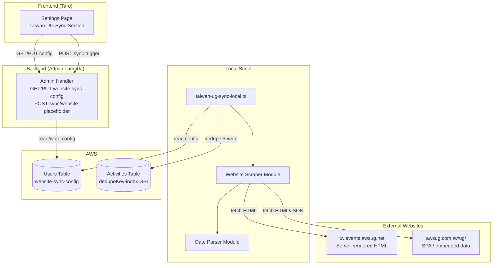

# Design Document: Taiwan UG Sync

## Overview

This feature extends the existing activity sync system to scrape event data from two Taiwan AWS User Group websites and sync them into the Activities DynamoDB table. Unlike the Meetup sync (which uses a GraphQL API), these sources are regular websites requiring HTML scraping.

**Key architectural decisions:**

1. **Local script pattern** — Website scraping runs as a local script (`scripts/taiwan-ug-sync-local.ts`) following the same pattern as `scripts/meetup-sync-local.ts`, because AWS Lambda IPs are blocked by these websites.
2. **Cheerio for HTML parsing** — Server-rendered HTML from `tw.events.awsug.net` is parsed with cheerio. For the SPA site `awsug.com.tw`, we attempt to find embedded data or a JSON API endpoint first, falling back to parsing whatever HTML is available.
3. **Chinese date parsing** — A dedicated `parseTaiwanDate()` module handles Chinese date formats (e.g., "3月12日(四)19:00-21:00") and English mixed formats, returning ISO `YYYY-MM-DD`.
4. **Admin API placeholder** — The "Sync Now" endpoint does NOT scrape websites from Lambda. It returns a message telling the user to run the local script. Actual scraping happens only in the local script.
5. **Config stored in DynamoDB** — Website sync sources are stored in the Users table under key `website-sync-config`, following the same pattern as `meetup-sync-config`.

**Data flow:**

```
┌─────────────────────┐     ┌──────────────────┐     ┌──────────────────┐
│  Settings UI        │────▶│  Admin API       │────▶│  DynamoDB        │
│  (config CRUD)      │     │  (GET/PUT config) │     │  (Users table)   │
└─────────────────────┘     └──────────────────┘     └──────────────────┘

┌─────────────────────┐     ┌──────────────────┐     ┌──────────────────┐
│  Local Script       │────▶│  Website Scraper  │────▶│  DynamoDB        │
│  (taiwan-ug-sync-   │     │  + Date Parser    │     │  (Activities     │
│   local.ts)         │     │  + cheerio        │     │   table)         │
└─────────────────────┘     └──────────────────┘     └──────────────────┘
```

## Architecture

### Component Diagram



### Design Rationale

1. **Why local script instead of Lambda?** — Both Taiwan UG websites block AWS IP ranges (same issue as Meetup). Running from a developer's local machine bypasses this restriction.
2. **Why cheerio instead of Puppeteer?** — Cheerio is lightweight, fast, and sufficient for server-rendered HTML. For the SPA site, we first try to find embedded data or API endpoints rather than running a full browser.
3. **Why a separate date parser module?** — Chinese date formats are complex and varied. Isolating parsing logic makes it independently testable with property-based tests (round-trip verification).
4. **Why placeholder sync endpoint?** — Maintaining API consistency with the Meetup sync pattern. The UI "Sync Now" button saves config; actual sync is done via the local script. The POST endpoint returns a helpful message rather than silently failing.

## Components and Interfaces

### 1. Date Parser (`packages/backend/src/sync/taiwan-date-parser.ts`)

Pure function module for parsing Chinese and mixed-format date strings.

```typescript
/**
 * Parse a Chinese/mixed-format date string into YYYY-MM-DD.
 * Returns null if the string cannot be parsed.
 *
 * Supported formats:
 * - Chinese: "3月12日(四)19:00-21:00", "1月29日(三) | 19:30~21:00"
 * - English: "February 7, 2026 13:30~18:00"
 * - ISO-like: "2024-03-12"
 *
 * Year inference: If no year is present, uses current year.
 * If the resulting date is more than 2 months in the past, uses next year.
 */
export function parseTaiwanDate(dateStr: string, referenceDate?: Date): string | null;
```

### 2. Website Scraper (`packages/backend/src/sync/taiwan-scraper.ts`)

Module for fetching and parsing event data from Taiwan UG websites.

```typescript
export interface ScrapedEvent {
  title: string;
  date: string;        // YYYY-MM-DD
  location?: string;
  sourceUrl: string;
  isUpcoming: boolean;  // true if event is future/coming soon
}

export interface ScrapeResult {
  success: boolean;
  events?: ScrapedEvent[];
  error?: { code: string; message: string };
}

/** Scrape events from tw.events.awsug.net (server-rendered HTML) */
export async function scrapeAwsugNet(url: string): Promise<ScrapeResult>;

/** Scrape events from awsug.com.tw (SPA — try embedded data/API first) */
export async function scrapeAwsugComTw(url: string): Promise<ScrapeResult>;

/** Generic scraper dispatcher based on URL pattern */
export async function scrapeWebsite(url: string): Promise<ScrapeResult>;
```

### 3. Local Sync Script (`scripts/taiwan-ug-sync-local.ts`)

Orchestrates scraping and DynamoDB writes. Follows the pattern of `scripts/meetup-sync-local.ts`.

```typescript
// Main flow:
// 1. Read website-sync-config from DynamoDB (or use hardcoded defaults)
// 2. For each source: scrape → filter past events → dedupe → write
// 3. Log summary

interface WebsiteSyncSource {
  url: string;
  displayName: string;
}

const DEFAULT_SOURCES: WebsiteSyncSource[] = [
  { url: 'https://tw.events.awsug.net/', displayName: 'AWS UG Taiwan' },
  { url: 'https://awsug.com.tw/ug/', displayName: 'AWS UG DevSecOps TW' },
];
```

### 4. Admin API Routes (in `packages/backend/src/admin/handler.ts`)

Three new routes following the existing meetup-sync-config pattern:

| Method | Path | Description |
|--------|------|-------------|
| `GET` | `/api/admin/settings/website-sync-config` | Read current config |
| `PUT` | `/api/admin/settings/website-sync-config` | Update config (validate URLs, max 20 sources) |
| `POST` | `/api/admin/sync/website` | Placeholder — returns message to run local script |

All routes require SuperAdmin role.

### 5. Settings UI (in `packages/frontend/src/pages/admin/settings.tsx`)

A new "Taiwan UG Sync" `CollapsibleSection` within the `activity-sync` category, placed below the Meetup sync section. Follows the same UI pattern:

- Source list with add/remove
- URL + displayName fields per source
- Save button (persists config)
- "Sync Now" button (calls POST endpoint, shows message about local script)
- Last sync timestamp display

### 6. i18n Keys

New translation keys under `activitySync` namespace:

```typescript
// Added to all 5 locale files (zh, en, zh-TW, ja, ko)
websiteSyncSectionTitle: string;
websiteSyncSectionDesc: string;
websiteSourceUrlLabel: string;
websiteSourceUrlPlaceholder: string;
websiteSourceDisplayNameLabel: string;
websiteSourceDisplayNamePlaceholder: string;
websiteAddSource: string;
websiteRemoveSource: string;
websiteSyncButton: string;
websiteSyncing: string;
websiteSyncSuccess: string;
websiteSyncFailed: string;
websiteSyncLocalOnly: string;  // Message: "Please run the local script"
websiteLastSyncLabel: string;
websiteNoSources: string;
websiteUrlValidation: string;  // "URL must start with https://"
websiteMaxSources: string;     // "Maximum 20 sources"
```

## Data Models

### Website Sync Config (DynamoDB Users Table)

Stored with `userId: 'website-sync-config'`, following the same pattern as `meetup-sync-config`.

```typescript
interface WebsiteSyncConfig {
  userId: string;              // 'website-sync-config' (partition key)
  sources: WebsiteSyncSource[];
  updatedAt: string;           // ISO timestamp
  updatedBy: string;           // user ID
  lastSyncTime?: string;       // ISO timestamp of last successful sync
  lastSyncResult?: string;     // 'success' | 'error'
  lastSyncSummary?: string;    // e.g., "synced=5, skipped=12"
}

interface WebsiteSyncSource {
  url: string;                 // Must start with https://
  displayName: string;         // Non-empty string
}
```

### Activity Record (DynamoDB Activities Table)

Uses the existing Activities table schema. New records from Taiwan UG sync:

| Field | Value | Notes |
|-------|-------|-------|
| `activityId` | ULID | Generated per record |
| `pk` | `"ALL"` | Required for activityDate-index GSI |
| `activityType` | `"线下活动"` | Fixed value, same as Meetup |
| `ugName` | Source displayName | e.g., "AWS UG Taiwan" |
| `topic` | Event title | Scraped from HTML |
| `activityDate` | `YYYY-MM-DD` | Parsed by Date Parser |
| `dedupeKey` | `{topic}#{activityDate}#{ugName}` | Existing format |
| `syncedAt` | ISO timestamp | When the sync ran |
| `sourceUrl` | Website URL | The source website URL |

No schema changes to the Activities table are needed.


## Correctness Properties

*A property is a characteristic or behavior that should hold true across all valid executions of a system — essentially, a formal statement about what the system should do. Properties serve as the bridge between human-readable specifications and machine-verifiable correctness guarantees.*

### Property 1: Date parsing round-trip

*For any* valid date in YYYY-MM-DD format, converting it to a string and re-parsing with `parseTaiwanDate` SHALL produce the same YYYY-MM-DD string.

**Validates: Requirements 2.5**

### Property 2: Chinese and English date parsing correctness

*For any* randomly generated valid date (year, month, day), formatting it as a Chinese date string (e.g., "X月Y日") or an English date string (e.g., "Month D, YYYY") and parsing with `parseTaiwanDate` SHALL extract the correct month and day (and year when explicitly present).

**Validates: Requirements 2.1, 2.2, 2.3**

### Property 3: Invalid date strings return null

*For any* string that does not match any supported date format (random alphanumeric strings, empty strings, numeric-only strings), `parseTaiwanDate` SHALL return null.

**Validates: Requirements 2.4**

### Property 4: Event data mapping preserves all fields

*For any* scraped event with a valid title, date, and source URL, and *for any* sync source with a displayName, the mapped activity record SHALL have: `activityType` equal to `"线下活动"`, `ugName` equal to the source's `displayName`, `topic` equal to the event's title, `activityDate` equal to the event's parsed date, `sourceUrl` equal to the source URL, and `dedupeKey` equal to `{topic}#{activityDate}#{ugName}`.

**Validates: Requirements 3.1, 3.2, 3.3, 3.4, 3.5, 3.6**

### Property 5: Future event filtering

*For any* list of events where some have dates in the future and some have dates in the past, applying the past-event filter SHALL include only events with dates on or before today and exclude all events with future dates.

**Validates: Requirements 4.2**

### Property 6: Scraper handles arbitrary HTML gracefully

*For any* arbitrary HTML string (including empty strings, random text, malformed HTML), the scraper's HTML parsing function SHALL either return valid event data or an empty event list, and SHALL NOT throw an exception.

**Validates: Requirements 1.5, 12.2**

### Property 7: Events missing required fields are skipped

*For any* list of scraped raw event objects where some are missing a title or date field, the event validation/filtering step SHALL exclude all events missing required fields and include only events with both title and date present.

**Validates: Requirements 12.3**

## Error Handling

### Scraper Errors

| Error Scenario | Handling | User Impact |
|---|---|---|
| HTTP 4xx/5xx from website | Return `ScrapeResult` with `success: false`, include status code | Script logs error, continues to next source |
| Network timeout (15s) | Return `ScrapeResult` with `success: false`, timeout error | Script logs error, continues to next source |
| HTML structure changed (no events found) | Return `ScrapeResult` with `success: true`, empty events list | Script logs warning, continues |
| Date parsing failure | `parseTaiwanDate` returns `null`, event is skipped | Script logs warning per skipped event |
| Missing required fields (title/date) | Event is skipped during mapping | Script logs warning per skipped event |

### Admin API Errors

| Error Scenario | HTTP Status | Response |
|---|---|---|
| Non-SuperAdmin access | 403 | `{ code: 'FORBIDDEN', message: '需要超级管理员权限' }` |
| Invalid request body | 400 | `{ code: 'INVALID_REQUEST', message: '<specific validation error>' }` |
| URL not starting with `https://` | 400 | `{ code: 'INVALID_REQUEST', message: 'URL 必须以 https:// 开头' }` |
| More than 20 sources | 400 | `{ code: 'INVALID_REQUEST', message: '最多支持 20 个同步源' }` |
| Empty displayName | 400 | `{ code: 'INVALID_REQUEST', message: 'displayName 不能为空' }` |
| DynamoDB read/write failure | 500 | `{ code: 'INTERNAL_ERROR', message: '服务器内部错误' }` |

### Local Script Error Isolation

The local script follows per-source error isolation (same pattern as Meetup sync):
- If source A fails, log the error and continue to source B
- If a single event fails to write, log and continue to the next event
- Always print a final summary with counts per source

## Testing Strategy

### Unit Tests (Example-Based)

| Test Area | Test Cases |
|---|---|
| Date Parser | Chinese format "3月12日", English format "February 7, 2026", pipe-separated format, edge cases (Dec 31 → Jan 1 year inference) |
| Scraper — tw.events.awsug.net | Mock HTML with known event cards, verify parsed events match expected |
| Scraper — awsug.com.tw | Mock HTML/JSON with known events, verify parsed events |
| Scraper — error cases | HTTP 404, timeout, empty HTML, malformed HTML |
| Event filtering | "COMING SOON" events skipped, "已截止"/"已結束" events included, future dates skipped |
| Admin API routes | GET returns config, PUT validates and saves, POST returns placeholder message, 403 for non-SuperAdmin |
| Config validation | URL format, displayName non-empty, max 20 sources, min 1 source |

### Property-Based Tests

Property-based tests use `fast-check` (already available in the project via vitest). Each test runs a minimum of 100 iterations.

| Property | Test File | Tag |
|---|---|---|
| Property 1: Date round-trip | `packages/backend/src/sync/taiwan-date-parser.property.test.ts` | Feature: taiwan-ug-sync, Property 1: Date parsing round-trip |
| Property 2: Chinese/English parsing | `packages/backend/src/sync/taiwan-date-parser.property.test.ts` | Feature: taiwan-ug-sync, Property 2: Chinese and English date parsing correctness |
| Property 3: Invalid dates → null | `packages/backend/src/sync/taiwan-date-parser.property.test.ts` | Feature: taiwan-ug-sync, Property 3: Invalid date strings return null |
| Property 4: Mapping preserves fields | `packages/backend/src/sync/taiwan-scraper.property.test.ts` | Feature: taiwan-ug-sync, Property 4: Event data mapping preserves all fields |
| Property 5: Future event filtering | `packages/backend/src/sync/taiwan-scraper.property.test.ts` | Feature: taiwan-ug-sync, Property 5: Future event filtering |
| Property 6: Arbitrary HTML handling | `packages/backend/src/sync/taiwan-scraper.property.test.ts` | Feature: taiwan-ug-sync, Property 6: Scraper handles arbitrary HTML gracefully |
| Property 7: Missing fields skipped | `packages/backend/src/sync/taiwan-scraper.property.test.ts` | Feature: taiwan-ug-sync, Property 7: Events missing required fields are skipped |

### Integration Tests

| Test Area | Approach |
|---|---|
| Admin API — website-sync-config CRUD | Mock DynamoDB, test GET/PUT/POST routes (same pattern as `meetup-config.test.ts`) |
| Local script — end-to-end | Mock fetch + DynamoDB, verify full scrape → dedupe → write flow |

### Test Configuration

- Property-based tests: minimum 100 iterations per property
- Test runner: vitest (existing project configuration)
- PBT library: fast-check (existing dependency)
- Each property test tagged with: `Feature: taiwan-ug-sync, Property {N}: {title}`
