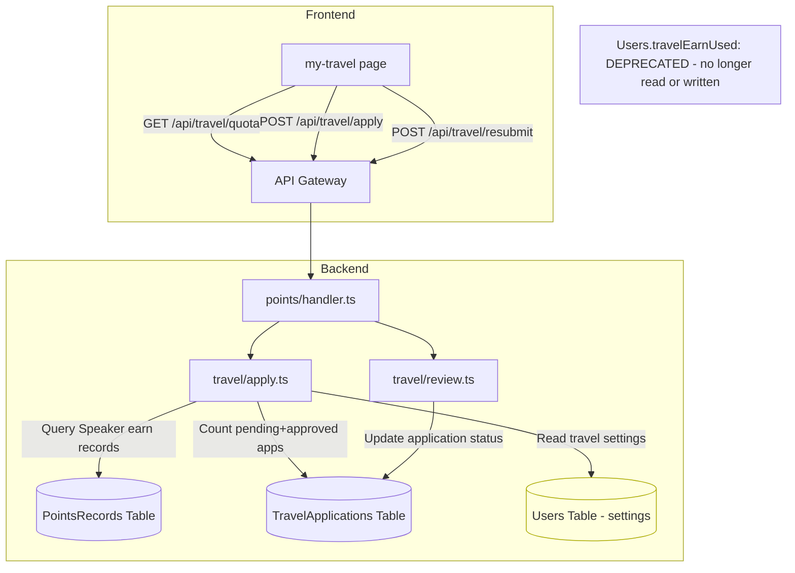

# Design Document: Travel Independent Quota

## Overview

The current travel sponsorship system uses a shared `travelEarnUsed` counter on the Users table to track quota consumption across both domestic and international categories. This creates a coupling problem: consuming a domestic quota reduces international availability and vice versa, because both categories deduct from the same counter.

This design replaces the shared counter with independent per-category quota calculation. Instead of maintaining a mutable `travelEarnUsed` field, the system derives used counts directly from the TravelApplications table by counting pending + approved applications per category. The new formula for each category is:

```
available = max(0, floor(earnTotal / categoryThreshold) - categoryUsedCount)
```

Key changes:
- **New `calculateAvailableCount` signature**: accepts `(earnTotal, threshold, categoryUsedCount)` instead of `(earnTotal, travelEarnUsed, threshold)`
- **`getTravelQuota` stops reading `travelEarnUsed`** from the Users table
- **`submitTravelApplication` and `resubmitTravelApplication` stop writing `travelEarnUsed`** — no more TransactWriteCommand for user record updates
- **`reviewTravelApplication` reject flow stops refunding `travelEarnUsed`** — uses a simple UpdateCommand instead of TransactWriteCommand
- **`TravelQuota` interface removes `travelEarnUsed` property**
- **Frontend removes any reference to `travelEarnUsed`**

The `travelEarnUsed` field is deprecated (stop reading/writing) but not physically removed from existing DynamoDB records.

## Architecture

The change is localized to the travel sponsorship subsystem. No new services or tables are introduced.



**Data flow for quota calculation (new):**
1. Query `PointsRecords` for Speaker earn total → `earnTotal`
2. Query `TravelApplications` for pending+approved count per category → `domesticUsedCount`, `internationalUsedCount`
3. Read travel settings → `domesticThreshold`, `internationalThreshold`
4. Calculate: `domesticAvailable = max(0, floor(earnTotal / domesticThreshold) - domesticUsedCount)`
5. Calculate: `internationalAvailable = max(0, floor(earnTotal / internationalThreshold) - internationalUsedCount)`

**Data flow for submit (new):**
1. Calculate category-specific availability using the new formula
2. If available < 1, return INSUFFICIENT_EARN_QUOTA
3. Create TravelApplication record (single Put, no user record update)

**Data flow for reject (new):**
1. Update application status to "rejected" with a single UpdateCommand
2. No `travelEarnUsed` refund needed

## Components and Interfaces

### 1. `calculateAvailableCount` (pure function — signature change)

**Current signature:**
```typescript
function calculateAvailableCount(earnTotal: number, travelEarnUsed: number, threshold: number): number
```

**New signature:**
```typescript
function calculateAvailableCount(earnTotal: number, threshold: number, categoryUsedCount: number): number
```

**Logic:**
```typescript
if (threshold === 0) return 0;
const totalQuota = Math.floor(earnTotal / threshold);
return Math.max(0, totalQuota - categoryUsedCount);
```

### 2. `getTravelQuota` (async function — remove travelEarnUsed read)

**Changes:**
- Remove the `GetCommand` that reads `travelEarnUsed` from the Users table
- Call `calculateAvailableCount` with the new signature: `(earnTotal, threshold, categoryUsedCount)`
- Remove `travelEarnUsed` from the returned `TravelQuota` object
- The `travelApplicationsTable` parameter becomes required (no longer optional)

### 3. `submitTravelApplication` (async function — remove travelEarnUsed write)

**Changes:**
- Remove the `GetCommand` that reads `travelEarnUsed` from the Users table
- Count pending+approved applications for the target category to get `categoryUsedCount`
- Use `calculateAvailableCount(earnTotal, threshold, categoryUsedCount)` for availability check
- Replace `TransactWriteCommand` (Put + Update) with a single `PutCommand` for the application record
- Remove `earnDeducted` field from the application record (no longer meaningful)

### 4. `resubmitTravelApplication` (async function — remove travelEarnUsed write)

**Changes:**
- Remove the `GetCommand` that reads `travelEarnUsed` from the Users table
- Count pending+approved applications for the new category (excluding the current rejected application) to get `categoryUsedCount`
- Use `calculateAvailableCount(earnTotal, newThreshold, categoryUsedCount)` for availability check
- Replace `TransactWriteCommand` (Put + Update) with a single `PutCommand` for the application record
- Remove `earnDeducted` field from the updated application record

### 5. `reviewTravelApplication` — reject path (async function — simplify)

**Changes:**
- Replace `TransactWriteCommand` (Update application + Update user travelEarnUsed) with a single `UpdateCommand` on the application record
- Remove the user record update that decrements `travelEarnUsed`

### 6. `TravelQuota` interface (shared types)

**Current:**
```typescript
export interface TravelQuota {
  speakerEarnTotal: number;
  travelEarnUsed: number;
  domesticAvailable: number;
  internationalAvailable: number;
  domesticThreshold: number;
  internationalThreshold: number;
  domesticUsedCount: number;
  internationalUsedCount: number;
}
```

**New:**
```typescript
export interface TravelQuota {
  speakerEarnTotal: number;
  domesticAvailable: number;
  internationalAvailable: number;
  domesticThreshold: number;
  internationalThreshold: number;
  domesticUsedCount: number;
  internationalUsedCount: number;
}
```

### 7. `TravelApplication` interface (shared types)

**Change:** The `earnDeducted` field becomes optional/deprecated. New applications will not include it. Existing records in DynamoDB may still have it but it will not be read for quota logic.

### 8. Frontend `my-travel/index.tsx`

**Changes:**
- Remove any reference to `quota.travelEarnUsed` in the template
- The page already displays `domesticAvailable`, `internationalAvailable`, `domesticUsedCount`, `internationalUsedCount` — these remain unchanged

## Data Models

### TravelQuota (API response — changed)

| Field | Type | Change |
|-------|------|--------|
| speakerEarnTotal | number | No change |
| ~~travelEarnUsed~~ | ~~number~~ | **Removed** |
| domesticAvailable | number | Now calculated as `max(0, floor(earnTotal/domesticThreshold) - domesticUsedCount)` |
| internationalAvailable | number | Now calculated as `max(0, floor(earnTotal/internationalThreshold) - internationalUsedCount)` |
| domesticThreshold | number | No change |
| internationalThreshold | number | No change |
| domesticUsedCount | number | No change (already derived from applications) |
| internationalUsedCount | number | No change (already derived from applications) |

### TravelApplication (DynamoDB record — minor change)

| Field | Type | Change |
|-------|------|--------|
| applicationId | string | No change |
| userId | string | No change |
| category | 'domestic' \| 'international' | No change |
| status | TravelApplicationStatus | No change |
| earnDeducted | number | **Deprecated** — new records omit this field; existing records retain it |
| (all other fields) | — | No change |

### Users table (DynamoDB — deprecation)

| Field | Type | Change |
|-------|------|--------|
| travelEarnUsed | number | **Deprecated** — no longer read or written; existing values remain in place |

## Correctness Properties

*A property is a characteristic or behavior that should hold true across all valid executions of a system — essentially, a formal statement about what the system should do. Properties serve as the bridge between human-readable specifications and machine-verifiable correctness guarantees.*

### Property 1: Quota calculation correctness

*For any* non-negative integer `earnTotal`, non-negative integer `threshold`, and non-negative integer `categoryUsedCount`:
- If `threshold === 0`, the result SHALL be `0`
- If `threshold > 0`, the result SHALL be `max(0, floor(earnTotal / threshold) - categoryUsedCount)`

**Validates: Requirements 1.1, 1.2, 1.3, 2.1, 2.2, 2.3**

### Property 2: Used count derivation from applications

*For any* set of travel application records with mixed statuses (`pending`, `approved`, `rejected`) and mixed categories (`domestic`, `international`), the `domesticUsedCount` SHALL equal the count of records where `status ∈ {pending, approved}` AND `category = domestic`, and the `internationalUsedCount` SHALL equal the count of records where `status ∈ {pending, approved}` AND `category = international`.

**Validates: Requirements 1.4, 2.4**

### Property 3: Category independence

*For any* valid `earnTotal`, `domesticThreshold`, `internationalThreshold`, `domesticUsedCount`, and two different `internationalUsedCount` values, the computed `domesticAvailable` SHALL be identical regardless of `internationalUsedCount`. Symmetrically, `internationalAvailable` SHALL be identical regardless of `domesticUsedCount`.

**Validates: Requirements 8.1, 8.2, 8.5**

### Property 4: Available plus used does not exceed total quota

*For any* valid `earnTotal`, positive `threshold`, and non-negative `categoryUsedCount`, the result of `calculateAvailableCount(earnTotal, threshold, categoryUsedCount) + categoryUsedCount` SHALL be less than or equal to `floor(earnTotal / threshold)`.

**Validates: Requirements 8.3, 8.4**

### Property 5: Submit and resubmit availability gate

*For any* category, `earnTotal`, `categoryThreshold > 0`, and `categoryUsedCount`, a travel application submission SHALL succeed if and only if `categoryUsedCount < floor(earnTotal / categoryThreshold)`. When the condition is not met, the handler SHALL return an `INSUFFICIENT_EARN_QUOTA` error.

**Validates: Requirements 4.1, 4.2, 4.3, 5.1, 5.2**

### Property 6: Reject preserves required output fields

*For any* pending travel application and any non-empty reject reason string, after rejection the returned application SHALL have `status = 'rejected'`, a non-empty `rejectReason`, a valid `reviewerId`, a valid `reviewerNickname`, and a valid ISO timestamp `reviewedAt`.

**Validates: Requirements 6.1**

## Error Handling

| Scenario | Error Code | Message | HTTP Status |
|----------|-----------|---------|-------------|
| Category-specific quota exhausted on submit | `INSUFFICIENT_EARN_QUOTA` | 积分配额不足 | 400 |
| Category-specific quota exhausted on resubmit | `INSUFFICIENT_EARN_QUOTA` | 积分配额不足 | 400 |
| Travel sponsorship feature disabled | `FEATURE_DISABLED` | 功能未启用 | 403 |
| Application not found (resubmit) | `APPLICATION_NOT_FOUND` | 申请不存在 | 404 |
| Application not in rejected status (resubmit) | `INVALID_APPLICATION_STATUS` | 申请状态不允许此操作 | 400 |
| Application not owned by user (resubmit) | `FORBIDDEN` | 无权编辑此申请 | 403 |
| Application already reviewed (review) | `APPLICATION_ALREADY_REVIEWED` | 申请已审核 | 400 |

**Deprecation handling:** If existing code elsewhere reads `travelEarnUsed` from a user record, it will still find the old value. Since we stop writing to it, the value becomes stale but harmless. No migration is needed — the field is simply ignored going forward.

**Race condition note:** Without the `TransactWriteCommand` atomic deduction, two concurrent submissions could both pass the availability check. This is acceptable because:
1. The used count is derived from actual application records, so the quota will be correctly reflected after both writes complete.
2. In the worst case, a user gets one extra application through, which an admin can reject.
3. The previous system had the same race window between the read and the transaction.

## Testing Strategy

### Property-Based Tests (fast-check, vitest)

Each property test runs a minimum of 100 iterations. The project already uses `fast-check` with `vitest` for property-based testing (see existing `apply.property.test.ts`).

| Property | Test File | What Varies |
|----------|-----------|-------------|
| P1: Quota calculation correctness | `apply.property.test.ts` | earnTotal, threshold, categoryUsedCount |
| P2: Used count derivation | `apply.property.test.ts` | Array of application records with mixed statuses/categories |
| P3: Category independence | `apply.property.test.ts` | earnTotal, thresholds, usedCounts for both categories |
| P4: Available + used invariant | `apply.property.test.ts` | earnTotal, threshold, categoryUsedCount |
| P5: Submit/resubmit availability gate | `apply.property.test.ts` | earnTotal, threshold, categoryUsedCount, category |
| P6: Reject output fields | `review.property.test.ts` | Application data, reject reason, reviewer info |

**Tag format:** `Feature: travel-independent-quota, Property {N}: {title}`

### Unit Tests (example-based)

| Test | File | What's Verified |
|------|------|-----------------|
| getTravelQuota does not read travelEarnUsed | `apply.test.ts` | No GetCommand for travelEarnUsed on Users table |
| submitTravelApplication uses PutCommand (no TransactWrite) | `apply.test.ts` | Command type is PutCommand, no Users table update |
| resubmitTravelApplication uses PutCommand (no TransactWrite) | `apply.test.ts` | Command type is PutCommand, no Users table update |
| reviewTravelApplication reject uses UpdateCommand (no TransactWrite) | `review.test.ts` | Command type is UpdateCommand, no Users table update |
| reviewTravelApplication approve unchanged | `review.test.ts` | Approve still uses UpdateCommand, no travelEarnUsed write |
| TravelQuota type excludes travelEarnUsed | Compile-time | TypeScript compilation catches references |

### Integration / Smoke Tests

| Test | What's Verified |
|------|-----------------|
| Frontend compiles without travelEarnUsed references | TypeScript build of frontend package |
| Existing property tests still pass | Run full test suite to catch regressions |

