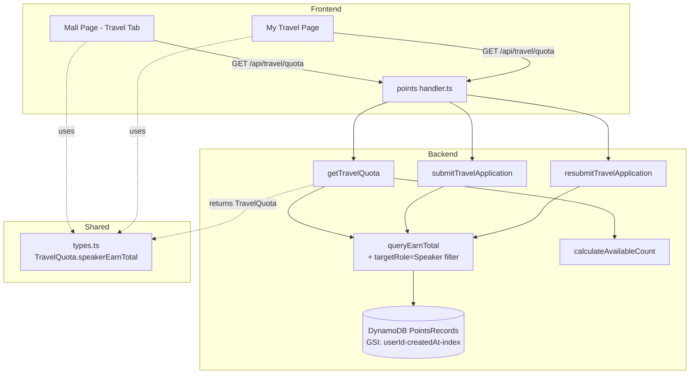

# Design: 差旅 Tab 积分逻辑调整（Speaker 角色积分）

## Overview

本设计将差旅赞助资格判定逻辑从"统计所有 earn 积分"调整为"仅统计 Speaker 角色获得的积分"。变更涉及三层：

1. **后端**：修改 `queryEarnTotal` 函数，在 DynamoDB FilterExpression 中增加 `targetRole = "Speaker"` 条件
2. **共享类型**：将 `TravelQuota.earnTotal` 重命名为 `speakerEarnTotal`，明确语义
3. **前端**：在差旅卡片和我的差旅页面展示 Speaker 积分进度与明细，更新相关 i18n 文案

变更范围小且集中，不涉及新 API 端点或数据库 schema 变更，仅调整现有查询过滤条件和字段命名。

## Architecture



变更流程：
1. `queryEarnTotal` 增加 `targetRole = "Speaker"` 过滤 → 返回值语义从"所有 earn 总和"变为"Speaker earn 总和"
2. `TravelQuota` 接口 `earnTotal` → `speakerEarnTotal`，所有消费方同步更新
3. 前端读取 `speakerEarnTotal` 展示积分进度和明细

## Components and Interfaces

### 1. Backend: `queryEarnTotal` (packages/backend/src/travel/apply.ts)

**当前实现**：
```typescript
FilterExpression: '#t = :earn',
ExpressionAttributeNames: { '#t': 'type' },
ExpressionAttributeValues: { ':uid': userId, ':earn': 'earn' },
```

**目标实现**：
```typescript
FilterExpression: '#t = :earn AND #tr = :speaker',
ExpressionAttributeNames: { '#t': 'type', '#tr': 'targetRole' },
ExpressionAttributeValues: { ':uid': userId, ':earn': 'earn', ':speaker': 'Speaker' },
```

函数签名不变，返回值语义变更为仅 Speaker 角色积分总和。

### 2. Shared Types: `TravelQuota` (packages/shared/src/types.ts)

**当前接口**：
```typescript
export interface TravelQuota {
  earnTotal: number;          // ← 重命名
  travelEarnUsed: number;
  domesticAvailable: number;
  internationalAvailable: number;
  domesticThreshold: number;
  internationalThreshold: number;
}
```

**目标接口**：
```typescript
export interface TravelQuota {
  speakerEarnTotal: number;   // ← 仅 Speaker 角色 earn 总和
  travelEarnUsed: number;
  domesticAvailable: number;
  internationalAvailable: number;
  domesticThreshold: number;
  internationalThreshold: number;
}
```

### 3. Backend: `getTravelQuota` 返回值更新

将 `return { earnTotal, ... }` 改为 `return { speakerEarnTotal: earnTotal, ... }`。

### 4. Frontend: Mall Page 差旅卡片 (packages/frontend/src/pages/index/index.tsx)

在 `renderTravelCard` 中新增 Speaker 积分进度行：
- 显示格式：`Speaker 积分: {speakerEarnTotal}/{threshold}`
- 颜色逻辑：`speakerEarnTotal >= threshold` 时用 `--success`，否则用 `--text-secondary`
- 更新门槛文案：从 `travelThreshold` 改为 `travelSpeakerThreshold`
- 更新积分不足文案：从 `travelInsufficientPoints` 改为 `travelSpeakerInsufficientPoints`

### 5. Frontend: My Travel Page (packages/frontend/src/pages/my-travel/index.tsx)

在配额概览区域新增 Speaker 积分明细卡片组：
- 第一行：Speaker 累计获得 (`speakerEarnTotal`) | 已消耗 (`travelEarnUsed`)
- 第二行：国内门槛 (`domesticThreshold`) | 国际门槛 (`internationalThreshold`)
- 保留现有的"国内 X 次 / 国际 Y 次"可用次数卡片

### 6. i18n 更新

新增/修改翻译键（5 种语言：zh、en、ja、ko、zh-TW）：

| 键 | 用途 |
|---|---|
| `mall.travelSpeakerPoints` | 差旅卡片 Speaker 积分进度 |
| `mall.travelSpeakerThreshold` | 差旅卡片门槛文案（替换 travelThreshold） |
| `mall.travelSpeakerInsufficientPoints` | 积分不足提示（替换 travelInsufficientPoints） |
| `travel.myTravel.speakerEarnTotal` | 我的差旅 - Speaker 累计获得 |
| `travel.myTravel.travelEarnUsed` | 我的差旅 - 已消耗积分 |
| `travel.myTravel.domesticThresholdLabel` | 我的差旅 - 国内门槛 |
| `travel.myTravel.internationalThresholdLabel` | 我的差旅 - 国际门槛 |

## Data Models

### PointsRecords 表（DynamoDB）

现有字段，无 schema 变更：

| 字段 | 类型 | 说明 |
|---|---|---|
| recordId | string | PK |
| userId | string | GSI partition key |
| type | string | "earn" / "spend" |
| targetRole | string | "Speaker" / "UserGroupLeader" / "Volunteer" |
| amount | number | 积分数量 |
| createdAt | string | GSI sort key |

查询变更：在 GSI `userId-createdAt-index` 的 FilterExpression 中增加 `targetRole = "Speaker"` 条件。

### TravelQuota 响应结构

```typescript
{
  speakerEarnTotal: number;      // 仅 Speaker 角色 earn 总和（原 earnTotal）
  travelEarnUsed: number;        // 差旅已消耗配额（不变）
  domesticAvailable: number;     // floor((speakerEarnTotal - travelEarnUsed) / domesticThreshold)
  internationalAvailable: number; // floor((speakerEarnTotal - travelEarnUsed) / internationalThreshold)
  domesticThreshold: number;     // 不变
  internationalThreshold: number; // 不变
}
```


## Correctness Properties

*A property is a characteristic or behavior that should hold true across all valid executions of a system — essentially, a formal statement about what the system should do. Properties serve as the bridge between human-readable specifications and machine-verifiable correctness guarantees.*

### Property 1: Speaker-only earn total filtering

*For any* user with a set of PointsRecords containing mixed `targetRole` values (Speaker, UserGroupLeader, Volunteer, or undefined), `queryEarnTotal` SHALL return the sum of `amount` only for records where `type = "earn"` AND `targetRole = "Speaker"`. Records with other targetRole values or type values SHALL be excluded from the total.

**Validates: Requirements 1.1, 1.3, 1.4, 2.4**

### Property 2: Quota calculation uses Speaker-filtered earn total

*For any* non-negative integers `speakerEarnTotal` and `travelEarnUsed`, and positive integer `threshold`, the available travel count SHALL equal `floor((speakerEarnTotal - travelEarnUsed) / threshold)` when `speakerEarnTotal >= travelEarnUsed`, and 0 otherwise. This property is unchanged from the existing `calculateAvailableCount` but now operates on Speaker-filtered input.

**Validates: Requirements 2.4**

> Note: This property is already covered by the existing `apply.property.test.ts` Property 3. The only change is that the `earnTotal` input now comes from Speaker-filtered data (validated by Property 1). No new test is needed for this property.

## Error Handling

### Backend

| 场景 | 处理方式 |
|---|---|
| 用户无 Speaker 角色 earn 记录 | `queryEarnTotal` 返回 0，`calculateAvailableCount` 返回 0，前端显示可用次数为 0 |
| `targetRole` 字段不存在（旧数据） | FilterExpression `targetRole = "Speaker"` 自动排除无此字段的记录，返回 0 |
| DynamoDB 查询分页 | 现有 do-while 分页逻辑不变，每页都应用相同的 FilterExpression |

### Frontend

| 场景 | 处理方式 |
|---|---|
| `speakerEarnTotal` 为 0 | 正常显示 "Speaker 积分: 0/{threshold}"，积分进度文本使用次要色 |
| quota 接口请求失败 | 保持现有降级逻辑：显示 "-" 占位符 |
| 非 Speaker 用户访问差旅 Tab | 保持现有逻辑：显示锁定状态和"仅 Speaker 可申请"提示 |

## Testing Strategy

### 单元测试（Example-based）

| 测试项 | 文件 | 说明 |
|---|---|---|
| queryEarnTotal FilterExpression 验证 | `apply.test.ts` | 验证 DynamoDB QueryCommand 包含 targetRole=Speaker 过滤条件 |
| getTravelQuota 返回 speakerEarnTotal 字段 | `apply.test.ts` | 验证响应结构包含 speakerEarnTotal 而非 earnTotal |
| 无 Speaker 记录时返回 0 | `apply.test.ts` | 边界情况：空结果集 |
| i18n 新增键存在性 | 现有 i18n 测试 | 验证所有语言文件包含新增翻译键 |

### 属性测试（Property-based）

| 属性 | 文件 | 说明 |
|---|---|---|
| Property 1: Speaker-only earn total filtering | `apply.property.test.ts` | 生成混合 targetRole 的 PointsRecords，验证仅 Speaker 记录被汇总 |

- PBT 库：`fast-check`
- 最少迭代次数：100
- 标签格式：`Feature: travel-speaker-points, Property 1: Speaker-only earn total filtering`

### 现有测试更新

以下现有测试需要更新以适配 `speakerEarnTotal` 字段重命名：
- `packages/backend/src/travel/apply.property.test.ts` — Property 5 和 Property 11 中的 mock 数据需确保 queryEarnTotal 的 mock 返回值语义正确
- `packages/shared/src/types.test.ts` — 如有 TravelQuota 相关测试需同步更新

### 编译验证

- TypeScript 编译通过即可验证所有 `earnTotal` → `speakerEarnTotal` 的重命名完整性（Requirements 6.1-6.4）
