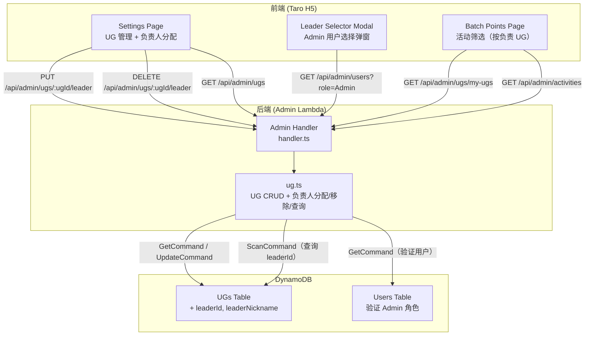

# 设计文档：UG 负责人分配（UG Leader Assignment）

## Overview

本功能为社区积分商城系统的 UG（User Group）管理新增负责人分配能力，包含以下核心模块：

1. **负责人数据存储**：在现有 UGs DynamoDB 表的 UG 记录中新增 `leaderId` 和 `leaderNickname` 可选字段，无需新建表。
2. **负责人分配/移除 API**：SuperAdmin 通过 PUT/DELETE `/api/admin/ugs/{ugId}/leader` 接口分配或移除负责人，分配时验证目标用户存在且拥有 Admin 角色。
3. **查询当前用户负责的 UG**：Admin 用户通过 GET `/api/admin/ugs/my-ugs` 查询自己作为负责人的 UG 列表，用于批量发放页面的活动筛选。
4. **前端 UG 管理区域扩展**：Settings 页面的 UG 管理列表中展示负责人信息，提供分配/更换/移除负责人的弹窗交互。
5. **批量发放页面活动筛选**：Admin 用户仅能看到自己所负责 UG 关联的活动，SuperAdmin 不受限制。

### 关键设计决策

1. **单一负责人模型**：每个 UG 最多一名负责人（`leaderId` 为单值字段，非数组），简化数据模型和权限逻辑。一个 Admin 可同时担任多个 UG 的负责人。
2. **复用现有 UGs 表**：`leaderId` 和 `leaderNickname` 作为可选字段添加到现有 UG 记录中，向后兼容——未分配负责人的 UG 记录不受影响。
3. **昵称快照策略**：`leaderNickname` 在分配时从 Users 表读取并写入 UG 记录，避免每次查询 UG 列表时 join Users 表。如果用户后续修改昵称，UG 记录中的快照不会自动更新（可接受的 trade-off）。
4. **活动筛选在前端执行**：批量发放页面先调用 `GET /api/admin/ugs/my-ugs` 获取负责 UG 名称列表，再用该列表在前端过滤活动。复用现有 `filterActivities` 纯函数逻辑，仅替换 `activeUGNames` 数据源。
5. **幂等移除操作**：移除负责人时，如果 UG 当前未分配负责人，仍返回成功，简化前端错误处理。

## Architecture



### 请求流程

1. **分配负责人**：Settings Page → 点击"分配负责人"按钮 → 弹出 Leader Selector Modal → 选择 Admin 用户 → PUT `/api/admin/ugs/{ugId}/leader` `{ leaderId }` → Admin Handler → `ug.ts#assignLeader` → 验证用户存在且为 Admin → UpdateCommand 更新 UG 记录的 leaderId、leaderNickname、updatedAt
2. **更换负责人**：Settings Page → 点击"更换负责人"按钮（已有负责人时显示）→ 弹出 Leader Selector Modal → 选择新的 Admin 用户 → PUT `/api/admin/ugs/{ugId}/leader` `{ leaderId }` → 同上流程，`assignLeader` 直接覆盖原有 leaderId 和 leaderNickname（无需先移除再分配）
3. **移除负责人**：Settings Page → Leader Selector Modal 中点击"移除负责人" → DELETE `/api/admin/ugs/{ugId}/leader` → Admin Handler → `ug.ts#removeLeader` → UpdateCommand 清空 leaderId、leaderNickname、更新 updatedAt
4. **查询负责 UG**：Batch Points Page 加载 → GET `/api/admin/ugs/my-ugs` → Admin Handler → `ug.ts#getMyUGs` → ScanCommand 扫描 leaderId = currentUserId 且 status = active 的 UG 记录
5. **活动筛选**：Batch Points Page → 用 my-ugs 返回的 UG 名称列表替代原有 activeUGNames → 复用 `filterActivities` 函数过滤活动

## Components and Interfaces

### Backend Module: `packages/backend/src/admin/ug.ts`（扩展）

```typescript
/** 分配负责人输入 */
export interface AssignLeaderInput {
  ugId: string;
  leaderId: string;
}

/** 分配负责人结果 */
export interface AssignLeaderResult {
  success: boolean;
  error?: { code: string; message: string };
}

/**
 * 分配或更换 UG 负责人
 * 1. GetCommand 检查 UG 存在
 * 2. GetCommand 检查 leaderId 对应用户存在且拥有 Admin 角色
 * 3. UpdateCommand 更新 leaderId、leaderNickname、updatedAt
 * 注意：如果 UG 已有负责人，直接覆盖（更换），无需先移除
 */
export async function assignLeader(
  input: AssignLeaderInput,
  dynamoClient: DynamoDBDocumentClient,
  ugsTable: string,
  usersTable: string,
): Promise<AssignLeaderResult>;

/**
 * 移除 UG 负责人
 * 1. GetCommand 检查 UG 存在
 * 2. UpdateCommand 清空 leaderId、leaderNickname（REMOVE 表达式），更新 updatedAt
 * 3. 幂等：UG 未分配负责人时仍返回成功
 */
export async function removeLeader(
  ugId: string,
  dynamoClient: DynamoDBDocumentClient,
  ugsTable: string,
): Promise<{ success: boolean; error?: { code: string; message: string } }>;

/**
 * 查询当前用户作为负责人的 UG 列表
 * 1. ScanCommand 扫描 UGs 表，FilterExpression: leaderId = :userId AND status = :active
 * 2. 返回匹配的 UG 记录列表
 */
export async function getMyUGs(
  userId: string,
  dynamoClient: DynamoDBDocumentClient,
  ugsTable: string,
): Promise<{ success: boolean; ugs?: UGRecord[]; error?: { code: string; message: string } }>;
```

### Admin Handler Routes（新增路由）

| Method | Path | Handler | Permission |
|--------|------|---------|------------|
| PUT | `/api/admin/ugs/{ugId}/leader` | `handleAssignLeader` | SuperAdmin |
| DELETE | `/api/admin/ugs/{ugId}/leader` | `handleRemoveLeader` | SuperAdmin |
| GET | `/api/admin/ugs/my-ugs` | `handleGetMyUGs` | Admin / SuperAdmin |

路由正则：
```typescript
const UGS_LEADER_REGEX = /^\/api\/admin\/ugs\/([^/]+)\/leader$/;
```

`GET /api/admin/ugs/my-ugs` 为精确路径匹配，需在 `UGS_DELETE_REGEX` 之前判断以避免被 `/api/admin/ugs/{ugId}` 模式误匹配。

### Shared Types 扩展（`packages/shared/src/types.ts`）

```typescript
/** UG 记录（扩展负责人字段） */
export interface UGRecord {
  ugId: string;
  name: string;
  status: 'active' | 'inactive';
  leaderId?: string;        // 新增：负责人用户 ID
  leaderNickname?: string;  // 新增：负责人昵称（快照）
  createdAt: string;
  updatedAt: string;
}
```

### Frontend Components

#### Settings Page UG 管理区域（扩展）

在现有 UG 列表的每行中新增：
- 负责人昵称显示（未分配时显示"未分配"占位文本）
- "分配负责人"/"更换负责人"按钮

#### Leader Selector Modal（新增组件）

内嵌在 Settings Page 中的模态弹窗组件：
- 调用 `GET /api/admin/users?role=Admin` 获取 Admin 用户列表
- 显示每个 Admin 用户的昵称和邮箱
- 提供搜索框支持按昵称/邮箱模糊搜索
- 点击用户后调用 `PUT /api/admin/ugs/{ugId}/leader` 分配
- 已有负责人时显示"移除负责人"按钮

#### Batch Points Page 活动筛选（修改）

- Admin 用户：调用 `GET /api/admin/ugs/my-ugs` 获取负责 UG 名称列表，替代原有 `fetchActiveUGs` 返回的全部 active UG 名称
- SuperAdmin 用户：保持现有逻辑，调用 `GET /api/admin/ugs?status=active` 获取所有 active UG 名称
- 无负责 UG 的 Admin 用户：显示空状态提示

## Data Models

### UGs Table（现有，扩展字段）

在现有 UG 记录基础上新增可选字段：

| Attribute | Type | Required | Description |
|-----------|------|----------|-------------|
| ugId (PK) | String | ✅ | ULID，唯一标识 |
| name | String | ✅ | UG 名称 |
| status | String | ✅ | active / inactive |
| leaderId | String | ❌ | 负责人用户 ID（未分配时不存在） |
| leaderNickname | String | ❌ | 负责人昵称快照（未分配时不存在） |
| createdAt | String | ✅ | ISO 8601 创建时间 |
| updatedAt | String | ✅ | ISO 8601 更新时间 |

**无需新增 GSI**：`getMyUGs` 使用 ScanCommand + FilterExpression 查询 leaderId，因 UG 数量有限（通常 < 100），Scan 性能可接受。

### Users Table（现有，仅读取）

分配负责人时通过 GetCommand 读取用户记录，验证：
- 用户存在（`userId` 对应记录存在）
- 用户拥有 Admin 角色（`roles` 数组包含 `'Admin'`）
- 读取 `nickname` 字段作为 `leaderNickname` 快照值


## Correctness Properties

*A property is a characteristic or behavior that should hold true across all valid executions of a system — essentially, a formal statement about what the system should do. Properties serve as the bridge between human-readable specifications and machine-verifiable correctness guarantees.*

### Property 1: Leader assignment validates role and updates fields correctly

*For any* UG and any user, calling `assignLeader` should succeed if and only if the UG exists, the user exists, and the user has the Admin role. On success, the UG record's `leaderId` should equal the input `leaderId`, `leaderNickname` should equal the user's nickname, and `updatedAt` should be a valid ISO timestamp. On failure due to non-existent user, the error code should be `USER_NOT_FOUND`; on failure due to missing Admin role, the error code should be `INVALID_LEADER_ROLE`; on failure due to non-existent UG, the error code should be `UG_NOT_FOUND`. The same Admin user should be assignable to multiple UGs.

**Validates: Requirements 2.1, 2.2, 2.3, 2.4, 2.5, 2.7**

### Property 2: Leader removal is idempotent and clears fields

*For any* existing UG, calling `removeLeader` should always succeed regardless of whether the UG currently has a leader assigned. After removal, the UG record should not contain `leaderId` or `leaderNickname` fields (or they should be empty), and `updatedAt` should be updated. Calling `removeLeader` twice on the same UG should produce the same result as calling it once.

**Validates: Requirements 3.1, 3.2, 3.3**

### Property 3: getMyUGs returns exactly the active UGs where leaderId matches

*For any* set of UG records with various `leaderId` values and statuses, calling `getMyUGs(userId)` should return exactly those UG records where `leaderId` equals `userId` AND `status` equals `'active'`. No matching UG should be excluded, and no non-matching UG should be included.

**Validates: Requirements 6.1, 6.2, 8.1, 8.2, 8.3**

### Property 4: Admin user search filter matches on nickname or email

*For any* list of Admin users and any search query, the client-side filter should return exactly those users whose nickname or email contains the search query (case-insensitive). When the search query is empty or whitespace-only, all users should be returned.

**Validates: Requirements 5.4**

## Error Handling

### Backend Error Codes

| Error Code | HTTP Status | Message | Trigger |
|------------|-------------|---------|---------|
| `FORBIDDEN` | 403 | 需要超级管理员权限 | 非 SuperAdmin 调用分配/移除负责人接口 |
| `FORBIDDEN` | 403 | 需要管理员权限 | 非 Admin/SuperAdmin 调用 my-ugs 接口 |
| `INVALID_REQUEST` | 400 | 缺少必填字段: leaderId | 分配负责人请求缺少 leaderId |
| `USER_NOT_FOUND` | 404 | 用户不存在 | leaderId 对应的用户不存在 |
| `INVALID_LEADER_ROLE` | 400 | 负责人必须拥有 Admin 角色 | leaderId 对应的用户不拥有 Admin 角色 |
| `UG_NOT_FOUND` | 404 | UG 不存在 | 目标 UG 不存在 |
| `INTERNAL_ERROR` | 500 | Internal server error | DynamoDB 操作失败等未预期错误 |

### 前端错误处理

- API 请求失败：Leader Selector Modal 中显示 Toast 提示具体错误消息
- 网络错误：显示通用错误提示
- 权限不足：重定向到管理后台首页
- 分配失败（角色不符）：在弹窗中显示"负责人必须拥有 Admin 角色"错误提示
- 用户不存在：在弹窗中显示"用户不存在"错误提示

## Testing Strategy

### 单元测试

使用 Vitest 进行单元测试，覆盖以下场景：

1. **assignLeader**：测试成功分配、用户不存在、用户无 Admin 角色、UG 不存在、同一 Admin 分配多个 UG
2. **removeLeader**：测试成功移除、UG 不存在、UG 无负责人时的幂等行为
3. **getMyUGs**：测试返回正确的 UG 列表、仅返回 active 状态、无匹配时返回空列表
4. **Admin Handler 路由**：测试新增路由的请求转发、权限校验、响应格式
5. **UGRecord 类型兼容性**：测试现有 UG 操作（list、updateStatus、delete）对含/不含 leader 字段的记录均正常工作

### 属性测试（Property-Based Testing）

使用 **fast-check** 库进行属性测试，每个属性测试运行最少 100 次迭代。

每个属性测试必须以注释标注对应的设计文档属性：
- 标签格式：`Feature: ug-leader-assignment, Property {number}: {property_text}`

属性测试覆盖 4 个核心属性：
1. Leader assignment validates role and updates fields correctly
2. Leader removal is idempotent and clears fields
3. getMyUGs returns exactly the active UGs where leaderId matches
4. Admin user search filter matches on nickname or email

### 集成测试

- Admin Handler 路由测试：验证新增 leader 相关路由的请求转发和响应格式
- 权限校验测试：验证 SuperAdmin 限制和 Admin 限制的正确性
- 前端交互测试：验证 Leader Selector Modal 的打开/关闭/搜索/选择流程
