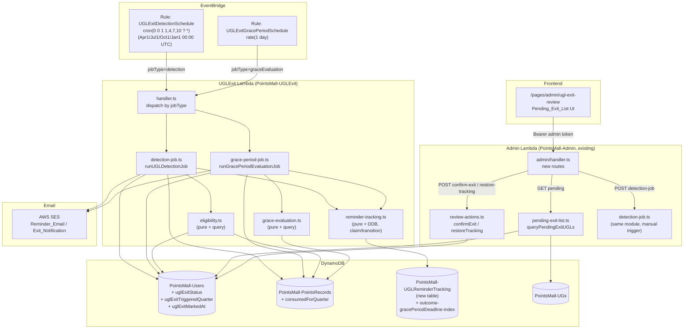
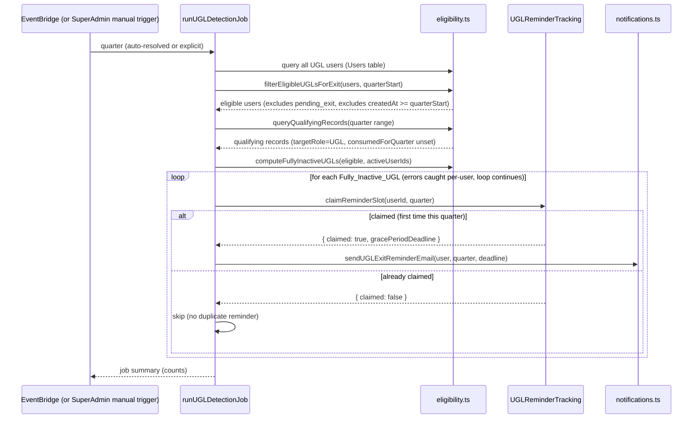
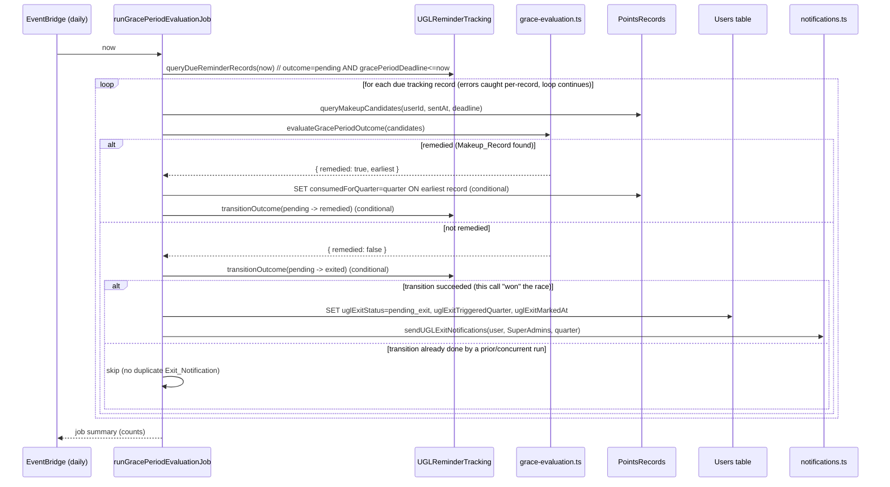

# Design Document: UGL Inactivity Exit Flow

## Overview

This feature adds a `UGL_Exit_Service` backend module that automates the full lifecycle of quarterly UGL inactivity detection → reminder → 30-day grace period → manual SuperAdmin review. It runs as a scheduled background process (no user-facing trigger except a SuperAdmin manual override), persists all state durably on the existing `Users` and `PointsRecords` tables plus one new tracking table, and exposes a small SuperAdmin-only Admin API surface (`Pending_Exit_List` + two review actions) plus a corresponding frontend page.

This is a **new, self-contained module** (`packages/backend/src/ugl-exit/`). It deliberately does **not** modify `packages/backend/src/reports/inactive-ugl-query.ts` — that file backs the existing `inactive-ugl-report` feature and must keep its exact current behavior (narrower/looser activity criteria, different output shape, different consumers). Where this feature's requirements call for a similar pattern (eligible-UGL filtering, active-set extraction, set-difference computation), we write **new, adapted pure functions** in the new module rather than importing or editing the report's internals — because Assumption 1 in requirements.md establishes this feature's `Qualifying_Points_Record` criterion (`targetRole === 'UserGroupLeader'` only) is intentionally narrower than the report's (`UserGroupLeader` OR `SpecialActivity`). We do directly reuse two things verbatim, per the requirements document's explicit instruction:
- `setUserStatus` (`packages/backend/src/admin/users.ts`) for the account-disable side effect of `Confirm_Exit_Action`.
- The existing quarter utilities (`parseQuarter`, `quarterToDateRange`, `getCurrentQuarter`) in `packages/backend/src/reports/quarter-utils.ts`, imported (not modified).

### Key Design Decisions

1. **A single per-user-per-quarter tracking record (`UGLReminderTracking`) is the backbone of idempotency.** Both the quarterly detection job and the daily grace-period evaluation job read/write the *same* tracking record for a `(userId, quarter)` pair. The detection job creates it with a conditional `PutCommand` (`attribute_not_exists`), which is simultaneously how we compute "has this user already been reminded this quarter?" (Req 4.5, 12.1) and how we timestamp the start of the Grace_Period (Req 4.4). The grace-period job transitions its `outcome` field with a conditional `UpdateCommand` (`outcome = :pending`), which is simultaneously how we guarantee at most one Exit_Notification per user per quarter (Req 12.3).
2. **Manual-only account mutation stays entirely inside two small, review-gated functions.** Neither the detection job nor the grace-period job ever calls `setUserStatus` or touches `roles`. Only `confirmExit` (invoked exclusively via the SuperAdmin-only `Confirm_Exit_Action` endpoint) calls `setUserStatus`. This makes Requirement 8 ("manual-only account changes") a structural property of the code, not just a runtime check.
3. **The grace-period evaluation job is a separate, independently-scheduled Lambda entry point from the quarterly detection job**, per Assumption 5 — a 30-day grace period will almost always expire mid-quarter, well before the next fixed detection date, so it needs its own daily cadence. Both entry points live in the same backend module and share pure functions, but are invoked by two separate EventBridge rules targeting the same Lambda with different `jobType` payloads (mirroring the existing Digest/Sync Lambda + EventBridge pattern in `packages/cdk/lib/api-stack.ts`).
4. **The manual trigger (Req 1.6) is a direct in-process function call from the Admin Lambda**, not a separate Lambda invocation — mirroring the existing `POST /api/admin/quarterly-award` / `special-activity-award` pattern, where SuperAdmin-triggered heavy DB operations run synchronously inside `admin/handler.ts` rather than invoking another Lambda. This keeps the manual-trigger code path and the scheduled code path calling the exact same `runUGLDetectionJob` function, so there is only one implementation of the detection algorithm to reason about.
5. **Consumed_Quarter_Marker is set at grace-period evaluation time, never at record-creation time** (Req 5.3, 5.4). The detection job and the "does a qualifying record exist for this quarter" query both explicitly ignore records with `consumedForQuarter` already set (Req 3.3), but nothing marks a record as consumed until a human's 30-day window is evaluated. This is why the marker-write lives in `grace-period-job.ts`, not in any query path.

## Architecture



### Detection Job Flow



### Grace-Period Evaluation Job Flow



## Components and Interfaces

### 1. Quarter Resolution (`packages/backend/src/ugl-exit/quarter.ts`)

Imports `parseQuarter`, `quarterToDateRange`, `getCurrentQuarter` from `../reports/quarter-utils` (unmodified).

```typescript
/** Returns the quarter immediately before the given quarter, rolling year backward at Q1. */
export function getPreviousQuarter(quarter: string): string; // "2026-Q1" -> "2025-Q4"

/** The quarter an *automatic* fixed-date run should evaluate: the quarter immediately preceding "now"'s quarter. */
export function resolveAutoDetectionQuarter(now: Date = new Date()): string;

export type DetectionQuarterResolution =
  | { valid: true; quarter: string }
  | { valid: false; error: { code: string; message: string } };

/**
 * Resolves the Detection_Quarter for a job run.
 * - explicitQuarter provided (manual trigger, Req 1.6): validated via parseQuarter (format + not-future) and
 *   returned as-is — NOT checked against the fixed-date mapping.
 * - explicitQuarter omitted (automatic run): resolveAutoDetectionQuarter(now).
 */
export function resolveDetectionQuarter(
  explicitQuarter: string | undefined,
  now?: Date,
): DetectionQuarterResolution;
```

### 2. Eligibility & Inactivity (`packages/backend/src/ugl-exit/eligibility.ts`)

Self-contained pure functions + one DynamoDB query function, structurally similar to (but independent from) `reports/inactive-ugl-query.ts`.

```typescript
export interface ExitEligibleUser {
  userId: string;
  nickname: string;
  email: string;
  roles: string[];
  status: string;
  createdAt: string;
  uglExitStatus?: 'pending_exit';
}

export interface ExitQualifyingRecord {
  recordId: string;
  userId: string;
  targetRole?: string;
  activityDate?: string;
  createdAt: string;
  consumedForQuarter?: string;
}

/**
 * Eligible_UGL filter (Req 2.1, 2.2, 7.1):
 * roles contains 'UserGroupLeader' AND status === 'active' AND createdAt < quarterStart
 * AND uglExitStatus !== 'pending_exit' (snapshot at call time — a later status change is not retroactively applied).
 */
export function filterEligibleUGLsForExit(
  users: ExitEligibleUser[],
  quarterStart: string,
): ExitEligibleUser[];

/**
 * Extracts the set of userIds with >=1 qualifying record in the quarter window.
 * A record counts only when targetRole === 'UserGroupLeader' (Assumption 1 — narrower than the
 * existing report's UGL+SpecialActivity criterion) AND consumedForQuarter is unset (Req 3.3)
 * AND its effective date (activityDate, falling back to createdAt's date part — Assumption 2)
 * falls within [quarterStart, quarterEnd].
 */
export function extractActiveUserIdsForQuarter(
  records: ExitQualifyingRecord[],
  quarterStart: string,
  quarterEnd: string,
): Set<string>;

/** Set difference: eligible users minus active userIds (Req 3.1, 3.2). */
export function computeFullyInactiveUGLs(
  eligibleUsers: ExitEligibleUser[],
  activeUserIds: Set<string>,
): ExitEligibleUser[];

/** Queries Users table for all UGL-role users (entityType-createdAt-index + FilterExpression), paginated. */
export async function queryAllUGLUsersForExit(
  dynamoClient: DynamoDBDocumentClient,
  usersTable: string,
): Promise<ExitEligibleUser[]>;

/** Queries PointsRecords in the widened createdAt window, filtered to targetRole='UserGroupLeader', paginated. */
export async function queryQuarterQualifyingRecords(
  dynamoClient: DynamoDBDocumentClient,
  pointsRecordsTable: string,
  quarterStart: string,
  quarterEnd: string,
): Promise<ExitQualifyingRecord[]>;
```

### 3. Reminder Tracking (`packages/backend/src/ugl-exit/reminder-tracking.ts`)

```typescript
export type ReminderOutcome = 'pending' | 'remedied' | 'exited';

export interface ReminderTrackingRecord {
  userId: string;
  quarter: string;
  reminderSentAt: string;      // ISO — start of Grace_Period (Req 4.4)
  gracePeriodDeadline: string; // ISO — reminderSentAt + 30 days
  outcome: ReminderOutcome;
  consumedRecordId?: string;   // set when outcome transitions to 'remedied'
  createdAt: string;
  updatedAt: string;
}

/** Pure: reminderSentAt + exactly 30*24h. */
export function computeGracePeriodDeadline(sentAt: string): string;

/**
 * Atomically creates the tracking record for (userId, quarter) using
 * ConditionExpression attribute_not_exists(userId). Returns claimed=false
 * (no write) when a record already exists — this IS the dedup mechanism
 * for Req 4.5 / 12.1.
 */
export async function claimReminderSlot(
  userId: string,
  quarter: string,
  now: string,
  dynamoClient: DynamoDBDocumentClient,
  trackingTable: string,
): Promise<{ claimed: boolean; record?: ReminderTrackingRecord }>;

/**
 * Queries tracking records with outcome='pending' AND gracePeriodDeadline <= now,
 * via the outcome-gracePeriodDeadline-index GSI. Paginated.
 */
export async function queryDueReminderRecords(
  now: string,
  dynamoClient: DynamoDBDocumentClient,
  trackingTable: string,
): Promise<ReminderTrackingRecord[]>;

/**
 * Atomically transitions outcome 'pending' -> target ('remedied' | 'exited') using
 * ConditionExpression outcome = :pending. Returns transitioned=false when the
 * condition fails (already transitioned by a prior/concurrent run) — this IS the
 * idempotency mechanism for Req 12.3.
 */
export async function transitionOutcome(
  userId: string,
  quarter: string,
  target: 'remedied' | 'exited',
  extra: { consumedRecordId?: string },
  dynamoClient: DynamoDBDocumentClient,
  trackingTable: string,
): Promise<{ transitioned: boolean }>;
```

### 4. Grace-Period Evaluation (`packages/backend/src/ugl-exit/grace-evaluation.ts`)

```typescript
/**
 * Selects, among candidate qualifying records that fall within [sentAt, deadline]
 * (by createdAt — Assumption 3) and are not yet consumed, the single earliest one
 * by createdAt (Req 5.4). Returns null when candidates is empty.
 */
export function selectEarliestMakeupRecord(
  candidates: ExitQualifyingRecord[],
): ExitQualifyingRecord | null;

export type GracePeriodOutcome =
  | { remedied: true; record: ExitQualifyingRecord }
  | { remedied: false };

/**
 * Combines "does a Makeup_Record exist" (Req 5.2) with "select the earliest one" (Req 5.4)
 * into a single outcome (Req 5.3, 5.5): remedied when a candidate exists, not-remedied otherwise.
 */
export function evaluateGracePeriodOutcome(
  candidates: ExitQualifyingRecord[],
): GracePeriodOutcome;

/**
 * Queries PointsRecords for the given user with targetRole='UserGroupLeader',
 * consumedForQuarter unset, createdAt in [sentAt, deadline] (userId-createdAt-index).
 */
export async function queryMakeupCandidates(
  userId: string,
  sentAt: string,
  deadline: string,
  dynamoClient: DynamoDBDocumentClient,
  pointsRecordsTable: string,
): Promise<ExitQualifyingRecord[]>;
```

### 5. Job Orchestration

```typescript
// detection-job.ts
export interface DetectionJobSummary {
  quarter: string;
  eligibleCount: number;
  fullyInactiveCount: number;
  remindersSent: number;
  remindersSkippedAlreadyClaimed: number;
  errors: number;
}

/**
 * Runs the full quarterly detection flow (see sequence diagram). Per-user try/catch:
 * an error processing one user is logged and the loop continues (Req 12.2) — never aborts the run.
 * Shared verbatim between the scheduled Lambda entry point and the manual-trigger Admin route.
 */
export async function runUGLDetectionJob(
  quarter: string,
  ctx: UGLExitServiceContext,
): Promise<DetectionJobSummary>;

// grace-period-job.ts
export interface GracePeriodJobSummary {
  evaluated: number;
  remedied: number;
  markedPendingExit: number;
  skippedAlreadyTransitioned: number;
  errors: number;
}

/** Runs the full daily grace-period evaluation flow (see sequence diagram). Per-record try/catch (Req 12.2 analog). */
export async function runGracePeriodEvaluationJob(
  now: string,
  ctx: UGLExitServiceContext,
): Promise<GracePeriodJobSummary>;

export interface UGLExitServiceContext {
  dynamoClient: DynamoDBDocumentClient;
  sesClient: SESClient;
  usersTable: string;
  pointsRecordsTable: string;
  trackingTable: string;
  senderEmail: string;
  emailTemplatesTable: string;
}
```

### 6. Review Actions (`packages/backend/src/ugl-exit/review-actions.ts`)

Reuses `setUserStatus` from `../admin/users.ts` verbatim for the disable side effect.

```typescript
export interface ReviewActionResult {
  success: boolean;
  error?: { code: string; message: string };
}

/**
 * Confirm_Exit_Action (Req 10.2, 10.6):
 * 1. Load user; not found -> USER_NOT_FOUND.
 * 2. uglExitStatus !== 'pending_exit' -> NOT_PENDING_EXIT (400), no writes.
 * 3. setUserStatus(userId, 'disabled', ...) — reused from admin/users.ts.
 * 4. UpdateCommand REMOVE uglExitStatus, uglExitTriggeredQuarter, uglExitMarkedAt,
 *    ConditionExpression uglExitStatus = :pending_exit (defensive against a concurrent
 *    duplicate call; a ConditionalCheckFailed here is treated as already-cleared and
 *    the action still returns success — idempotent from the caller's point of view).
 */
export async function confirmExit(
  userId: string,
  callerUserId: string,
  callerRoles: string[],
  dynamoClient: DynamoDBDocumentClient,
  usersTable: string,
): Promise<ReviewActionResult>;

/**
 * Restore_Tracking_Action (Req 10.3, 10.4, 10.6):
 * 1. Load user; not found -> USER_NOT_FOUND.
 * 2. uglExitStatus !== 'pending_exit' -> NOT_PENDING_EXIT (400), no writes.
 * 3. UpdateCommand REMOVE uglExitStatus, uglExitTriggeredQuarter, uglExitMarkedAt
 *    (status field is never touched), ConditionExpression uglExitStatus = :pending_exit.
 *    Clearing uglExitStatus is sufficient by itself to make the user pass
 *    filterEligibleUGLsForExit on the next detection run (Req 10.4) — no separate flag needed.
 */
export async function restoreTracking(
  userId: string,
  dynamoClient: DynamoDBDocumentClient,
  usersTable: string,
): Promise<ReviewActionResult>;
```

### 7. Pending Exit List (`packages/backend/src/ugl-exit/pending-exit-list.ts`)

```typescript
export interface PendingExitRecord {
  userId: string;
  nickname: string;
  email: string;
  ugName: string;
  triggeredQuarter: string;
  markedAt: string;
}

/**
 * Queries Users table via entityType-createdAt-index (PK='user') + FilterExpression
 * uglExitStatus = 'pending_exit' (same GSI/query shape as listUsers in admin/users.ts),
 * then Scans UGs table to build a leaderId -> ugName map (small table, same pattern as
 * the existing report's buildLeaderUGMap, reimplemented locally — not imported, to keep
 * this module independent of inactive-ugl-query.ts).
 */
export async function queryPendingExitUGLs(
  dynamoClient: DynamoDBDocumentClient,
  tables: { usersTable: string; ugsTable: string },
): Promise<PendingExitRecord[]>;
```

### 8. Lambda Entry Point (`packages/backend/src/ugl-exit/handler.ts`)

```typescript
export interface UGLExitJobEvent {
  jobType: 'detection' | 'graceEvaluation';
  quarter?: string; // only meaningful for jobType='detection'; omitted -> auto-resolved
}

/** EventBridge-triggered handler. Dispatches on event.jobType. */
export async function handler(event: UGLExitJobEvent): Promise<void>;
```

### 9. Admin API Routes (added to existing `packages/backend/src/admin/handler.ts`)

Following the existing routing convention in that file (regex-matched path parameters, `isSuperAdmin` gate before dispatch):

```typescript
const UGL_EXIT_CONFIRM_REGEX = /^\/api\/admin\/ugl-exit\/([^/]+)\/confirm-exit$/;
const UGL_EXIT_RESTORE_REGEX = /^\/api\/admin\/ugl-exit\/([^/]+)\/restore-tracking$/;

// GET /api/admin/ugl-exit/pending — SuperAdmin only
// POST /api/admin/ugl-exit/detection-job — SuperAdmin only, manual trigger, body: { quarter?: string }
// POST /api/admin/ugl-exit/{userId}/confirm-exit — SuperAdmin only
// POST /api/admin/ugl-exit/{userId}/restore-tracking — SuperAdmin only
```

| Method | Path | Auth | Success | Errors |
|---|---|---|---|---|
| GET | `/api/admin/ugl-exit/pending` | SuperAdmin | 200 `{ records: PendingExitRecord[] }` | 403 `FORBIDDEN` |
| POST | `/api/admin/ugl-exit/detection-job` | SuperAdmin | 200 `DetectionJobSummary` | 403 `FORBIDDEN`; 400 `INVALID_QUARTER_FORMAT` / `FUTURE_QUARTER` |
| POST | `/api/admin/ugl-exit/{userId}/confirm-exit` | SuperAdmin | 200 `{ success: true }` | 403 `FORBIDDEN`; 404 `USER_NOT_FOUND`; 400 `NOT_PENDING_EXIT` |
| POST | `/api/admin/ugl-exit/{userId}/restore-tracking` | SuperAdmin | 200 `{ success: true }` | 403 `FORBIDDEN`; 404 `USER_NOT_FOUND`; 400 `NOT_PENDING_EXIT` |

### 10. Email Notifications (added to `packages/backend/src/email/notifications.ts`, `send.ts`, `templates.ts`)

Three new `NotificationType` values, each gated by a feature toggle (default `true`, following the wish-pool email pattern rather than the pointsEarned default-`false` pattern, since these are account-lifecycle-critical rather than optional-engagement emails):

```typescript
// send.ts — extend NotificationType union
'uglExitReminder' | 'uglExitNotification' | 'uglExitAdminNotification'

// templates.ts — TEMPLATE_VARIABLE_MAP additions
uglExitReminder: ['nickname', 'detectionQuarter', 'gracePeriodDeadline'],
uglExitNotification: ['nickname', 'detectionQuarter'],
uglExitAdminNotification: ['affectedNickname', 'affectedEmail', 'detectionQuarter'],

// notifications.ts — TOGGLE_MAP additions
uglExitReminder: 'emailUglExitReminderEnabled',
uglExitNotification: 'emailUglExitNotificationEnabled',
uglExitAdminNotification: 'emailUglExitNotificationEnabled', // shares one toggle — both are the same logical Exit_Notification event
```

```typescript
/** Sends the Reminder_Email to a single Fully_Inactive_UGL (Req 4.1, 4.2, 4.3). Best-effort: catches and logs its own errors, never throws into the job loop. */
export async function sendUGLExitReminderEmail(
  ctx: NotificationContext,
  userId: string,
  detectionQuarter: string,
  gracePeriodDeadline: string,
): Promise<{ sent: boolean }>;

/**
 * Sends the Exit_Notification to the affected user AND to every current SuperAdmin
 * (Req 6.1, 6.2, 6.3, 6.4). Scans Users table filtered to roles containing 'SuperAdmin'
 * for the admin recipient list (same Scan shape as sendNewOrderEmail's admin lookup,
 * filtered to SuperAdmin only). Best-effort per recipient — one failed send does not
 * block the others.
 */
export async function sendUGLExitNotifications(
  ctx: NotificationContext,
  affectedUserId: string,
  detectionQuarter: string,
): Promise<{ userSent: boolean; adminsSent: number; adminsFailed: number }>;
```

`packages/backend/src/email/seed.ts` gets `uglExitReminder` / `uglExitNotification` / `uglExitAdminNotification` default templates for all 5 locales, and `packages/backend/src/settings/feature-toggles.ts` gets the two new boolean fields (default `true`), following the exact pattern the `weekly-digest-email` feature used for `emailWeeklyDigestEnabled`.

### 11. Frontend: SuperAdmin Pending Exit List (`packages/frontend/src/pages/admin/ugl-exit-review.tsx`)

Modeled directly on `packages/frontend/src/pages/admin/wishes.tsx`'s list + confirm-dialog pattern and gated with `useSuperAdminGuard` (same hook used by `pages/admin/reports.tsx`):

- On mount: if `!isSuperAdmin` (once `ready`), render nothing beyond a "not authorized" placeholder and do not call the API (Req 9.3). If the API nonetheless ever returns 403 (Req 9.2), immediately clear the list and switch to the same hidden/forbidden state — the frontend treats the backend 403 as authoritative and does not attempt to render partial data.
- List view: one row per `PendingExitRecord` — nickname, email, ugName, `triggeredQuarter`, formatted `markedAt`. Empty state message when `records.length === 0` (Req 9.4), reusing the `admin-wishes-empty` / `common.noData` pattern.
- Each row has two action buttons — Confirm_Exit_Action (danger style, mirrors `wish-row__action-btn--danger`) and Restore_Tracking_Action (secondary/primary style) — each opening a confirmation dialog (mirrors `wish-form-overlay` / `wish-form-modal`) before submitting, per Requirement 10.1's requirement that both controls exist for every listed user.
- On submit: `POST` to the corresponding endpoint; on success, show a toast and refetch the list; on `NOT_PENDING_EXIT` (400) or `FORBIDDEN` (403) error, show the error message inline in the dialog (same `reviewError` pattern as `wishes.tsx`) rather than crashing.
- Added to `ADMIN_LINKS` in `packages/frontend/src/pages/admin/index.tsx` under `category: 'operations'`, `superAdminOnly: true`, reusing the existing `ClaimIcon`.

## Data Models

### Users Table (`PointsMall-Users`) — extended

| Field | Type | Notes |
|---|---|---|
| `uglExitStatus` | `'pending_exit'` \| absent | Set by the grace-period job when a Fully_Inactive_UGL's grace period expires with no Makeup_Record (Req 5.5). Cleared by both review actions (Req 10.2, 10.3). |
| `uglExitTriggeredQuarter` | String (`"YYYY-QN"`) \| absent | The Detection_Quarter that produced the pending-exit marker (Req 9.1, 11.1). |
| `uglExitMarkedAt` | String (ISO 8601) \| absent | Timestamp the marker was set — displayed in the Pending_Exit_List (Req 9.1). |

No new GSI is required: the `Pending_Exit_List` query reuses the existing `entityType-createdAt-index` GSI (PK=`'user'`) with a `FilterExpression` on `uglExitStatus`, the same shape `listUsers` already uses for `role`/`excludeRoles` filters.

### PointsRecords Table (`PointsMall-PointsRecords`) — extended

| Field | Type | Notes |
|---|---|---|
| `consumedForQuarter` | String (`"YYYY-QN"`) \| absent | Set exactly once, at grace-period evaluation time, on the single earliest Makeup_Record for a remedied Detection_Quarter (Req 5.3, 5.4, 11.2). A record with this field set is permanently excluded from `extractActiveUserIdsForQuarter` and from `queryMakeupCandidates` for any other quarter (Req 3.3). |

No new GSI required — `queryQuarterQualifyingRecords` reuses the existing `type-createdAt-index` GSI (same widened-range + FilterExpression pattern as the existing report's `queryQuarterEarnRecords`), and `queryMakeupCandidates` reuses the existing `userId-createdAt-index` GSI.

### New Table: `PointsMall-UGLReminderTracking`

Backs Assumption 6 — the per-user-per-quarter reminder/grace-period tracking record.

**Primary key**: `userId` (String, PK) + `quarter` (String, SK)

| Field | Type | Notes |
|---|---|---|
| `userId` | String (PK) | |
| `quarter` | String (SK) | Detection_Quarter, `"YYYY-QN"` |
| `reminderSentAt` | String (ISO 8601) | Set at creation — start of Grace_Period (Req 4.4) |
| `gracePeriodDeadline` | String (ISO 8601) | `reminderSentAt + 30 days`, computed at creation |
| `outcome` | `'pending'` \| `'remedied'` \| `'exited'` | State machine, transitioned exactly once away from `'pending'` (Req 12.3) |
| `consumedRecordId` | String \| absent | Set when `outcome === 'remedied'`; the `recordId` of the Makeup_Record that was marked consumed |
| `createdAt` | String (ISO 8601) | |
| `updatedAt` | String (ISO 8601) | |

**GSI** `outcome-gracePeriodDeadline-index`:
- Partition Key: `outcome` (String)
- Sort Key: `gracePeriodDeadline` (String)
- Projection: ALL

Used by `queryDueReminderRecords`: `Query outcome = 'pending' AND gracePeriodDeadline <= :now`.

### Reminder / Exit Notification Email Templates — new records

| templateId | locale | Variables |
|---|---|---|
| `uglExitReminder` | zh / en / ja / ko / zh-TW | `nickname`, `detectionQuarter`, `gracePeriodDeadline` |
| `uglExitNotification` | zh / en / ja / ko / zh-TW | `nickname`, `detectionQuarter` |
| `uglExitAdminNotification` | zh / en / ja / ko / zh-TW | `affectedNickname`, `affectedEmail`, `detectionQuarter` |

## Correctness Properties

*A property is a characteristic or behavior that should hold true across all valid executions of a system — essentially, a formal statement about what the system should do. Properties serve as the bridge between human-readable specifications and machine-verifiable correctness guarantees.*

### Property 1: Detection quarter resolution correctness

*For any* current quarter string, `resolveAutoDetectionQuarter` returns exactly the quarter immediately preceding it, correctly rolling the year backward when the current quarter is Q1 (e.g. `2026-Q1` → `2025-Q4`). *For any* well-formed, non-future explicit quarter string, `resolveDetectionQuarter(explicitQuarter, now)` returns exactly that quarter for every possible value of `now` — it never rejects an explicit quarter for failing to match the fixed-date-to-quarter mapping that governs automatic runs.

**Validates: Requirements 1.1, 1.2, 1.3, 1.4, 1.6**

### Property 2: Eligible UGL determination correctness

*For any* list of user records with randomly generated `roles`, `status`, `createdAt`, and `uglExitStatus` values, and any `quarterStart` boundary, `filterEligibleUGLsForExit` returns exactly those users where `roles` contains `'UserGroupLeader'` AND `status === 'active'` AND `createdAt < quarterStart` AND `uglExitStatus !== 'pending_exit'` — regardless of how recently a user was promoted to `UserGroupLeader` (no separate role-tenure check), and regardless of any `uglExitStatus` value other than `'pending_exit'`.

**Validates: Requirements 2.1, 2.2, 7.1**

### Property 3: Fully inactive UGL classification correctness

*For any* set of eligible users and any set of `ExitQualifyingRecord`s (with randomly varying `targetRole`, `consumedForQuarter`, `activityDate`/`createdAt`, and quarter-window placement), `computeFullyInactiveUGLs(eligibleUsers, extractActiveUserIdsForQuarter(records, quarterStart, quarterEnd))` returns exactly the eligible users for whom **zero** records satisfy all of: `targetRole === 'UserGroupLeader'`, `consumedForQuarter` is unset, and the effective date falls within `[quarterStart, quarterEnd]`. Records with any other `targetRole`, an already-set `consumedForQuarter`, or a date outside the window never count as evidence of activity.

**Validates: Requirements 3.1, 3.2, 3.3**

### Property 4: Reminder dispatch correctness and idempotency

*For any* set of Fully_Inactive_UGL users and any number of times `runUGLDetectionJob` is invoked for the *same* quarter (sequentially, simulating retries/overlapping executions), across all invocations combined: (a) exactly one Reminder_Email is sent per Fully_Inactive_UGL for that quarter, (b) no user outside the Fully_Inactive_UGL set ever receives one, and (c) the persisted `gracePeriodDeadline` for each such user equals `reminderSentAt + 30 days`, computed once at the first successful claim and never recomputed on subsequent runs.

**Validates: Requirements 4.1, 4.3, 4.4, 4.5, 12.1**

### Property 5: Per-user error isolation in the detection job

*For any* sequence of N eligible users where an arbitrary subset throw an error during per-user processing (e.g. a simulated send failure or DB error), `runUGLDetectionJob` still attempts processing for all N users — the total number of per-user processing attempts equals N regardless of how many of them fail, and no failure aborts the remaining loop iterations.

**Validates: Requirements 4.6, 12.2**

### Property 6: Grace-period evaluation outcome correctness

*For any* set of candidate qualifying records for a user's grace period window, `evaluateGracePeriodOutcome(candidates)` returns `remedied: true` if and only if `candidates` is non-empty, and in that case the returned `record` is a member of `candidates`; it returns `remedied: false` if and only if `candidates` is empty.

**Validates: Requirements 5.2, 5.3, 5.5**

### Property 7: Earliest makeup record selection

*For any* non-empty set of candidate qualifying records with distinct `createdAt` values, `selectEarliestMakeupRecord` returns the single record whose `createdAt` is the minimum among all candidates; every other candidate in the set is excluded from the returned value (and therefore remains available, unconsumed, for a later Detection_Quarter's evaluation).

**Validates: Requirements 5.4**

### Property 8: Grace-period evaluation idempotency

*For any* tracking record and any number of times `runGracePeriodEvaluationJob` processes it (simulating repeated/overlapping executions for the same due record), `transitionOutcome` succeeds (`transitioned: true`) on at most one of those invocations; every subsequent invocation for the same `(userId, quarter)` returns `transitioned: false`, and consequently at most one Exit_Notification is ever sent and at most one Consumed_Quarter_Marker is ever set for that `(userId, quarter)` pair, regardless of how many times evaluation runs.

**Validates: Requirements 12.3**

### Property 9: Exit notification recipient correctness

*For any* set of users (some becoming a Pending_Exit_UGL during a given evaluation, some not) and any set of current SuperAdmin users, `sendUGLExitNotifications` results in the Exit_Notification being sent to exactly the affected user plus exactly the set of users whose `roles` contains `'SuperAdmin'` at that moment — no non-SuperAdmin user other than the affected user ever receives it, and no SuperAdmin is skipped.

**Validates: Requirements 6.1, 6.2, 6.4**

### Property 10: No unauthorized account or role mutation by background jobs

*For any* sequence of `runUGLDetectionJob` and `runGracePeriodEvaluationJob` executions over any set of users (with no SuperAdmin review action interleaved), every user's `roles` array and every existing PointsRecord's fields other than `consumedForQuarter` remain byte-for-byte identical before and after the sequence, and no user's account `status` is ever changed to `'disabled'` by either job — the only fields either job is permitted to write are `uglExitStatus`, `uglExitTriggeredQuarter`, `uglExitMarkedAt` on Users and `consumedForQuarter` on PointsRecords (plus the tracking table).

**Validates: Requirements 8.1, 8.2**

### Property 11: Pending exit list correctness

*For any* set of user records with randomly varying `uglExitStatus` values, `queryPendingExitUGLs` returns exactly those users where `uglExitStatus === 'pending_exit'`, each populated with `nickname`, `email`, `ugName` (from the leader→UG mapping, empty string when the user leads no UG), `triggeredQuarter`, and `markedAt` taken directly from that user's stored fields; users with any other `uglExitStatus` value (including absent) never appear in the result.

**Validates: Requirements 9.1**

### Property 12: Authorization gate for the pending-exit list and review actions

*For any* set of caller roles not containing `'SuperAdmin'`, a request to `GET /api/admin/ugl-exit/pending`, `POST /api/admin/ugl-exit/{userId}/confirm-exit`, or `POST /api/admin/ugl-exit/{userId}/restore-tracking` always returns HTTP 403 with code `FORBIDDEN`, and the target user's record is left completely unmodified — regardless of whether that target user is currently a Pending_Exit_UGL. *For any* set of caller roles containing `'SuperAdmin'`, the request is not rejected for authorization reasons (it proceeds to the action's own business-rule checks).

**Validates: Requirements 9.2, 10.5**

### Property 13: Confirm exit action correctness

*For any* user whose `uglExitStatus === 'pending_exit'`, invoking `confirmExit` results in: `status === 'disabled'` AND `uglExitStatus`, `uglExitTriggeredQuarter`, `uglExitMarkedAt` all absent — for every possible prior value of those three fields and every prior `status` value the user could have had.

**Validates: Requirements 10.2**

### Property 14: Restore tracking action correctness

*For any* user whose `uglExitStatus === 'pending_exit'` and any prior `status` value, invoking `restoreTracking` results in: `uglExitStatus`, `uglExitTriggeredQuarter`, `uglExitMarkedAt` all absent, AND `status` unchanged from its value immediately before the call. Furthermore, feeding the resulting user record (with a `createdAt` before the next quarter's start and `status === 'active'`) into `filterEligibleUGLsForExit` for the next Detection_Quarter includes that user in the result.

**Validates: Requirements 10.3, 10.4**

### Property 15: Non-pending-exit rejection for review actions

*For any* user whose `uglExitStatus` is anything other than exactly `'pending_exit'` (absent, or any other string value), invoking `confirmExit` or `restoreTracking` on that user always returns `success: false` with `error.code === 'NOT_PENDING_EXIT'`, and the user's record — including `status`, `roles`, and all `uglExit*` fields — is left completely unmodified.

**Validates: Requirements 10.6**

## Error Handling

### Error Codes

| Code | HTTP | Scenario |
|---|---|---|
| `FORBIDDEN` (existing) | 403 | Non-SuperAdmin calls any of the four `ugl-exit` admin endpoints |
| `NOT_PENDING_EXIT` (new) | 400 | `confirmExit` / `restoreTracking` invoked on a user whose `uglExitStatus !== 'pending_exit'` |
| `USER_NOT_FOUND` (existing) | 404 | Target `userId` does not exist |
| `INVALID_QUARTER_FORMAT` (existing, from `parseQuarter`) | 400 | Manual detection-job trigger with a malformed `quarter` |
| `FUTURE_QUARTER` (existing, from `parseQuarter`) | 400 | Manual detection-job trigger with a quarter that hasn't started yet |
| `INTERNAL_ERROR` (existing) | 500 | Unexpected DynamoDB/SES failure not otherwise categorized |

`NOT_PENDING_EXIT` is added to `packages/shared/src/errors.ts` `ErrorCodes` / `ErrorHttpStatus` / `ErrorMessages`, following the exact same pattern as the existing `CANNOT_DISABLE_SUPERADMIN`-style entries.

### Job-Level Resilience

- **Per-user isolation (detection job)**: each eligible user is processed inside its own `try/catch`; a thrown error is logged with the `userId` and quarter, then the loop continues (Req 12.2). The job's summary counts failures but never throws out of `runUGLDetectionJob` itself.
- **Per-record isolation (grace-period job)**: identical shape — each due tracking record is processed inside its own `try/catch`.
- **Email delivery failures never fail the job**: `sendUGLExitReminderEmail` / `sendUGLExitNotifications` catch and log their own SES errors internally (matching the existing `sendPointsEarnedEmail` / `sendWishAdoptedEmail` best-effort pattern) and return a status object rather than throwing, so a failed send cannot prevent the tracking record from being claimed/transitioned (Req 4.6).
- **Race-condition prevention**: both idempotency guarantees (Req 4.5/12.1 and Req 12.3) rely on DynamoDB conditional writes (`attribute_not_exists` for the claim, `outcome = :pending` for the transition) rather than application-level locking — two concurrent Lambda invocations racing on the same `(userId, quarter)` will have exactly one `PutCommand`/`UpdateCommand` succeed and the other fail with `ConditionalCheckFailedException`, which is caught and treated as "already handled."
- **Confirm/Restore concurrent double-invocation**: the final `UpdateCommand` in both `confirmExit` and `restoreTracking` carries a defensive `ConditionExpression uglExitStatus = :pending_exit`. Because the pre-check already confirmed this immediately before, a condition failure here can only mean a second concurrent SuperAdmin request already completed the same action; that case is treated as success (idempotent) rather than surfaced as an error, since the account is already in the intended end state either way.

## Testing Strategy

### Dual Testing Approach

- **Property-based tests** (`fast-check`, ≥100 iterations each) cover the pure/orchestration logic in `quarter.ts`, `eligibility.ts`, `reminder-tracking.ts`, `grace-evaluation.ts`, `review-actions.ts`, `pending-exit-list.ts`, and the notification recipient-selection logic — anywhere a "for all inputs" claim from the Correctness Properties section applies. Orchestration functions (`runUGLDetectionJob`, `runGracePeriodEvaluationJob`, `transitionOutcome` idempotency) are tested against an in-memory mock DynamoDB client (same pattern as `special-activity-award.property.test.ts` / `batch-points.property.test.ts`), not a real table.
- **Unit/example tests** cover: handler routing and 403/404/400 status codes in `admin/handler.ts`; EventBridge event dispatch in `ugl-exit/handler.ts` (`jobType` switch); email template variable completeness for the three new notification types (reusing the existing template-variable-map test pattern); frontend list/empty-state/dialog rendering and the "hide on 403" behavior; CDK snapshot assertions for the new table, GSI, Lambda, and the two EventBridge rules.

Each property test file includes a comment tag: `// Feature: ugl-inactivity-exit-flow, Property {N}: {property title}`, and uses `fast-check`'s `numRuns: 100` (or higher) configuration, matching the project-wide convention.

### Property → Test File Mapping

| Property | Test file |
|---|---|
| 1 | `packages/backend/src/ugl-exit/quarter.property.test.ts` |
| 2 | `packages/backend/src/ugl-exit/eligibility.property.test.ts` |
| 3 | `packages/backend/src/ugl-exit/eligibility.property.test.ts` (append) |
| 4, 5 | `packages/backend/src/ugl-exit/detection-job.property.test.ts` |
| 6, 7 | `packages/backend/src/ugl-exit/grace-evaluation.property.test.ts` |
| 8 | `packages/backend/src/ugl-exit/reminder-tracking.property.test.ts` |
| 9 | `packages/backend/src/email/notifications.property.test.ts` (append — reuses existing file per project convention of one notifications property-test file) |
| 10 | `packages/backend/src/ugl-exit/detection-job.property.test.ts` / `grace-period-job.property.test.ts` (combined invariant assertion) |
| 11 | `packages/backend/src/ugl-exit/pending-exit-list.property.test.ts` |
| 12, 13, 15 | `packages/backend/src/ugl-exit/review-actions.property.test.ts` |
| 14 | `packages/backend/src/ugl-exit/review-actions.property.test.ts` (append) |

### Example Test Coverage (non-PBT)

- **Admin routing**: each of the four `ugl-exit` routes returns 403 for non-SuperAdmin, 404 `USER_NOT_FOUND` for a missing `userId`, and the happy-path 200 shape for a valid SuperAdmin request.
- **CDK snapshot**: `PointsMall-UGLReminderTracking` table exists with the `outcome-gracePeriodDeadline-index` GSI; `PointsMall-UGLExit` Lambda exists; `cron(0 0 1 1,4,7,10 ? *)` rule and the daily rate rule both target it with the correct `jobType` input.
- **Email seed/template integration**: `getDefaultTemplates()` includes all 3 new notification types × 5 locales; `TEMPLATE_VARIABLE_MAP` entries match the variables actually passed by `sendUGLExitReminderEmail` / `sendUGLExitNotifications`.
- **Frontend**: Pending_Exit_List renders the empty-state message for zero records; renders Confirm/Restore buttons per row; opening a confirmation dialog and submitting calls the correct endpoint; a 403 response hides the page content instead of rendering a partial/error table.
- **Happy-path integration** (1 example): full detection job run over a small mocked dataset → reminder sent + tracking record created → simulate deadline passed → grace-period job run with no makeup record → `uglExitStatus` set + Exit_Notification sent to user and SuperAdmins → `confirmExit` → `status='disabled'`, markers cleared.

### Not Suitable for PBT

- **EventBridge cron expressions and Lambda wiring** (CDK): declarative infrastructure, validated via snapshot tests, not property tests.
- **Email HTML template content/wording** (Req 4.2, 6.3): covered by the existing template-variable-completeness mechanism and a short example test asserting the required variable names are passed; the specific wording is not a computable property.
- **Frontend visual rendering / dialog UI**: example-based UI tests only.
