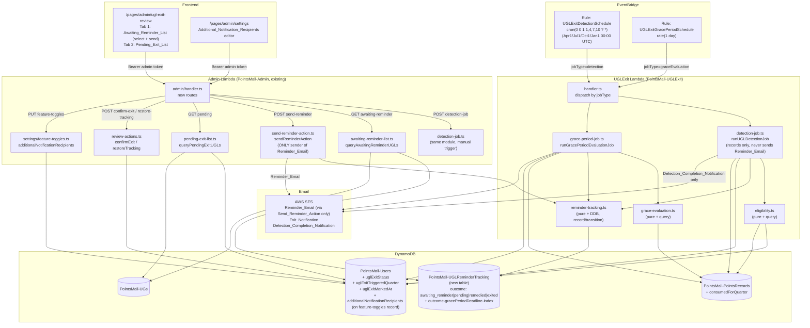
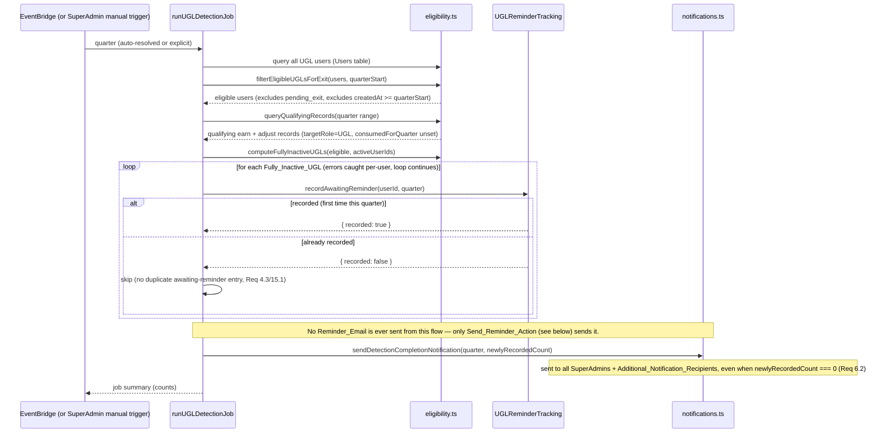
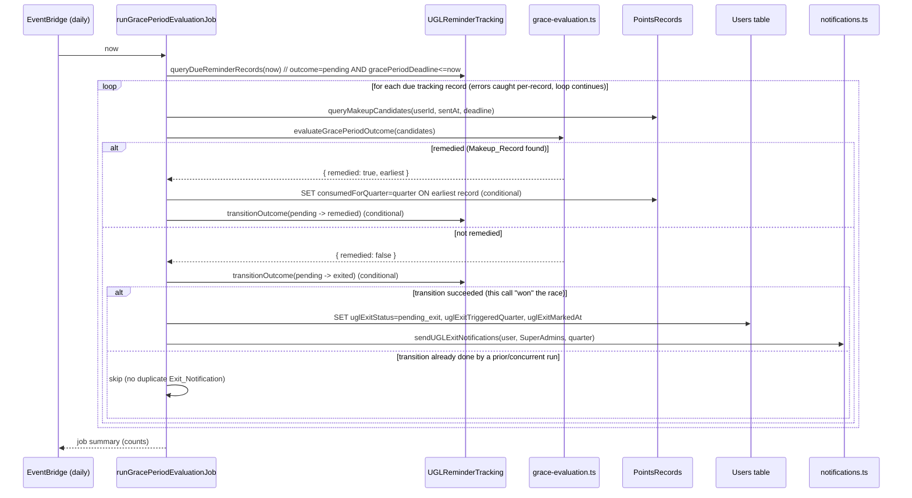

# Design Document: UGL Inactivity Exit Flow

## Overview

This feature adds a `UGL_Exit_Service` backend module that automates the full lifecycle of quarterly UGL inactivity detection → SuperAdmin-reviewed reminder dispatch → 30-day grace period → manual SuperAdmin exit review. Detection runs as a scheduled background process (no user-facing trigger except a SuperAdmin manual override), but reminder email dispatch itself is **always** a SuperAdmin-initiated action against a review list — detection never sends email directly. All state is persisted durably on the existing `Users` and `PointsRecords` tables plus one new tracking table, and the feature exposes a SuperAdmin-only Admin API surface (`Awaiting_Reminder_List` + `Send_Reminder_Action`, `Pending_Exit_List` + two review actions, `Additional_Notification_Recipients` configuration) plus a corresponding frontend page with two tabs.

This is a **new, self-contained module** (`packages/backend/src/ugl-exit/`). It deliberately does **not** modify `packages/backend/src/reports/inactive-ugl-query.ts` — that file backs the existing `inactive-ugl-report` feature and must keep its exact current behavior (narrower/looser activity criteria, different output shape, different consumers). Where this feature's requirements call for a similar pattern (eligible-UGL filtering, active-set extraction, set-difference computation), we write **new, adapted pure functions** in the new module rather than importing or editing the report's internals — because Assumption 1 in requirements.md establishes this feature's `Qualifying_Points_Record` criterion (`targetRole === 'UserGroupLeader'` only) is intentionally narrower than the report's (`UserGroupLeader` OR `SpecialActivity`). We do directly reuse two things verbatim, per the requirements document's explicit instruction:
- `setUserStatus` (`packages/backend/src/admin/users.ts`) for the account-disable side effect of `Confirm_Exit_Action`.
- The existing quarter utilities (`parseQuarter`, `quarterToDateRange`, `getCurrentQuarter`) in `packages/backend/src/reports/quarter-utils.ts`, imported (not modified).

### Key Design Decisions

1. **A single per-user-per-quarter tracking record (`UGLReminderTracking`) is the backbone of idempotency and now also the Awaiting_Reminder_UGL state.** Both the quarterly detection job and the daily grace-period evaluation job — plus the new SuperAdmin-initiated Send_Reminder_Action — read/write the *same* tracking record for a `(userId, quarter)` pair. The `outcome` field is now a 4-state machine: `'awaiting_reminder'` → `'pending'` → (`'remedied'` | `'exited'`). The detection job creates the record in `'awaiting_reminder'` state with a conditional `PutCommand` (`attribute_not_exists`), which is how we compute "has this user already been recorded this quarter?" (Req 4.3, 15.1) — critically, **no `reminderSentAt`/`gracePeriodDeadline` is set at this point**. Only the Send_Reminder_Action transitions `'awaiting_reminder'` → `'pending'` (via a conditional `UpdateCommand` that doubles as an atomic claim), and it is that transition — not detection — that computes `reminderSentAt`/`gracePeriodDeadline`; the email is then sent, and if the send fails a compensating conditional transition reverts the record back to `'awaiting_reminder'` so the entry reappears in the Awaiting_Reminder_List with no Grace_Period started (Req 5.3, 5.8, 15.4). The grace-period job transitions `'pending'` → (`'remedied'`|`'exited'`) exactly as before, guaranteeing at most one Exit_Notification per user per quarter (Req 15.3).
2. **Manual-only account mutation stays entirely inside two small, review-gated functions.** Neither the detection job nor the grace-period job ever calls `setUserStatus` or touches `roles`. Only `confirmExit` (invoked exclusively via the SuperAdmin-only `Confirm_Exit_Action` endpoint) calls `setUserStatus`. This makes Requirement 11 ("manual-only account changes") a structural property of the code, not just a runtime check.
3. **Email dispatch is now manual-only at two points, not one.** Previously the detection job sent the Reminder_Email directly; now it never calls any "send reminder" function at all — it only writes tracking records and, once per run, sends the Detection_Completion_Notification summary (Req 6). The Reminder_Email is sent exclusively from the new `sendReminderAction` function, invoked exclusively via the SuperAdmin-only `POST /api/admin/ugl-exit/send-reminder` endpoint (Req 5). This mirrors Key Decision 2's structural-safety pattern: grep-ability of "who can trigger a Reminder_Email send" is a single call site.
4. **The grace-period evaluation job is a separate, independently-scheduled Lambda entry point from the quarterly detection job**, per Assumption 5 — a 30-day grace period will almost always expire mid-quarter, well before the next fixed detection date, so it needs its own daily cadence. Both entry points live in the same backend module and share pure functions, but are invoked by two separate EventBridge rules targeting the same Lambda with different `jobType` payloads (mirroring the existing Digest/Sync Lambda + EventBridge pattern in `packages/cdk/lib/api-stack.ts`).
5. **The manual detection trigger (Req 1.6) is a direct in-process function call from the Admin Lambda**, not a separate Lambda invocation — mirroring the existing `POST /api/admin/quarterly-award` / `special-activity-award` pattern, where SuperAdmin-triggered heavy DB operations run synchronously inside `admin/handler.ts` rather than invoking another Lambda. This keeps the manual-trigger code path and the scheduled code path calling the exact same `runUGLDetectionJob` function, so there is only one implementation of the detection algorithm to reason about. The new `sendReminderAction` function is likewise a direct in-process call from the Admin Lambda — there is no scheduled path that ever calls it.
6. **Consumed_Quarter_Marker is set at grace-period evaluation time, never at record-creation time** (Req 8.3, 8.4). The detection job and the "does a qualifying record exist for this quarter" query both explicitly ignore records with `consumedForQuarter` already set (Req 3.3), but nothing marks a record as consumed until a human's 30-day window is evaluated. This is why the marker-write lives in `grace-period-job.ts`, not in any query path.
7. **Additional_Notification_Recipients reuses the existing feature-toggles settings record**, following the exact pattern already used for `contentReviewerIds` (a plain `string[]` field on the same `FeatureToggles` DynamoDB item, read/written via the existing `getFeatureToggles`/`updateFeatureToggles` functions) rather than introducing a new table or a new settings endpoint.

## Architecture



### Detection Job Flow



### Send Reminder Action Flow

The critical constraint driving this flow's shape is that two requirements pull in opposite directions on ordering: Req 15.4 requires that a duplicate/retried `Send_Reminder_Action` call for the same entry never sends a second Reminder_Email (which needs an atomic "claim" *before* sending, so two concurrent calls can't both pass a plain read-check), while Req 5.8 requires that a failed send leaves the entry back in the Awaiting_Reminder_List with the Grace_Period *not* started (which needs the transition to only "stick" *after* a successful send). We resolve this with a **claim-then-compensate** pattern: the conditional transition `'awaiting_reminder' → 'pending'` (computing `reminderSentAt`/`gracePeriodDeadline`) doubles as the atomic claim — it is what makes a concurrent duplicate call's own transition attempt fail immediately, before it could ever send a second email. If the subsequent send then fails, a compensating conditional transition reverts the record back to `'awaiting_reminder'` (clearing `reminderSentAt`/`gracePeriodDeadline`), restoring the pre-call state so the entry reappears in the Awaiting_Reminder_List exactly as Req 5.8 requires.

```mermaid
sequenceDiagram
    participant SA as SuperAdmin (Awaiting_Reminder_List UI)
    participant AH as admin/handler.ts
    participant SRA as sendReminderAction
    participant Track as UGLReminderTracking
    participant Email as notifications.ts

    SA->>AH: POST /api/admin/ugl-exit/send-reminder { userIds: [...] }
    AH->>AH: isSuperAdmin check (403 FORBIDDEN otherwise)
    alt userIds is empty
        AH-->>SA: 200 { sentCount: 0, ... } (Req 5.9 — no-op, not an error)
    else userIds non-empty
        AH->>SRA: sendReminderAction(userIds, ctx)
        loop for each userId (errors caught per-user, loop continues)
            SRA->>Track: claimAndStartGracePeriod(userId, quarter, now)
            Note over Track: conditional UpdateCommand: outcome = 'awaiting_reminder' -> 'pending', sets reminderSentAt=now, gracePeriodDeadline=now+30d
            alt claimed (was 'awaiting_reminder')
                Track-->>SRA: { claimed: true, reminderSentAt, gracePeriodDeadline }
                SRA->>Email: sendUGLExitReminderEmail(user, quarter, gracePeriodDeadline)
                alt send succeeds
                    Email-->>SRA: { sent: true }
                    SRA->>SRA: entry now removed from Awaiting_Reminder_List (Req 5.7); Grace_Period started (Req 5.3)
                else send fails
                    Email-->>SRA: { sent: false }
                    SRA->>Track: revertToAwaitingReminder(userId, quarter)
                    Note over Track: conditional UpdateCommand: outcome = 'pending' -> 'awaiting_reminder' (only if still exactly this claim), clears reminderSentAt/gracePeriodDeadline
                    SRA->>SRA: log failure — entry stays in Awaiting_Reminder_List, Grace_Period not started (Req 5.8)
                end
            else not claimed (already 'pending'/'remedied'/'exited' — duplicate/retried call, Req 15.4)
                Track-->>SRA: { claimed: false }
                SRA->>SRA: skip (no duplicate Reminder_Email, no deadline recompute)
            end
        end
        SRA-->>AH: SendReminderActionSummary { sentCount, alreadySentCount, errors }
        AH-->>SA: 200 SendReminderActionSummary
    end
```

### Grace-Period Evaluation Job Flow



## Components and Interfaces

### 1. Quarter Resolution (`packages/backend/src/ugl-exit/quarter.ts`)

Imports `parseQuarter`, `quarterToDateRange`, `getCurrentQuarter` from `../reports/quarter-utils` (unmodified).

```typescript
/** Returns the quarter immediately before the given quarter, rolling year backward at Q1. */
export function getPreviousQuarter(quarter: string): string; // "2026-Q1" -> "2025-Q4"

/** The quarter an *automatic* fixed-date run should evaluate: the quarter immediately preceding "now"'s quarter. */
export function resolveAutoDetectionQuarter(now: Date = new Date()): string;

export type DetectionQuarterResolution =
  | { valid: true; quarter: string }
  | { valid: false; error: { code: string; message: string } };

/**
 * Resolves the Detection_Quarter for a job run.
 * - explicitQuarter provided (manual trigger, Req 1.6): validated via parseQuarter (format + not-future) and
 *   returned as-is — NOT checked against the fixed-date mapping.
 * - explicitQuarter omitted (automatic run): resolveAutoDetectionQuarter(now).
 */
export function resolveDetectionQuarter(
  explicitQuarter: string | undefined,
  now?: Date,
): DetectionQuarterResolution;
```

### 2. Eligibility & Inactivity (`packages/backend/src/ugl-exit/eligibility.ts`)

Self-contained pure functions + one DynamoDB query function, structurally similar to (but independent from) `reports/inactive-ugl-query.ts`.

```typescript
export interface ExitEligibleUser {
  userId: string;
  nickname: string;
  email: string;
  roles: string[];
  status: string;
  createdAt: string;
  uglExitStatus?: 'pending_exit';
}

export interface ExitQualifyingRecord {
  recordId: string;
  userId: string;
  targetRole?: string;
  activityDate?: string;
  createdAt: string;
  consumedForQuarter?: string;
}

/**
 * Eligible_UGL filter (Req 2.1, 2.2, 10.1):
 * roles contains 'UserGroupLeader' AND status === 'active' AND createdAt < quarterStart
 * AND uglExitStatus !== 'pending_exit' (snapshot at call time — a later status change is not retroactively applied).
 */
export function filterEligibleUGLsForExit(
  users: ExitEligibleUser[],
  quarterStart: string,
): ExitEligibleUser[];

/**
 * Extracts the set of userIds whose NET qualifying points for the quarter window are > 0.
 * Per user, sums the signed `amount` of every qualifying record where targetRole ===
 * 'UserGroupLeader' (Assumption 1 — narrower than the existing report's UGL+SpecialActivity
 * criterion) AND consumedForQuarter is unset (Req 3.3) AND its effective date (activityDate,
 * falling back to createdAt's date part — Assumption 2) falls within [quarterStart, quarterEnd].
 * A user is "active" only when this net sum is strictly positive.
 *
 * This nets type='earn' awards against type='adjust' correction records (both fetched by
 * queryQuarterQualifyingRecords), so a UGL whose sole quarter activity was fully reversed via a
 * batch-points-adjust deletion (earn +N then adjust −N = 0) is correctly detected as inactive,
 * while a partial downward correction that leaves a positive net keeps the UGL active (Req 3.4, 3.5).
 * Existence of the preserved original earn record alone must NOT count as activity.
 */
export function extractActiveUserIdsForQuarter(
  records: ExitQualifyingRecord[],
  quarterStart: string,
  quarterEnd: string,
): Set<string>;

/** Set difference: eligible users minus active userIds — i.e. users with Net_Quarter_Points ≤ 0 (Req 3.1, 3.2, 3.4). */
export function computeFullyInactiveUGLs(
  eligibleUsers: ExitEligibleUser[],
  activeUserIds: Set<string>,
): ExitEligibleUser[];

/** Queries Users table for all UGL-role users (entityType-createdAt-index + FilterExpression), paginated. */
export async function queryAllUGLUsersForExit(
  dynamoClient: DynamoDBDocumentClient,
  usersTable: string,
): Promise<ExitEligibleUser[]>;

/**
 * Queries PointsRecords in the widened createdAt window, filtered to targetRole='UserGroupLeader',
 * paginated. Queries BOTH type='earn' (awards) AND type='adjust' (correction records written by
 * admin/batch-points-adjust.ts) via the type-createdAt-index GSI and merges them, projecting the
 * signed `amount` so extractActiveUserIdsForQuarter can net awards against downward corrections /
 * full reversals (Req 3.1, 3.4).
 */
export async function queryQuarterQualifyingRecords(
  dynamoClient: DynamoDBDocumentClient,
  pointsRecordsTable: string,
  quarterStart: string,
  quarterEnd: string,
): Promise<ExitQualifyingRecord[]>;
```

### 3. Reminder Tracking (`packages/backend/src/ugl-exit/reminder-tracking.ts`)

```typescript
export type ReminderOutcome = 'awaiting_reminder' | 'pending' | 'remedied' | 'exited';

export interface ReminderTrackingRecord {
  userId: string;
  quarter: string;
  outcome: ReminderOutcome;
  reminderSentAt?: string;      // ISO — absent while outcome='awaiting_reminder'; set at Send_Reminder_Action time (Req 5.3)
  gracePeriodDeadline?: string; // ISO — reminderSentAt + 30 days; absent while outcome='awaiting_reminder'
  consumedRecordId?: string;    // set when outcome transitions to 'remedied'
  createdAt: string;
  updatedAt: string;
}

/** Pure: reminderSentAt + exactly 30*24h. */
export function computeGracePeriodDeadline(sentAt: string): string;

/**
 * Atomically creates the tracking record for (userId, quarter) in outcome='awaiting_reminder',
 * using ConditionExpression attribute_not_exists(userId). Does NOT set reminderSentAt/
 * gracePeriodDeadline. Returns recorded=false (no write) when a record already exists for
 * this (userId, quarter) in ANY outcome state — this IS the dedup mechanism for Req 4.3, 15.1.
 * Called only from the detection job; never sends email.
 */
export async function recordAwaitingReminder(
  userId: string,
  quarter: string,
  now: string,
  dynamoClient: DynamoDBDocumentClient,
  trackingTable: string,
): Promise<{ recorded: boolean; record?: ReminderTrackingRecord }>;

/**
 * Queries all tracking records with outcome='awaiting_reminder' for use by the
 * Awaiting_Reminder_List. Paginated (Query on the outcome-gracePeriodDeadline-index GSI
 * is not usable here since gracePeriodDeadline is absent for awaiting_reminder records —
 * this instead uses a Scan+FilterExpression, acceptable given the small expected item count
 * for this table; see Data Models section for the GSI's sparse-index behavior).
 */
export async function queryAwaitingReminderRecords(
  dynamoClient: DynamoDBDocumentClient,
  trackingTable: string,
): Promise<ReminderTrackingRecord[]>;

/**
 * Atomically claims the entry for the Send_Reminder_Action: transitions outcome
 * 'awaiting_reminder' -> 'pending' using ConditionExpression outcome = :awaitingReminder,
 * computing and setting reminderSentAt=now and gracePeriodDeadline=computeGracePeriodDeadline(now)
 * in the same UpdateCommand. Returns claimed=false when the condition fails — either because
 * the entry doesn't exist, or (more commonly) because it has already moved past
 * 'awaiting_reminder' (already sent, or never was in awaiting_reminder) — this IS the
 * idempotency mechanism for Req 15.4. This is the ONLY function in the codebase that computes
 * gracePeriodDeadline for a real send.
 */
export async function claimAndStartGracePeriod(
  userId: string,
  quarter: string,
  now: string,
  dynamoClient: DynamoDBDocumentClient,
  trackingTable: string,
): Promise<{ claimed: boolean; record?: ReminderTrackingRecord }>;

/**
 * Compensating action for a failed send immediately after claimAndStartGracePeriod succeeded:
 * atomically transitions outcome 'pending' -> 'awaiting_reminder' using
 * ConditionExpression outcome = :pending AND reminderSentAt = :expectedSentAt (the exact
 * timestamp this call's own claim just set, so it can never revert a different, later-claimed
 * attempt), clearing reminderSentAt/gracePeriodDeadline. Implements Req 5.8.
 */
export async function revertToAwaitingReminder(
  userId: string,
  quarter: string,
  expectedReminderSentAt: string,
  dynamoClient: DynamoDBDocumentClient,
  trackingTable: string,
): Promise<{ reverted: boolean }>;

/**
 * Queries tracking records with outcome='pending' AND gracePeriodDeadline <= now,
 * via the outcome-gracePeriodDeadline-index GSI. Paginated.
 */
export async function queryDueReminderRecords(
  now: string,
  dynamoClient: DynamoDBDocumentClient,
  trackingTable: string,
): Promise<ReminderTrackingRecord[]>;

/**
 * Atomically transitions outcome 'pending' -> target ('remedied' | 'exited') using
 * ConditionExpression outcome = :pending. Returns transitioned=false when the
 * condition fails (already transitioned by a prior/concurrent run) — this IS the
 * idempotency mechanism for Req 12.3 (this design's Req 15.3).
 */
export async function transitionOutcome(
  userId: string,
  quarter: string,
  target: 'remedied' | 'exited',
  extra: { consumedRecordId?: string },
  dynamoClient: DynamoDBDocumentClient,
  trackingTable: string,
): Promise<{ transitioned: boolean }>;
```

### 4. Grace-Period Evaluation (`packages/backend/src/ugl-exit/grace-evaluation.ts`)

```typescript
/**
 * Selects, among candidate qualifying records that fall within [sentAt, deadline]
 * (by createdAt — Assumption 3) and are not yet consumed, the single earliest one
 * by createdAt (Req 5.4). Returns null when candidates is empty.
 */
export function selectEarliestMakeupRecord(
  candidates: ExitQualifyingRecord[],
): ExitQualifyingRecord | null;

export type GracePeriodOutcome =
  | { remedied: true; record: ExitQualifyingRecord }
  | { remedied: false };

/**
 * Combines "does a Makeup_Record exist" (Req 5.2) with "select the earliest one" (Req 5.4)
 * into a single outcome (Req 5.3, 5.5): remedied when a candidate exists, not-remedied otherwise.
 */
export function evaluateGracePeriodOutcome(
  candidates: ExitQualifyingRecord[],
): GracePeriodOutcome;

/**
 * Queries PointsRecords for the given user with targetRole='UserGroupLeader',
 * consumedForQuarter unset, createdAt in [sentAt, deadline] (userId-createdAt-index).
 */
export async function queryMakeupCandidates(
  userId: string,
  sentAt: string,
  deadline: string,
  dynamoClient: DynamoDBDocumentClient,
  pointsRecordsTable: string,
): Promise<ExitQualifyingRecord[]>;
```

### 5. Job Orchestration

```typescript
// detection-job.ts
export interface DetectionJobSummary {
  quarter: string;
  eligibleCount: number;
  fullyInactiveCount: number;
  awaitingReminderRecorded: number;         // newly recorded this run (Req 4.3) — this is the count reported in Detection_Completion_Notification
  awaitingReminderSkippedAlreadyRecorded: number;
  errors: number;
}

/**
 * Runs the full quarterly detection flow (see "Detection Job Flow" sequence diagram). Per-user
 * try/catch: an error processing one user is logged and the loop continues (Req 4.4, 15.2) —
 * never aborts the run. Shared verbatim between the scheduled Lambda entry point and the
 * manual-trigger Admin route. Never calls sendUGLExitReminderEmail — that call exists only in
 * sendReminderAction (send-reminder-action.ts). Always ends the run (successful or partial) by
 * calling sendDetectionCompletionNotification(quarter, awaitingReminderRecorded, ctx), including
 * when awaitingReminderRecorded === 0 (Req 6.1, 6.2).
 */
export async function runUGLDetectionJob(
  quarter: string,
  ctx: UGLExitServiceContext,
): Promise<DetectionJobSummary>;

// grace-period-job.ts
export interface GracePeriodJobSummary {
  evaluated: number;
  remedied: number;
  markedPendingExit: number;
  skippedAlreadyTransitioned: number;
  errors: number;
}

/** Runs the full daily grace-period evaluation flow (see sequence diagram). Per-record try/catch (Req 15.2 analog). */
export async function runGracePeriodEvaluationJob(
  now: string,
  ctx: UGLExitServiceContext,
): Promise<GracePeriodJobSummary>;

// send-reminder-action.ts
export interface SendReminderActionSummary {
  sentCount: number;              // successfully claimed + emailed (Req 5.3)
  alreadySentCount: number;       // claim failed — not in 'awaiting_reminder' (Req 15.4)
  sendFailedCount: number;        // claimed but email delivery failed — reverted (Req 5.8)
  errors: number;
}

/**
 * Runs the Send_Reminder_Action for a batch of userIds against the current Detection_Quarter's
 * (or, if a user has entries for more than one quarter — which Req 4.3/15.1 prevents within a
 * single quarter but does not prevent across quarters — the single oldest 'awaiting_reminder'
 * entry for that user) tracking entry. Per-user try/catch (mirrors detection job's isolation
 * pattern). See "Send Reminder Action Flow" sequence diagram for the claim-then-compensate
 * pattern. An empty userIds array is a no-op returning all-zero counts (Req 5.9) — not an error.
 */
export async function sendReminderAction(
  userIds: string[],
  ctx: UGLExitServiceContext,
): Promise<SendReminderActionSummary>;

export interface UGLExitServiceContext {
  dynamoClient: DynamoDBDocumentClient;
  sesClient: SESClient;
  usersTable: string;
  pointsRecordsTable: string;
  trackingTable: string;
  senderEmail: string;
  emailTemplatesTable: string;
}
```

### 6. Awaiting Reminder List (`packages/backend/src/ugl-exit/awaiting-reminder-list.ts`)

```typescript
export interface AwaitingReminderRecord {
  userId: string;
  nickname: string;
  email: string;
  ugName: string;
  quarter: string;   // the Detection_Quarter that produced this entry
  recordedAt: string; // tracking record's createdAt
}

/**
 * Queries the UGLReminderTracking table for all records with outcome='awaiting_reminder'
 * (reminder-tracking.ts's queryAwaitingReminderRecords), then joins against the Users table
 * (BatchGetCommand by userId, same batching pattern as other admin list endpoints) and the UGs
 * table (Scan for leaderId -> ugName map, same locally-reimplemented pattern as
 * pending-exit-list.ts's map-building, kept independent per the Overview's stated design
 * boundary) to populate nickname/email/ugName (Req 5.1).
 */
export async function queryAwaitingReminderUGLs(
  dynamoClient: DynamoDBDocumentClient,
  tables: { trackingTable: string; usersTable: string; ugsTable: string },
): Promise<AwaitingReminderRecord[]>;
```

### 7. Review Actions (`packages/backend/src/ugl-exit/review-actions.ts`)

Reuses `setUserStatus` from `../admin/users.ts` verbatim for the disable side effect.

```typescript
export interface ReviewActionResult {
  success: boolean;
  error?: { code: string; message: string };
}

/**
 * Confirm_Exit_Action (Req 13.2, 13.6):
 * 1. Load user; not found -> USER_NOT_FOUND.
 * 2. uglExitStatus !== 'pending_exit' -> NOT_PENDING_EXIT (400), no writes.
 * 3. setUserStatus(userId, 'disabled', ...) — reused from admin/users.ts.
 * 4. UpdateCommand REMOVE uglExitStatus, uglExitTriggeredQuarter, uglExitMarkedAt,
 *    ConditionExpression uglExitStatus = :pending_exit (defensive against a concurrent
 *    duplicate call; a ConditionalCheckFailed here is treated as already-cleared and
 *    the action still returns success — idempotent from the caller's point of view).
 */
export async function confirmExit(
  userId: string,
  callerUserId: string,
  callerRoles: string[],
  dynamoClient: DynamoDBDocumentClient,
  usersTable: string,
): Promise<ReviewActionResult>;

/**
 * Restore_Tracking_Action (Req 13.3, 13.4, 13.6):
 * 1. Load user; not found -> USER_NOT_FOUND.
 * 2. uglExitStatus !== 'pending_exit' -> NOT_PENDING_EXIT (400), no writes.
 * 3. UpdateCommand REMOVE uglExitStatus, uglExitTriggeredQuarter, uglExitMarkedAt
 *    (status field is never touched), ConditionExpression uglExitStatus = :pending_exit.
 *    Clearing uglExitStatus is sufficient by itself to make the user pass
 *    filterEligibleUGLsForExit on the next detection run (Req 13.4) — no separate flag needed.
 */
export async function restoreTracking(
  userId: string,
  dynamoClient: DynamoDBDocumentClient,
  usersTable: string,
): Promise<ReviewActionResult>;
```

### 8. Pending Exit List (`packages/backend/src/ugl-exit/pending-exit-list.ts`)

```typescript
export interface PendingExitRecord {
  userId: string;
  nickname: string;
  email: string;
  ugName: string;
  triggeredQuarter: string;
  markedAt: string;
}

/**
 * Queries Users table via entityType-createdAt-index (PK='user') + FilterExpression
 * uglExitStatus = 'pending_exit' (same GSI/query shape as listUsers in admin/users.ts),
 * then Scans UGs table to build a leaderId -> ugName map (small table, same pattern as
 * the existing report's buildLeaderUGMap, reimplemented locally — not imported, to keep
 * this module independent of inactive-ugl-query.ts).
 */
export async function queryPendingExitUGLs(
  dynamoClient: DynamoDBDocumentClient,
  tables: { usersTable: string; ugsTable: string },
): Promise<PendingExitRecord[]>;
```

### 9. Lambda Entry Point (`packages/backend/src/ugl-exit/handler.ts`)

```typescript
export interface UGLExitJobEvent {
  jobType: 'detection' | 'graceEvaluation';
  quarter?: string; // only meaningful for jobType='detection'; omitted -> auto-resolved
}

/** EventBridge-triggered handler. Dispatches on event.jobType. */
export async function handler(event: UGLExitJobEvent): Promise<void>;
```

### 10. Admin API Routes (added to existing `packages/backend/src/admin/handler.ts`)

Following the existing routing convention in that file (regex-matched path parameters, `isSuperAdmin` gate before dispatch):

```typescript
const UGL_EXIT_CONFIRM_REGEX = /^\/api\/admin\/ugl-exit\/([^/]+)\/confirm-exit$/;
const UGL_EXIT_RESTORE_REGEX = /^\/api\/admin\/ugl-exit\/([^/]+)\/restore-tracking$/;

// GET /api/admin/ugl-exit/awaiting-reminder — SuperAdmin only
// POST /api/admin/ugl-exit/send-reminder — SuperAdmin only, body: { userIds: string[] }
// GET /api/admin/ugl-exit/pending — SuperAdmin only
// POST /api/admin/ugl-exit/detection-job — SuperAdmin only, manual trigger, body: { quarter?: string }
// POST /api/admin/ugl-exit/{userId}/confirm-exit — SuperAdmin only
// POST /api/admin/ugl-exit/{userId}/restore-tracking — SuperAdmin only
```

Additional_Notification_Recipients (Requirement 7) does **not** get a dedicated endpoint. Per Key Decision 7, it is one more field on the existing feature-toggles record, so it is read via the existing `GET /api/admin/settings/feature-toggles` and written via the existing `PUT /api/admin/settings/feature-toggles` — both already SuperAdmin-gated (`handleUpdateFeatureToggles`) and already used by `settings.tsx` for the structurally identical `contentReviewerIds` list-of-strings field. This avoids introducing a new authorization surface for a field that fits the existing settings shape exactly.

| Method | Path | Auth | Success | Errors |
|---|---|---|---|---|
| GET | `/api/admin/ugl-exit/awaiting-reminder` | SuperAdmin | 200 `{ records: AwaitingReminderRecord[] }` | 403 `FORBIDDEN` |
| POST | `/api/admin/ugl-exit/send-reminder` | SuperAdmin | 200 `SendReminderActionSummary` | 403 `FORBIDDEN` |
| GET | `/api/admin/ugl-exit/pending` | SuperAdmin | 200 `{ records: PendingExitRecord[] }` | 403 `FORBIDDEN` |
| POST | `/api/admin/ugl-exit/detection-job` | SuperAdmin | 200 `DetectionJobSummary` | 403 `FORBIDDEN`; 400 `INVALID_QUARTER_FORMAT` / `FUTURE_QUARTER` |
| POST | `/api/admin/ugl-exit/{userId}/confirm-exit` | SuperAdmin | 200 `{ success: true }` | 403 `FORBIDDEN`; 404 `USER_NOT_FOUND`; 400 `NOT_PENDING_EXIT` |
| POST | `/api/admin/ugl-exit/{userId}/restore-tracking` | SuperAdmin | 200 `{ success: true }` | 403 `FORBIDDEN`; 404 `USER_NOT_FOUND`; 400 `NOT_PENDING_EXIT` |
| PUT | `/api/admin/settings/feature-toggles` (existing, extended) | SuperAdmin | 200 includes `additionalNotificationRecipients` in `settings` | 403 `FORBIDDEN`; 400 `INVALID_REQUEST` (malformed email, Req 7.4) |

### 11. Email Notifications (added to `packages/backend/src/email/notifications.ts`, `send.ts`, `templates.ts`)

Four new `NotificationType` values, each gated by a feature toggle (default `true`, following the wish-pool email pattern rather than the pointsEarned default-`false` pattern, since these are account-lifecycle-critical rather than optional-engagement emails):

```typescript
// send.ts — extend NotificationType union
'uglExitReminder' | 'uglExitNotification' | 'uglExitAdminNotification' | 'uglExitDetectionCompletion'

// templates.ts — TEMPLATE_VARIABLE_MAP additions
uglExitReminder: ['nickname', 'detectionQuarter', 'gracePeriodDeadline'],
uglExitNotification: ['nickname', 'detectionQuarter'],
uglExitAdminNotification: ['affectedNickname', 'affectedEmail', 'detectionQuarter'],
uglExitDetectionCompletion: ['detectionQuarter', 'newlyRecordedCount'],

// notifications.ts — TOGGLE_MAP additions
uglExitReminder: 'emailUglExitReminderEnabled',
uglExitNotification: 'emailUglExitNotificationEnabled',
uglExitAdminNotification: 'emailUglExitNotificationEnabled', // shares one toggle — both are the same logical Exit_Notification event
uglExitDetectionCompletion: 'emailUglExitNotificationEnabled', // shares the same toggle — all three are SuperAdmin-facing lifecycle notices for this feature
```

```typescript
/**
 * Sends the Reminder_Email to a single Awaiting_Reminder_UGL as a direct result of a
 * Send_Reminder_Action (Req 5.3, 5.4, 5.5). Called exclusively from sendReminderAction —
 * never from the detection job. Best-effort: catches and logs its own errors, never throws;
 * returns { sent: false } on failure so the caller can run the compensating revert (Req 5.8).
 */
export async function sendUGLExitReminderEmail(
  ctx: NotificationContext,
  userId: string,
  detectionQuarter: string,
  gracePeriodDeadline: string,
): Promise<{ sent: boolean }>;

/**
 * Sends the Exit_Notification to the affected user AND to every current SuperAdmin
 * (Req 9.1, 9.2, 9.3, 9.4). Scans Users table filtered to roles containing 'SuperAdmin'
 * for the admin recipient list (same Scan shape as sendNewOrderEmail's admin lookup,
 * filtered to SuperAdmin only). Best-effort per recipient — one failed send does not
 * block the others.
 */
export async function sendUGLExitNotifications(
  ctx: NotificationContext,
  affectedUserId: string,
  detectionQuarter: string,
): Promise<{ userSent: boolean; adminsSent: number; adminsFailed: number }>;

/**
 * Sends the Detection_Completion_Notification after every UGL_Detection_Job run, regardless of
 * trigger source and regardless of whether newlyRecordedCount is zero (Req 6.1, 6.2). Recipients
 * are the union of every current SuperAdmin's registered email (same Scan as
 * sendUGLExitNotifications' admin lookup) and every address in
 * getFeatureToggles(...).additionalNotificationRecipients (Req 6.3, 6.4). Best-effort per
 * recipient — one failed delivery is logged and does not block the others (Req 6.5).
 */
export async function sendDetectionCompletionNotification(
  ctx: NotificationContext,
  detectionQuarter: string,
  newlyRecordedCount: number,
): Promise<{ recipientsSent: number; recipientsFailed: number }>;
```

`packages/backend/src/email/seed.ts` gets `uglExitReminder` / `uglExitNotification` / `uglExitAdminNotification` / `uglExitDetectionCompletion` default templates for all 5 locales, and `packages/backend/src/settings/feature-toggles.ts` gets the two existing boolean fields (default `true`, unchanged) plus the new `additionalNotificationRecipients: string[]` field (default `[]`), following the exact pattern the `weekly-digest-email` feature used for `emailWeeklyDigestEnabled` and the existing pattern used for `contentReviewerIds`.

### 12. Frontend

**`packages/frontend/src/pages/admin/ugl-exit-review.tsx`** — extended with a two-tab layout (mirrors the existing tab-switcher pattern already used elsewhere in the admin section, e.g. `pages/admin/settings.tsx`'s section navigation), gated with `useSuperAdminGuard` (same hook used by `pages/admin/reports.tsx`) for the whole page — both tabs share the same authorization boundary:

- **Tab 1 — Awaiting_Reminder_List** (new, default-active tab): one row per `AwaitingReminderRecord` — nickname, email, ugName, `quarter`, formatted `recordedAt` — with a leading checkbox per row plus a "select all" checkbox in the header (Req 5.2). A "发送提醒" (Send_Reminder_Action) button, disabled when zero rows are checked, `POST`s the checked `userIds` to `/api/admin/ugl-exit/send-reminder`; on success it refetches the list (successfully-sent entries disappear per Req 5.7) and shows a toast summarizing `sentCount`/`sendFailedCount`. Empty state message when `records.length === 0` (Req 5.11), reusing the `admin-wishes-empty` / `common.noData` pattern.
- **Tab 2 — Pending_Exit_List** (existing, unchanged in behavior): one row per `PendingExitRecord` — nickname, email, ugName, `triggeredQuarter`, formatted `markedAt`. Empty state message when `records.length === 0` (Req 12.4, the Pending_Exit_List's own empty-state criterion). Each row has two action buttons — Confirm_Exit_Action (danger style, mirrors `wish-row__action-btn--danger`) and Restore_Tracking_Action (secondary/primary style) — each opening a confirmation dialog (mirrors `wish-form-overlay` / `wish-form-modal`) before submitting, per Requirement 13.1.
- On mount: if `!isSuperAdmin` (once `ready`), render nothing beyond a "not authorized" placeholder and do not call either tab's API (Req 5.10, 12.3). If either tab's API ever returns 403, immediately clear that tab's list and switch to the same hidden/forbidden state — the frontend treats the backend 403 as authoritative and does not attempt to render partial data.
- On submit (either tab): `POST` to the corresponding endpoint; on success, show a toast and refetch that tab's list; on `NOT_PENDING_EXIT` (400) or `FORBIDDEN` (403) error, show the error message inline (same `reviewError` pattern as `wishes.tsx`) rather than crashing.
- Already present in `ADMIN_LINKS` in `packages/frontend/src/pages/admin/index.tsx` under `category: 'operations'`, `superAdminOnly: true` — unchanged, since this is still one page.

**`packages/frontend/src/pages/admin/settings.tsx`** — extended with an Additional_Notification_Recipients editor (Req 7.1): a list-of-emails input reusing the exact UI pattern already implemented for `contentReviewerIds` (add/remove chip-style rows, client-side email-format pre-check mirroring the backend's validation before submit), included in the same `PUT /api/admin/settings/feature-toggles` payload as the rest of the toggles form. A malformed-email 400 response is shown inline without resetting the other unsaved toggle values (Req 7.4).

## Data Models

### Users Table (`PointsMall-Users`) — extended

| Field | Type | Notes |
|---|---|---|
| `uglExitStatus` | `'pending_exit'` \| absent | Set by the grace-period job when a Fully_Inactive_UGL's grace period expires with no Makeup_Record (Req 8.5). Cleared by both review actions (Req 13.2, 13.3). |
| `uglExitTriggeredQuarter` | String (`"YYYY-QN"`) \| absent | The Detection_Quarter that produced the pending-exit marker (Req 12.1, 11.1). |
| `uglExitMarkedAt` | String (ISO 8601) \| absent | Timestamp the marker was set — displayed in the Pending_Exit_List (Req 12.1). |

No new GSI is required: the `Pending_Exit_List` query reuses the existing `entityType-createdAt-index` GSI (PK=`'user'`) with a `FilterExpression` on `uglExitStatus`, the same shape `listUsers` already uses for `role`/`excludeRoles` filters.

### PointsRecords Table (`PointsMall-PointsRecords`) — extended

| Field | Type | Notes |
|---|---|---|
| `consumedForQuarter` | String (`"YYYY-QN"`) \| absent | Set exactly once, at grace-period evaluation time, on the single earliest Makeup_Record for a remedied Detection_Quarter (Req 8.3, 8.4, 14.2). A record with this field set is permanently excluded from `extractActiveUserIdsForQuarter` and from `queryMakeupCandidates` for any other quarter (Req 3.3). |

No new GSI required — `queryQuarterQualifyingRecords` reuses the existing `type-createdAt-index` GSI (same widened-range + FilterExpression pattern as the existing report's `queryQuarterEarnRecords`), and `queryMakeupCandidates` reuses the existing `userId-createdAt-index` GSI.

### FeatureToggles Record — extended

| Field | Type | Notes |
|---|---|---|
| `additionalNotificationRecipients` | `string[]` | Backs Assumption 8 (Req 7.1–7.5). Plain array of email address strings, stored on the same `FEATURE_TOGGLES_KEY` item as `contentReviewerIds`/`productManagerIds`, read/written via the existing `getFeatureToggles`/`updateFeatureToggles` functions. Default `[]`. Validated as a whole (all-or-nothing) on update: every entry must match the same email-format regex already used elsewhere in this codebase for email fields; one malformed entry rejects the entire update with `INVALID_REQUEST` (400) and leaves the stored value unmodified (Assumption 9, Req 7.4). Independent of whether each address belongs to a registered SuperAdmin (or any) account (Req 7.2). |

### New Table: `PointsMall-UGLReminderTracking`

Backs Assumption 6/7 — the per-user-per-quarter awaiting-reminder/reminder/grace-period tracking record.

**Primary key**: `userId` (String, PK) + `quarter` (String, SK)

| Field | Type | Notes |
|---|---|---|
| `userId` | String (PK) | |
| `quarter` | String (SK) | Detection_Quarter, `"YYYY-QN"` |
| `outcome` | `'awaiting_reminder'` \| `'pending'` \| `'remedied'` \| `'exited'` | State machine. Created in `'awaiting_reminder'` by the detection job; transitions to `'pending'` only via `claimAndStartGracePeriod` (Send_Reminder_Action); may transition back to `'awaiting_reminder'` exactly once via `revertToAwaitingReminder` on a send failure; transitions from `'pending'` to `'remedied'`/`'exited'` exactly once (Req 15.3) |
| `reminderSentAt` | String (ISO 8601) \| absent | **Absent** while `outcome === 'awaiting_reminder'`. Set by `claimAndStartGracePeriod` — start of Grace_Period (Req 5.3). Cleared again by `revertToAwaitingReminder`. |
| `gracePeriodDeadline` | String (ISO 8601) \| absent | **Absent** while `outcome === 'awaiting_reminder'`. `reminderSentAt + 30 days`, computed by `claimAndStartGracePeriod` at claim time (never at record-creation time). Cleared again by `revertToAwaitingReminder`. |
| `consumedRecordId` | String \| absent | Set when `outcome === 'remedied'`; the `recordId` of the Makeup_Record that was marked consumed |
| `createdAt` | String (ISO 8601) | |
| `updatedAt` | String (ISO 8601) | |

**GSI** `outcome-gracePeriodDeadline-index`:
- Partition Key: `outcome` (String)
- Sort Key: `gracePeriodDeadline` (String)
- Projection: ALL

Used by `queryDueReminderRecords`: `Query outcome = 'pending' AND gracePeriodDeadline <= :now`. Because DynamoDB GSIs sparse-index items that are missing the declared sort-key attribute, records with `outcome === 'awaiting_reminder'` (which have no `gracePeriodDeadline`) simply do not appear in this index at all — this is a beneficial, no-extra-code side effect: the grace-period job's query can never accidentally pick up an awaiting-reminder entry, without needing an explicit `outcome <> 'awaiting_reminder'` filter. `queryAwaitingReminderRecords` (used by the Awaiting_Reminder_List) cannot use this GSI for the same reason and instead performs a `Scan` with `FilterExpression outcome = 'awaiting_reminder'` directly on the base table — acceptable given the small expected item count (bounded by the number of Fully_Inactive_UGL users awaiting review at any moment, not by total historical tracking records).

### Reminder / Exit Notification Email Templates — new records

| templateId | locale | Variables |
|---|---|---|
| `uglExitReminder` | zh / en / ja / ko / zh-TW | `nickname`, `detectionQuarter`, `gracePeriodDeadline` |
| `uglExitNotification` | zh / en / ja / ko / zh-TW | `nickname`, `detectionQuarter` |
| `uglExitAdminNotification` | zh / en / ja / ko / zh-TW | `affectedNickname`, `affectedEmail`, `detectionQuarter` |
| `uglExitDetectionCompletion` | zh / en / ja / ko / zh-TW | `detectionQuarter`, `newlyRecordedCount` |

## Correctness Properties

*A property is a characteristic or behavior that should hold true across all valid executions of a system — essentially, a formal statement about what the system should do. Properties serve as the bridge between human-readable specifications and machine-verifiable correctness guarantees.*

### Property 1: Detection quarter resolution correctness

*For any* current quarter string, `resolveAutoDetectionQuarter` returns exactly the quarter immediately preceding it, correctly rolling the year backward when the current quarter is Q1 (e.g. `2026-Q1` → `2025-Q4`). *For any* well-formed, non-future explicit quarter string, `resolveDetectionQuarter(explicitQuarter, now)` returns exactly that quarter for every possible value of `now` — it never rejects an explicit quarter for failing to match the fixed-date-to-quarter mapping that governs automatic runs.

**Validates: Requirements 1.1, 1.2, 1.3, 1.4, 1.6**

### Property 2: Eligible UGL determination correctness

*For any* list of user records with randomly generated `roles`, `status`, `createdAt`, and `uglExitStatus` values, and any `quarterStart` boundary, `filterEligibleUGLsForExit` returns exactly those users where `roles` contains `'UserGroupLeader'` AND `status === 'active'` AND `createdAt < quarterStart` AND `uglExitStatus !== 'pending_exit'` — regardless of how recently a user was promoted to `UserGroupLeader` (no separate role-tenure check), and regardless of any `uglExitStatus` value other than `'pending_exit'`.

**Validates: Requirements 2.1, 2.2, 10.1**

### Property 3: Fully inactive UGL classification correctness

*For any* set of eligible users and any set of `ExitQualifyingRecord`s (with randomly varying `targetRole`, `consumedForQuarter`, `activityDate`/`createdAt`, signed `amount`, and quarter-window placement), `computeFullyInactiveUGLs(eligibleUsers, extractActiveUserIdsForQuarter(records, quarterStart, quarterEnd))` returns exactly the eligible users whose **Net_Quarter_Points ≤ 0** — i.e. the sum of the signed `amount` of their records satisfying all of `targetRole === 'UserGroupLeader'`, `consumedForQuarter` unset, and effective date within `[quarterStart, quarterEnd]` is **not strictly positive**. Records with any other `targetRole`, an already-set `consumedForQuarter`, or a date outside the window never contribute to the net. This holds both when a user has zero qualifying records and when their qualifying `type='earn'` awards are fully reversed by qualifying `type='adjust'` corrections (net 0); a strictly positive net (e.g. a partial downward correction leaving +30) keeps the user active.

**Validates: Requirements 3.1, 3.2, 3.3, 3.4, 3.5**

### Property 4: Awaiting-reminder recording idempotency and error isolation

*For any* set of Fully_Inactive_UGL users and any number of times `runUGLDetectionJob` is invoked for the *same* quarter (sequentially, simulating retries/overlapping executions), across all invocations combined: (a) exactly one `UGLReminderTracking` record in outcome `'awaiting_reminder'` is created per Fully_Inactive_UGL for that quarter, regardless of how many runs process that user, and (b) no user outside the Fully_Inactive_UGL set ever gets one. *For any* sequence of N eligible users within a single run where an arbitrary subset throw an error during per-user processing (e.g. a simulated DB error), `runUGLDetectionJob` still attempts processing for all N users — the total number of per-user processing attempts equals N regardless of how many fail, and no failure aborts the remaining loop iterations.

**Validates: Requirements 4.1, 4.3, 4.4, 4.5, 15.1, 15.2**

### Property 5: Detection job never sends the Reminder_Email; always sends the Detection_Completion_Notification

*For any* set of Fully_Inactive_UGL users (including the empty set) processed by `runUGLDetectionJob`, the number of calls made to `sendUGLExitReminderEmail` during that run is always exactly zero, and the number of calls made to `sendDetectionCompletionNotification` is always exactly one — regardless of how many Fully_Inactive_UGL users were found, including when that count is zero (the summary's `awaitingReminderRecorded` value passed to the notification correctly reflects that count in every case).

**Validates: Requirements 4.1, 6.1, 6.2**

### Property 6: Send_Reminder_Action dispatch, grace-period start timing, and idempotency

*For any* set of `AwaitingReminderRecord` entries and any number of times `sendReminderAction` is invoked with overlapping/repeated `userIds` selections (simulating retried requests), across all invocations combined: (a) exactly one Reminder_Email is ever sent per entry, (b) no user outside the originally-selected, still-`'awaiting_reminder'` entries ever receives one, (c) the persisted `gracePeriodDeadline` for each successfully-sent entry equals `reminderSentAt + 30 days` where `reminderSentAt` is the timestamp of the *specific* `sendReminderAction` call whose `claimAndStartGracePeriod` succeeded — never the entry's original detection-time `createdAt` — and (d) that deadline, once set by a successful send, is never recomputed by any later duplicate call for the same entry (`claimed: false` on every later attempt).

**Validates: Requirements 5.3, 5.5, 5.6, 5.7, 15.4**

### Property 7: Send_Reminder_Action failure isolation, revert, and empty-selection no-op

*For any* set of selected `userIds` where an arbitrary subset's `sendUGLExitReminderEmail` call is simulated to fail, `sendReminderAction` leaves every failed entry's tracking record in outcome `'awaiting_reminder'` with `reminderSentAt`/`gracePeriodDeadline` both absent — byte-for-byte identical to its pre-call state — while every succeeding entry transitions to `'pending'` with both fields set; processing one entry's failure never prevents any other selected entry from being attempted. *For any* call to `sendReminderAction` with an empty `userIds` array, the function performs zero tracking-table writes and zero email sends, and returns a summary with all counts at zero (never an error).

**Validates: Requirements 5.8, 5.9**

### Property 8: Grace-period evaluation outcome correctness

*For any* set of candidate qualifying records for a user's grace period window, `evaluateGracePeriodOutcome(candidates)` returns `remedied: true` if and only if `candidates` is non-empty, and in that case the returned `record` is a member of `candidates`; it returns `remedied: false` if and only if `candidates` is empty.

**Validates: Requirements 8.2, 8.3, 8.5**

### Property 9: Earliest makeup record selection

*For any* non-empty set of candidate qualifying records with distinct `createdAt` values, `selectEarliestMakeupRecord` returns the single record whose `createdAt` is the minimum among all candidates; every other candidate in the set is excluded from the returned value (and therefore remains available, unconsumed, for a later Detection_Quarter's evaluation).

**Validates: Requirements 8.4**

### Property 10: Grace-period evaluation idempotency

*For any* tracking record and any number of times `runGracePeriodEvaluationJob` processes it (simulating repeated/overlapping executions for the same due record), `transitionOutcome` succeeds (`transitioned: true`) on at most one of those invocations; every subsequent invocation for the same `(userId, quarter)` returns `transitioned: false`, and consequently at most one Exit_Notification is ever sent and at most one Consumed_Quarter_Marker is ever set for that `(userId, quarter)` pair, regardless of how many times evaluation runs.

**Validates: Requirements 15.3**

### Property 11: Exit notification recipient correctness

*For any* set of users (some becoming a Pending_Exit_UGL during a given evaluation, some not) and any set of current SuperAdmin users, `sendUGLExitNotifications` results in the Exit_Notification being sent to exactly the affected user plus exactly the set of users whose `roles` contains `'SuperAdmin'` at that moment — no non-SuperAdmin user other than the affected user ever receives it, and no SuperAdmin is skipped.

**Validates: Requirements 9.1, 9.2, 9.4**

### Property 12: Detection completion notification recipient correctness

*For any* set of current SuperAdmin users and any `additionalNotificationRecipients` list (including the empty list, and including addresses that do not belong to any registered account), `sendDetectionCompletionNotification` results in the Detection_Completion_Notification being sent to exactly the union of every current SuperAdmin's registered email and every address in `additionalNotificationRecipients` — no other recipient ever receives it. *For any* subset of those recipients whose simulated send fails, delivery is still attempted for every remaining recipient (one failure never blocks another).

**Validates: Requirements 6.3, 6.4, 6.5**

### Property 13: Additional Notification Recipients CRUD correctness and authorization

*For any* well-formed list of email address strings submitted by a caller whose roles contain `'SuperAdmin'`, `updateFeatureToggles` persists exactly that list as `additionalNotificationRecipients`, retrievable unchanged via `getFeatureToggles`. *For any* submitted list containing at least one malformed email address string, `updateFeatureToggles` rejects the entire update with `INVALID_REQUEST` (400) and the previously stored `additionalNotificationRecipients` value remains byte-for-byte unchanged. *For any* caller whose roles do not contain `'SuperAdmin'`, a request to view or edit `additionalNotificationRecipients` always returns 403 `FORBIDDEN` and the stored configuration is left unmodified.

**Validates: Requirements 7.2, 7.3, 7.4, 7.5**

### Property 14: No unauthorized account or role mutation by background jobs

*For any* sequence of `runUGLDetectionJob`, `sendReminderAction`, and `runGracePeriodEvaluationJob` executions over any set of users (with no SuperAdmin review action interleaved), every user's `roles` array and every existing PointsRecord's fields other than `consumedForQuarter` remain byte-for-byte identical before and after the sequence, and no user's account `status` is ever changed to `'disabled'` by any of the three — the only fields any of them is permitted to write are `uglExitStatus`, `uglExitTriggeredQuarter`, `uglExitMarkedAt` on Users and `consumedForQuarter` on PointsRecords (plus the tracking table).

**Validates: Requirements 11.1, 11.2**

### Property 15: Pending exit list correctness

*For any* set of user records with randomly varying `uglExitStatus` values, `queryPendingExitUGLs` returns exactly those users where `uglExitStatus === 'pending_exit'`, each populated with `nickname`, `email`, `ugName` (from the leader→UG mapping, empty string when the user leads no UG), `triggeredQuarter`, and `markedAt` taken directly from that user's stored fields; users with any other `uglExitStatus` value (including absent) never appear in the result.

**Validates: Requirements 12.1**

### Property 16: Authorization gate for awaiting-reminder, send-reminder, pending-exit list, and review action endpoints

*For any* set of caller roles not containing `'SuperAdmin'`, a request to `GET /api/admin/ugl-exit/awaiting-reminder`, `POST /api/admin/ugl-exit/send-reminder`, `GET /api/admin/ugl-exit/pending`, `POST /api/admin/ugl-exit/{userId}/confirm-exit`, or `POST /api/admin/ugl-exit/{userId}/restore-tracking` always returns HTTP 403 with code `FORBIDDEN`, and any target user's or tracking record's state is left completely unmodified — regardless of whether that target user is currently a Pending_Exit_UGL or Awaiting_Reminder_UGL. *For any* set of caller roles containing `'SuperAdmin'`, the request is not rejected for authorization reasons (it proceeds to the action's own business-rule checks).

**Validates: Requirements 5.10, 12.2, 13.5**

### Property 17: Confirm exit action correctness

*For any* user whose `uglExitStatus === 'pending_exit'`, invoking `confirmExit` results in: `status === 'disabled'` AND `uglExitStatus`, `uglExitTriggeredQuarter`, `uglExitMarkedAt` all absent — for every possible prior value of those three fields and every prior `status` value the user could have had.

**Validates: Requirements 13.2**

### Property 18: Restore tracking action correctness

*For any* user whose `uglExitStatus === 'pending_exit'` and any prior `status` value, invoking `restoreTracking` results in: `uglExitStatus`, `uglExitTriggeredQuarter`, `uglExitMarkedAt` all absent, AND `status` unchanged from its value immediately before the call. Furthermore, feeding the resulting user record (with a `createdAt` before the next quarter's start and `status === 'active'`) into `filterEligibleUGLsForExit` for the next Detection_Quarter includes that user in the result.

**Validates: Requirements 13.3, 13.4**

### Property 19: Non-pending-exit rejection for review actions

*For any* user whose `uglExitStatus` is anything other than exactly `'pending_exit'` (absent, or any other string value), invoking `confirmExit` or `restoreTracking` on that user always returns `success: false` with `error.code === 'NOT_PENDING_EXIT'`, and the user's record — including `status`, `roles`, and all `uglExit*` fields — is left completely unmodified.

**Validates: Requirements 13.6**

## Error Handling

### Error Codes

| Code | HTTP | Scenario |
|---|---|---|
| `FORBIDDEN` (existing) | 403 | Non-SuperAdmin calls any of the `ugl-exit` admin endpoints, or attempts to view/edit `additionalNotificationRecipients` |
| `NOT_PENDING_EXIT` (new) | 400 | `confirmExit` / `restoreTracking` invoked on a user whose `uglExitStatus !== 'pending_exit'` |
| `USER_NOT_FOUND` (existing) | 404 | Target `userId` does not exist |
| `INVALID_QUARTER_FORMAT` (existing, from `parseQuarter`) | 400 | Manual detection-job trigger with a malformed `quarter` |
| `FUTURE_QUARTER` (existing, from `parseQuarter`) | 400 | Manual detection-job trigger with a quarter that hasn't started yet |
| `INVALID_REQUEST` (existing) | 400 | `PUT /api/admin/settings/feature-toggles` submitted with a malformed `additionalNotificationRecipients` entry |
| `INTERNAL_ERROR` (existing) | 500 | Unexpected DynamoDB/SES failure not otherwise categorized |

`NOT_PENDING_EXIT` is added to `packages/shared/src/errors.ts` `ErrorCodes` / `ErrorHttpStatus` / `ErrorMessages`, following the exact same pattern as the existing `CANNOT_DISABLE_SUPERADMIN`-style entries. `additionalNotificationRecipients` validation reuses the existing `INVALID_REQUEST` code already returned by `updateFeatureToggles` for every other malformed field, rather than introducing a new code.

### Job-Level Resilience

- **Per-user isolation (detection job)**: each eligible user is processed inside its own `try/catch`; a thrown error is logged with the `userId` and quarter, then the loop continues (Req 15.2). The job's summary counts failures but never throws out of `runUGLDetectionJob` itself. The Detection_Completion_Notification is sent once at the end of the run regardless of how many per-user errors occurred (Req 6.1).
- **Per-entry isolation (Send_Reminder_Action)**: identical shape — each selected `userId` is processed inside its own `try/catch`; a failure sending to one user (or an unexpected error claiming its tracking record) is logged and does not prevent any other selected user's entry from being processed (Req 5.8).
- **Per-record isolation (grace-period job)**: identical shape — each due tracking record is processed inside its own `try/catch`.
- **Email delivery failures never fail the job or the action**: `sendUGLExitReminderEmail` / `sendUGLExitNotifications` / `sendDetectionCompletionNotification` catch and log their own SES errors internally (matching the existing `sendPointsEarnedEmail` / `sendWishAdoptedEmail` best-effort pattern) and return a status object rather than throwing. For `sendUGLExitReminderEmail` specifically, a `{ sent: false }` result triggers `sendReminderAction`'s compensating `revertToAwaitingReminder` call (Req 5.8) rather than leaving the tracking record stranded in `'pending'` with no email actually delivered.
- **Race-condition prevention**: all idempotency guarantees (Req 4.3/15.1, Req 5.6/15.4, and Req 15.3) rely on DynamoDB conditional writes (`attribute_not_exists` for the detection-time record creation; `outcome = :awaiting_reminder` for the claim; `outcome = :pending AND reminderSentAt = :expected` for the revert; `outcome = :pending` for the remedied/exited transition) rather than application-level locking — two concurrent Lambda/Admin-Lambda invocations racing on the same `(userId, quarter)` will have exactly one write succeed and the other fail with `ConditionalCheckFailedException`, which is caught and treated as "already handled."
- **Confirm/Restore concurrent double-invocation**: the final `UpdateCommand` in both `confirmExit` and `restoreTracking` carries a defensive `ConditionExpression uglExitStatus = :pending_exit`. Because the pre-check already confirmed this immediately before, a condition failure here can only mean a second concurrent SuperAdmin request already completed the same action; that case is treated as success (idempotent) rather than surfaced as an error, since the account is already in the intended end state either way.

## Testing Strategy

### Dual Testing Approach

- **Property-based tests** (`fast-check`, ≥100 iterations each) cover the pure/orchestration logic in `quarter.ts`, `eligibility.ts`, `reminder-tracking.ts`, `grace-evaluation.ts`, `send-reminder-action.ts`, `review-actions.ts`, `pending-exit-list.ts`, `awaiting-reminder-list.ts`, `settings/feature-toggles.ts` (`additionalNotificationRecipients` validation), and the notification recipient-selection logic — anywhere a "for all inputs" claim from the Correctness Properties section applies. Orchestration functions (`runUGLDetectionJob`, `sendReminderAction`, `runGracePeriodEvaluationJob`, `transitionOutcome`/`claimAndStartGracePeriod`/`revertToAwaitingReminder` idempotency) are tested against an in-memory mock DynamoDB client (same pattern as `special-activity-award.property.test.ts` / `batch-points.property.test.ts`), not a real table.
- **Unit/example tests** cover: handler routing and 403/404/400 status codes in `admin/handler.ts`; EventBridge event dispatch in `ugl-exit/handler.ts` (`jobType` switch); email template variable completeness for the four notification types (reusing the existing template-variable-map test pattern); frontend list/empty-state/dialog rendering, the two-tab switcher, and the "hide on 403" behavior for both tabs; CDK snapshot assertions for the table, GSI, Lambda, and the two EventBridge rules (no new CDK resources beyond what already exists, per Key Decision 7 reusing the existing table and feature-toggles record).

Each property test file includes a comment tag: `// Feature: ugl-inactivity-exit-flow, Property {N}: {property title}`, and uses `fast-check`'s `numRuns: 100` (or higher) configuration, matching the project-wide convention.

### Property → Test File Mapping

| Property | Test file |
|---|---|
| 1 | `packages/backend/src/ugl-exit/quarter.property.test.ts` |
| 2 | `packages/backend/src/ugl-exit/eligibility.property.test.ts` |
| 3 | `packages/backend/src/ugl-exit/eligibility.property.test.ts` (append) |
| 4, 5 | `packages/backend/src/ugl-exit/detection-job.property.test.ts` |
| 6, 7 | `packages/backend/src/ugl-exit/send-reminder-action.property.test.ts` |
| 8, 9 | `packages/backend/src/ugl-exit/grace-evaluation.property.test.ts` |
| 10 | `packages/backend/src/ugl-exit/reminder-tracking.property.test.ts` |
| 11, 12 | `packages/backend/src/email/notifications.property.test.ts` (append — reuses existing file per project convention of one notifications property-test file) |
| 13 | `packages/backend/src/settings/feature-toggles.property.test.ts` (append) |
| 14 | `packages/backend/src/ugl-exit/detection-job.property.test.ts` / `send-reminder-action.property.test.ts` / `grace-period-job.property.test.ts` (combined invariant assertion) |
| 15 | `packages/backend/src/ugl-exit/pending-exit-list.property.test.ts` |
| 16, 17, 19 | `packages/backend/src/ugl-exit/review-actions.property.test.ts` |
| 18 | `packages/backend/src/ugl-exit/review-actions.property.test.ts` (append) |

### Example Test Coverage (non-PBT)

- **Admin routing**: each `ugl-exit` route returns 403 for non-SuperAdmin, 404 `USER_NOT_FOUND` for a missing `userId` where applicable, and the happy-path 200 shape for a valid SuperAdmin request; `POST /api/admin/ugl-exit/send-reminder` with an empty `userIds` array returns 200 with all-zero counts (not an error).
- **CDK snapshot**: `PointsMall-UGLReminderTracking` table exists with the `outcome-gracePeriodDeadline-index` GSI (unchanged shape — no new GSI needed for the `awaiting_reminder` state, per the sparse-index note in Data Models); `PointsMall-UGLExit` Lambda exists; `cron(0 0 1 1,4,7,10 ? *)` rule and the daily rate rule both target it with the correct `jobType` input.
- **Email seed/template integration**: `getDefaultTemplates()` includes all 4 notification types × 5 locales; `TEMPLATE_VARIABLE_MAP` entries match the variables actually passed by `sendUGLExitReminderEmail` / `sendUGLExitNotifications` / `sendDetectionCompletionNotification`.
- **Frontend**: `ugl-exit-review.tsx` renders both tabs; Awaiting_Reminder_List renders the empty-state message for zero records, renders per-row checkboxes and a disabled-when-none-selected Send_Reminder_Action button; Pending_Exit_List renders the empty-state message for zero records and renders Confirm/Restore buttons per row; opening a confirmation dialog and submitting calls the correct endpoint; a 403 response hides that tab's content instead of rendering a partial/error table; `settings.tsx` renders the Additional_Notification_Recipients editor and shows an inline error on a malformed-email 400 response without clearing other unsaved fields.
- **Happy-path integration** (1 example): full detection job run over a small mocked dataset → user recorded as `awaiting_reminder` + Detection_Completion_Notification sent (count=1) → SuperAdmin `sendReminderAction([userId])` → `pending` with `reminderSentAt`/`gracePeriodDeadline` set + Reminder_Email sent → simulate deadline passed → grace-period job run with no makeup record → `uglExitStatus` set + Exit_Notification sent to user and SuperAdmins → `confirmExit` → `status='disabled'`, markers cleared.
- **Happy-path integration, zero-count branch** (1 example): detection job run finds zero Fully_Inactive_UGL users → Detection_Completion_Notification is still sent, with `newlyRecordedCount: 0`, to all SuperAdmins + `additionalNotificationRecipients`.

### Not Suitable for PBT

- **EventBridge cron expressions and Lambda wiring** (CDK): declarative infrastructure, validated via snapshot tests, not property tests.
- **Email HTML template content/wording** (Req 5.4, 9.3, 6.1): covered by the existing template-variable-completeness mechanism and a short example test asserting the required variable names are passed; the specific wording is not a computable property.
- **Frontend visual rendering / dialog UI / tab-switcher**: example-based UI tests only.
