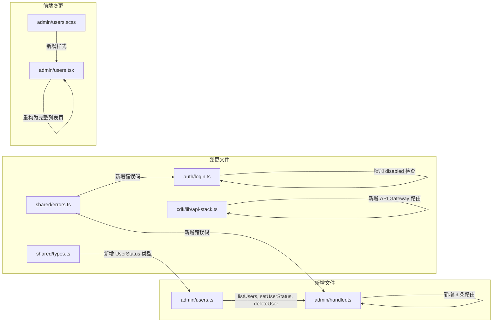

# 技术设计文档 - 用户管理增强（User Management）

## 概述（Overview）

本设计将管理后台的用户管理页面从"手动输入用户 ID 分配角色"的简单表单，升级为完整的用户管理系统。核心变更包括：

1. **后端新增模块** `admin/users.ts`：实现 `listUsers`、`setUserStatus`、`deleteUser` 三个核心函数
2. **Admin Handler 路由扩展**：新增 `GET /api/admin/users`、`PATCH /api/admin/users/{id}/status`、`DELETE /api/admin/users/{id}` 三条路由
3. **登录流程增强**：在 `login.ts` 中增加 `disabled` 状态检查，阻止已停用用户登录
4. **前端重构**：将 `admin/users.tsx` 从简单表单重构为完整的用户列表管理页面
5. **CDK 路由配置**：在 API Gateway 中注册新增路由
6. **错误码扩展**：新增用户管理相关错误码

设计目标：
- 复用现有架构模式（DynamoDB Scan + 分页、Admin Handler 路由分发、前端 admin 页面模式）
- Users 表新增 `status` 字段，历史记录默认视为 `active`
- 权限分级：SuperAdmin 不可被停用/删除，Admin 用户仅 SuperAdmin 可操作

---

## 架构（Architecture）

### 变更范围

本次增强不引入新的 Lambda 函数或 DynamoDB 表，仅在现有架构上扩展：



### 架构决策

| 决策 | 选择 | 理由 |
|------|------|------|
| 用户列表查询方式 | DynamoDB Scan + 分页 | 用户量 < 1000，Scan 性能可接受；无需新建 GSI |
| 角色筛选实现 | Scan + FilterExpression | 角色存储为 StringSet，DynamoDB `contains` 过滤即可 |
| 用户状态字段 | Users 表新增 `status` 字段 | 最小化变更，历史记录默认 `active` |
| 停用实现方式 | 软删除（status=disabled） | 保留用户数据，可恢复 |
| 删除实现方式 | 硬删除（DeleteItem） | 需求明确要求从表中移除记录 |
| 新模块位置 | `admin/users.ts` | 与现有 `admin/roles.ts`、`admin/codes.ts` 保持一致 |
| 登录拦截位置 | `login.ts` 中密码验证前 | 尽早拦截，避免不必要的 bcrypt 计算 |

---

## 组件与接口（Components and Interfaces）

### 1. 后端核心模块（packages/backend/src/admin/users.ts）

#### 1.1 listUsers - 用户列表查询

```typescript
interface ListUsersOptions {
  role?: string;        // 按角色筛选
  pageSize?: number;    // 每页数量，默认 20
  lastKey?: Record<string, unknown>;  // 分页游标
}

interface ListUsersResult {
  users: UserListItem[];
  lastKey?: Record<string, unknown>;
}

interface UserListItem {
  userId: string;
  email: string;
  nickname: string;
  roles: string[];
  points: number;
  status: 'active' | 'disabled';
  createdAt: string;
}

export async function listUsers(
  options: ListUsersOptions,
  dynamoClient: DynamoDBDocumentClient,
  tableName: string,
): Promise<ListUsersResult>;
```

实现要点：
- 使用 `ScanCommand`，`ProjectionExpression` 仅返回需要的字段
- 当 `role` 参数存在时，使用 `FilterExpression: 'contains(#roles, :role)'`
- `status` 字段不存在时默认返回 `'active'`（兼容历史数据）
- `pageSize` 默认 20，最大 100
- 角色筛选时，由于 FilterExpression 在 Scan 后过滤，实际返回数量可能少于 pageSize

#### 1.2 setUserStatus - 停用/启用用户

```typescript
interface SetUserStatusResult {
  success: boolean;
  error?: { code: string; message: string };
}

export async function setUserStatus(
  userId: string,
  status: 'active' | 'disabled',
  callerUserId: string,
  callerRoles: string[],
  dynamoClient: DynamoDBDocumentClient,
  tableName: string,
): Promise<SetUserStatusResult>;
```

实现要点：
- 先 `GetCommand` 获取目标用户，不存在返回 `USER_NOT_FOUND`
- 目标用户含 `SuperAdmin` 角色 → 返回 `CANNOT_DISABLE_SUPERADMIN`
- 目标用户含 `Admin` 角色且调用者非 `SuperAdmin` → 返回 `ONLY_SUPERADMIN_CAN_MANAGE_ADMIN`
- 使用 `UpdateCommand` 更新 `status` 和 `updatedAt`

#### 1.3 deleteUser - 删除用户

```typescript
interface DeleteUserResult {
  success: boolean;
  error?: { code: string; message: string };
}

export async function deleteUser(
  userId: string,
  callerUserId: string,
  callerRoles: string[],
  dynamoClient: DynamoDBDocumentClient,
  tableName: string,
): Promise<DeleteUserResult>;
```

实现要点：
- 先 `GetCommand` 获取目标用户，不存在返回 `USER_NOT_FOUND`
- `callerUserId === userId` → 返回 `CANNOT_DELETE_SELF`
- 目标用户含 `SuperAdmin` 角色 → 返回 `CANNOT_DELETE_SUPERADMIN`
- 目标用户含 `Admin` 角色且调用者非 `SuperAdmin` → 返回 `ONLY_SUPERADMIN_CAN_MANAGE_ADMIN`
- 使用 `DeleteCommand` 硬删除用户记录

### 2. Admin Handler 路由扩展（packages/backend/src/admin/handler.ts）

新增路由正则和处理函数：

```typescript
const USERS_STATUS_REGEX = /^\/api\/admin\/users\/([^/]+)\/status$/;
const USERS_DELETE_REGEX = /^\/api\/admin\/users\/([^/]+)$/;

// GET /api/admin/users → handleListUsers
// PATCH /api/admin/users/{id}/status → handleSetUserStatus
// DELETE /api/admin/users/{id} → handleDeleteUser
```

路由分发逻辑：
- `GET` + `/api/admin/users` → `handleListUsers`（解析 `role`、`pageSize`、`lastKey` 查询参数）
- `PATCH` + 匹配 `USERS_STATUS_REGEX` → `handleSetUserStatus`（解析 body 中的 `status`）
- `DELETE` + 匹配 `USERS_DELETE_REGEX` → `handleDeleteUser`（注意：需排除已有的 `PUT /api/admin/users/{id}/roles` 路由冲突）

### 3. 登录流程增强（packages/backend/src/auth/login.ts）

在现有 `loginUser` 函数中，密码验证之前增加 `disabled` 状态检查：

```typescript
// 在 lockUntil 检查之后、密码比较之前新增：
if (user.status === 'disabled') {
  return {
    success: false,
    error: {
      code: ErrorCodes.ACCOUNT_DISABLED,
      message: ErrorMessages.ACCOUNT_DISABLED,
    },
  };
}
```

### 4. API 路由配置（packages/cdk/lib/api-stack.ts）

在现有 `adminUsers` 资源上扩展：

```typescript
// 现有：adminUsers.addResource('{id}').addResource('roles').addMethod('PUT', adminInt);
// 新增：
adminUsers.addMethod('GET', adminInt);  // GET /api/admin/users
const adminUserById = adminUsers.addResource('{id}');  // 需要复用已有的 {id} 资源
adminUserById.addResource('status').addMethod('PATCH', adminInt);
adminUserById.addMethod('DELETE', adminInt);
```

注意：现有代码中 `adminUsers.addResource('{id}')` 已创建了 `{id}` 子资源用于 `roles` 路由。需要将该资源提取为变量复用，避免重复创建。

### 5. 前端用户管理页面（packages/frontend/src/pages/admin/users.tsx）

参照 `invites.tsx` 的模式重构：

**页面结构：**
- 顶部工具栏：返回按钮 + 标题"用户管理"
- 角色筛选标签栏：全部 | UserGroupLeader | CommunityBuilder | Speaker | Volunteer | Admin
- 用户列表：每行显示昵称、邮箱、角色徽章、积分、状态、注册时间、操作按钮
- 分页：底部"加载更多"按钮
- 角色编辑弹窗：复用 `form-overlay` / `form-modal` 模式
- 确认对话框：停用/删除操作前的二次确认

**状态管理：**
```typescript
const [users, setUsers] = useState<UserListItem[]>([]);
const [roleFilter, setRoleFilter] = useState<string>('all');
const [loading, setLoading] = useState(true);
const [lastKey, setLastKey] = useState<string | null>(null);
const [editingUser, setEditingUser] = useState<UserListItem | null>(null);
const [confirmAction, setConfirmAction] = useState<{ type: 'disable' | 'enable' | 'delete'; user: UserListItem } | null>(null);
```

**API 调用：**
- `GET /api/admin/users?role=xxx&pageSize=20&lastKey=xxx` → 获取用户列表
- `PUT /api/admin/users/{id}/roles` → 更新角色（复用现有接口）
- `PATCH /api/admin/users/{id}/status` → 停用/启用
- `DELETE /api/admin/users/{id}` → 删除

---

## 数据模型（Data Models）

### Users 表变更

在现有 Users 表基础上新增 `status` 字段：

| 属性 | 类型 | 说明 |
|------|------|------|
| `status` | String | 用户账号状态：`'active'` 或 `'disabled'`。历史记录无此字段时默认视为 `'active'` |

无需新建 GSI。用户列表查询使用 Scan（用户量 < 1000），角色筛选使用 FilterExpression。

### 完整用户记录结构

```typescript
interface UserRecord {
  userId: string;           // PK
  email: string;            // GSI: email-index
  nickname: string;
  passwordHash: string;
  roles: Set<string>;       // DynamoDB StringSet
  points: number;
  status?: string;          // 'active' | 'disabled'，历史记录可能不存在
  wechatOpenId?: string;    // GSI: wechatOpenId-index
  emailVerified?: boolean;
  loginFailCount?: number;
  lockUntil?: number;
  resetToken?: string;
  resetTokenExpiry?: number;
  createdAt: string;
  updatedAt?: string;
}
```

### 新增共享类型（packages/shared/src/types.ts）

```typescript
/** 用户账号状态 */
export type UserStatus = 'active' | 'disabled';
```

### 新增错误码（packages/shared/src/errors.ts）

| HTTP 状态码 | 错误码 | 消息 | 对应需求 |
|-------------|--------|------|----------|
| 404 | `USER_NOT_FOUND` | 用户不存在 | 2.4, 3.3 |
| 403 | `CANNOT_DISABLE_SUPERADMIN` | 禁止停用 SuperAdmin 用户 | 2.5 |
| 403 | `ONLY_SUPERADMIN_CAN_MANAGE_ADMIN` | 仅 SuperAdmin 可操作管理员 | 2.6, 3.5 |
| 403 | `CANNOT_DELETE_SUPERADMIN` | 禁止删除 SuperAdmin 用户 | 3.4 |
| 403 | `CANNOT_DELETE_SELF` | 禁止删除自身账号 | 3.6 |
| 403 | `ACCOUNT_DISABLED` | 账号已停用 | 2.7 |


---

## 正确性属性（Correctness Properties）

*属性（Property）是指在系统所有有效执行中都应成立的特征或行为——本质上是对系统应做什么的形式化陈述。属性是人类可读规范与机器可验证正确性保证之间的桥梁。*

### Property 1: 用户列表返回完整记录且默认状态正确

*对于任何*存储在 Users 表中的用户记录集合（包括有 `status` 字段和无 `status` 字段的历史记录），`listUsers` 返回的每条记录都应包含 `userId`、`email`、`nickname`、`roles`、`points`、`status` 和 `createdAt` 字段，且无 `status` 字段的记录应返回 `'active'`。

**Validates: Requirements 1.1, 1.6**

### Property 2: 角色筛选仅返回匹配用户

*对于任何*用户记录集合和任何有效的角色筛选值，`listUsers` 使用该角色筛选后返回的每个用户的 `roles` 数组都应包含该指定角色。

**Validates: Requirements 1.2**

### Property 3: 分页大小约束

*对于任何*正整数 `pageSize`，`listUsers` 返回的用户记录数量应不超过 `pageSize`。

**Validates: Requirements 1.3**

### Property 4: 用户状态切换往返一致性

*对于任何*状态为 `active` 的普通用户（不含 Admin/SuperAdmin 角色），先将其状态设置为 `disabled`，再设置回 `active`，该用户的状态应恢复为 `active`，且其他字段（roles、points 等）不受影响。

**Validates: Requirements 2.2, 2.3**

### Property 5: SuperAdmin 用户不可被停用或删除

*对于任何*拥有 `SuperAdmin` 角色的用户，无论调用者是 Admin 还是 SuperAdmin，`setUserStatus(disabled)` 和 `deleteUser` 操作都应被拒绝，分别返回 `CANNOT_DISABLE_SUPERADMIN` 和 `CANNOT_DELETE_SUPERADMIN` 错误码。

**Validates: Requirements 2.5, 3.4**

### Property 6: 非 SuperAdmin 管理员无法操作 Admin 用户

*对于任何*不包含 `SuperAdmin` 的调用者角色集合（包括仅有 `Admin`），尝试停用或删除拥有 `Admin` 角色的用户应被拒绝，并返回 `ONLY_SUPERADMIN_CAN_MANAGE_ADMIN` 错误码。

**Validates: Requirements 2.6, 3.5**

### Property 7: 已停用用户无法登录

*对于任何*状态为 `disabled` 的用户，即使提供正确的邮箱和密码，登录请求应被拒绝并返回 `ACCOUNT_DISABLED` 错误码。

**Validates: Requirements 2.7**

### Property 8: 删除用户后记录不存在

*对于任何*存在于 Users 表中的普通用户（不含 SuperAdmin 角色，且非调用者自身），执行 `deleteUser` 后，该用户的记录应从表中被移除（GetCommand 返回空）。

**Validates: Requirements 3.2**

### Property 9: 禁止删除自身账号

*对于任何*管理员用户，尝试删除自身的 `userId` 应被拒绝并返回 `CANNOT_DELETE_SELF` 错误码，且该用户的记录应保持不变。

**Validates: Requirements 3.6**

---

## 错误处理（Error Handling）

### 新增错误码

在现有 `ErrorCodes` 基础上新增：

```typescript
// packages/shared/src/errors.ts 新增
export const ErrorCodes = {
  // ... 现有错误码 ...

  /** 用户不存在 (404) - 需求 2.4, 3.3 */
  USER_NOT_FOUND: 'USER_NOT_FOUND',
  /** 禁止停用 SuperAdmin 用户 (403) - 需求 2.5 */
  CANNOT_DISABLE_SUPERADMIN: 'CANNOT_DISABLE_SUPERADMIN',
  /** 仅 SuperAdmin 可操作管理员 (403) - 需求 2.6, 3.5 */
  ONLY_SUPERADMIN_CAN_MANAGE_ADMIN: 'ONLY_SUPERADMIN_CAN_MANAGE_ADMIN',
  /** 禁止删除 SuperAdmin 用户 (403) - 需求 3.4 */
  CANNOT_DELETE_SUPERADMIN: 'CANNOT_DELETE_SUPERADMIN',
  /** 禁止删除自身账号 (403) - 需求 3.6 */
  CANNOT_DELETE_SELF: 'CANNOT_DELETE_SELF',
  /** 账号已停用 (403) - 需求 2.7 */
  ACCOUNT_DISABLED: 'ACCOUNT_DISABLED',
} as const;
```

### 错误码映射

| HTTP 状态码 | 错误码 | 消息 | 对应需求 |
|-------------|--------|------|----------|
| 404 | `USER_NOT_FOUND` | 用户不存在 | 2.4, 3.3 |
| 403 | `CANNOT_DISABLE_SUPERADMIN` | 禁止停用 SuperAdmin 用户 | 2.5 |
| 403 | `ONLY_SUPERADMIN_CAN_MANAGE_ADMIN` | 仅 SuperAdmin 可操作管理员 | 2.6, 3.5 |
| 403 | `CANNOT_DELETE_SUPERADMIN` | 禁止删除 SuperAdmin 用户 | 3.4 |
| 403 | `CANNOT_DELETE_SELF` | 禁止删除自身账号 | 3.6 |
| 403 | `ACCOUNT_DISABLED` | 账号已停用 | 2.7 |

### 错误处理策略

1. **用户不存在**：`setUserStatus` 和 `deleteUser` 均先 GetCommand 检查用户是否存在，不存在返回 404
2. **权限校验顺序**：先检查目标用户是否存在 → 再检查 SuperAdmin 保护 → 再检查 Admin 权限分级 → 再检查自删除 → 最后执行操作
3. **并发安全**：DynamoDB 单条记录操作为原子操作，无需额外并发控制
4. **历史数据兼容**：`listUsers` 中对无 `status` 字段的记录默认返回 `'active'`，使用 `item.status ?? 'active'`

---

## 测试策略（Testing Strategy）

### 双重测试方法

延续现有系统的单元测试 + 属性测试双重策略。

### 技术选型

| 类别 | 工具 |
|------|------|
| 测试框架 | Vitest（现有） |
| 属性测试库 | fast-check（现有） |

### 单元测试范围

单元测试聚焦于具体示例、边界情况和集成点：

- **admin/users.test.ts**：`listUsers`、`setUserStatus`、`deleteUser` 的具体场景
  - 空表返回空列表
  - 分页游标正确传递（需求 1.4, 1.5）
  - 目标用户不存在时返回 404（需求 2.4, 3.3）
  - 无效 status 值被拒绝
- **admin/handler.test.ts**：新增路由的 handler 集成测试
  - GET /api/admin/users 路由分发
  - PATCH /api/admin/users/{id}/status 路由分发
  - DELETE /api/admin/users/{id} 路由分发
- **auth/login.test.ts**：登录流程中 disabled 用户拦截的具体示例

### 属性测试范围

每个正确性属性对应一个属性测试，使用 fast-check 库实现。

**配置要求：**
- 每个属性测试最少运行 100 次迭代
- 每个测试必须用注释引用设计文档中的属性编号
- 标签格式：`Feature: user-management, Property {number}: {property_text}`

**属性测试清单：**

| 属性编号 | 测试文件 | 测试描述 | 生成器 |
|----------|----------|----------|--------|
| Property 1 | admin/users.property.test.ts | 列表返回完整记录且默认状态正确 | 随机用户记录（有/无 status 字段） |
| Property 2 | admin/users.property.test.ts | 角色筛选仅返回匹配用户 | 随机用户记录 + 随机角色筛选值 |
| Property 3 | admin/users.property.test.ts | 分页大小约束 | 随机用户记录 + 随机 pageSize |
| Property 4 | admin/users.property.test.ts | 状态切换往返一致性 | 随机普通用户 |
| Property 5 | admin/users.property.test.ts | SuperAdmin 不可被停用或删除 | 随机 SuperAdmin 用户 + 随机调用者 |
| Property 6 | admin/users.property.test.ts | 非 SuperAdmin 无法操作 Admin 用户 | 随机 Admin 用户 + 随机非 SuperAdmin 调用者 |
| Property 7 | auth/login-disabled.property.test.ts | 已停用用户无法登录 | 随机 disabled 用户 + 正确密码 |
| Property 8 | admin/users.property.test.ts | 删除后记录不存在 | 随机普通用户 |
| Property 9 | admin/users.property.test.ts | 禁止删除自身账号 | 随机管理员 userId |

### 测试示例

```typescript
import { describe, it, expect } from 'vitest';
import fc from 'fast-check';

// Feature: user-management, Property 2: 角色筛选仅返回匹配用户
describe('Property 2: 角色筛选仅返回匹配用户', () => {
  it('筛选后的每个用户都应包含指定角色', () => {
    fc.assert(
      fc.property(
        fc.array(arbUserRecord(), { minLength: 1, maxLength: 20 }),
        fc.constantFrom('UserGroupLeader', 'CommunityBuilder', 'Speaker', 'Volunteer', 'Admin', 'SuperAdmin'),
        (users, filterRole) => {
          // 将 users 写入 mock DynamoDB，调用 listUsers({ role: filterRole })
          // 验证返回的每个用户的 roles 都包含 filterRole
          const filtered = users.filter(u => u.roles.includes(filterRole));
          const result = listUsersSync(users, { role: filterRole });
          expect(result.users.length).toBe(filtered.length);
          result.users.forEach(u => {
            expect(u.roles).toContain(filterRole);
          });
        }
      ),
      { numRuns: 100 }
    );
  });
});

// Feature: user-management, Property 5: SuperAdmin 不可被停用或删除
describe('Property 5: SuperAdmin 不可被停用或删除', () => {
  it('任何对 SuperAdmin 的停用或删除操作都应被拒绝', () => {
    fc.assert(
      fc.property(
        arbSuperAdminUser(),
        fc.constantFrom('Admin', 'SuperAdmin'),
        (targetUser, callerRole) => {
          const disableResult = setUserStatusSync(targetUser.userId, 'disabled', 'caller-1', [callerRole]);
          expect(disableResult.success).toBe(false);
          expect(disableResult.error?.code).toBe('CANNOT_DISABLE_SUPERADMIN');

          const deleteResult = deleteUserSync(targetUser.userId, 'caller-1', [callerRole]);
          expect(deleteResult.success).toBe(false);
          expect(deleteResult.error?.code).toBe('CANNOT_DELETE_SUPERADMIN');
        }
      ),
      { numRuns: 100 }
    );
  });
});
```
