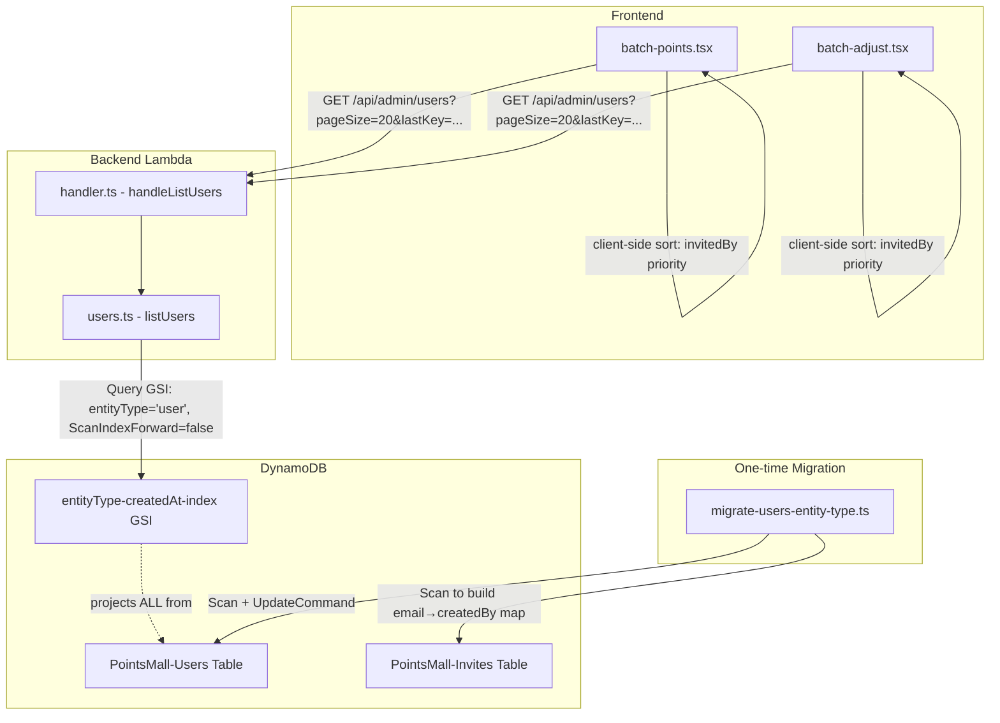

# Design Document: Users GSI Pagination

## Overview

This design replaces the current full-table `Scan` in `listUsers` with a DynamoDB `Query` on a new Global Secondary Index (`entityType-createdAt-index`). The current approach scans the entire `PointsMall-Users` table and filters out system configuration records client-side, which breaks DynamoDB's native pagination and won't scale. The new GSI partitions user records by `entityType = "user"` with `createdAt` as the sort key, enabling correct cursor-based pagination with deterministic page sizes.

Additionally, the `invitedBy` field is introduced on user records to track which admin invited each user. This enables frontend priority sorting where the current admin's invited users appear first in batch points/adjust pages.

### Key Design Decisions

1. **GSI over Scan**: Query on a GSI with `entityType` partition key guarantees only user records are returned, eliminating the filter-before-pagination problem.
2. **`entityType` as a sparse attribute**: System config records won't have `entityType`, so they won't appear in the GSI at all. This is a DynamoDB best practice for sparse indexes.
3. **`invitedBy` backfill via Invites table**: The migration script cross-references the Invites table (matching by email) to populate `invitedBy` on existing user records.
4. **Frontend sorting stays client-side**: The `invitedBy` priority sort is applied on the frontend after fetching each page, since DynamoDB can't sort by a field that depends on the caller's identity.
5. **Migration script as a standalone Node.js script**: Not a Lambda — run once manually via `npx ts-node` against the live table.

## Architecture



### Data Flow

1. **Registration flow**: `register.ts` creates user record with `entityType: "user"` and `invitedBy: <createdBy from invite>` in a single `PutCommand`.
2. **List users flow**: `listUsers` queries the GSI with `entityType = "user"`, `ScanIndexForward = false` (newest first), applies role `FilterExpression` if needed, and returns `LastEvaluatedKey` for pagination.
3. **Frontend flow**: Pages fetch with `pageSize=20`, append results, apply `invitedBy` priority sort client-side, and show "Load more" when `lastKey` is present.

## Components and Interfaces

### 1. CDK — `database-stack.ts`

Add the new GSI to the Users table:

```typescript
this.usersTable.addGlobalSecondaryIndex({
  indexName: 'entityType-createdAt-index',
  partitionKey: { name: 'entityType', type: dynamodb.AttributeType.STRING },
  sortKey: { name: 'createdAt', type: dynamodb.AttributeType.STRING },
  projectionType: dynamodb.ProjectionType.ALL,
});
```

**Rationale**: `ProjectionType.ALL` avoids extra table fetches. PAY_PER_REQUEST billing is inherited from the table.

### 2. Backend — `users.ts` (rewritten `listUsers`)

```typescript
export interface ListUsersOptions {
  role?: string;
  pageSize?: number;
  lastKey?: Record<string, unknown>;
  excludeRoles?: string[];
}

export interface ListUsersResult {
  users: UserListItem[];
  lastKey?: Record<string, unknown>;
}

export interface UserListItem {
  userId: string;
  email: string;
  nickname: string;
  roles: string[];
  points: number;
  status: UserStatus;
  createdAt: string;
  invitedBy?: string;  // NEW: admin userId who created the invite
}
```

**Key changes**:
- Replace `ScanCommand` with `QueryCommand` on `entityType-createdAt-index`
- Set `ScanIndexForward: false` for descending `createdAt` order
- Use `Limit: pageSize` (DynamoDB Query Limit applies *before* FilterExpression for key conditions, but *after* for non-key filters — same behavior as Scan for role filtering, but the partition key eliminates system records)
- Return `LastEvaluatedKey` directly as `lastKey` (no more full-table scan loop)
- Add `invitedBy` to `ProjectionExpression` and `UserListItem`

**Note on FilterExpression with Query**: When `role` or `excludeRoles` filters are applied, DynamoDB may return fewer than `pageSize` items per page (same as Scan). This is acceptable — the frontend already handles "Load more" pagination. The key improvement is that system config records are eliminated by the partition key, not by filtering.

### 3. Backend — `register.ts` (modified)

Add two fields to the `PutCommand` item:
- `entityType: "user"` — always set
- `invitedBy: invite.createdBy` — set only if the invite record has `createdBy`

The invite record is already fetched during `validateInviteToken`. To get `createdBy`, we need to fetch the full invite record. Currently `validateInviteToken` returns only `{ roles, isEmployee }`. Two options:

**Chosen approach**: After `validateInviteToken` succeeds, do a separate `GetCommand` on the Invites table to fetch `createdBy`. This avoids changing the `validateInviteToken` interface which is used elsewhere.

```typescript
// After validateInviteToken succeeds:
const inviteRecord = await dynamoClient.send(
  new GetCommand({
    TableName: invitesTable,
    Key: { token: request.inviteToken },
    ProjectionExpression: 'createdBy',
  }),
);
const invitedBy = inviteRecord.Item?.createdBy as string | undefined;

// In the user object:
const user = {
  ...existingFields,
  entityType: 'user',
  ...(invitedBy ? { invitedBy } : {}),
};
```

### 4. Migration Script — `scripts/migrate-users-entity-type.ts`

A standalone script that:

1. Scans the Invites table to build a `Map<email, createdBy>` from used invites (where `status = "used"` and `email` exists on the invite record).
   - **Note**: The Invites table stores `email` on the invite record only after it's consumed (via `usedByNickname` etc.). We need to cross-reference: scan Users table for emails, then scan Invites table for `usedBy` matching the userId, then get `createdBy` from that invite.
   - **Revised approach**: Scan Invites table for all records with `status = "used"`. Each used invite has `usedBy` (the userId who consumed it) and `createdBy` (the admin who created it). Build a `Map<userId, createdBy>` from `usedBy → createdBy`.

2. Scans the Users table. For each record with `email` attribute:
   - Sets `entityType = "user"` (using `SET entityType = :et` with condition `attribute_exists(email)`)
   - If the user's `userId` exists in the invite map and the user doesn't already have `invitedBy`, sets `invitedBy`
   - Uses `attribute_not_exists(invitedBy) OR invitedBy = :existing` condition to avoid overwriting

3. Logs counts: updated, skipped (no email), already had invitedBy.

### 5. Frontend — `batch-points.tsx` and `batch-adjust.tsx`

Changes:
- `pageSize=200` → `pageSize=20`
- Add `invitedBy` to `UserListItem` type
- After each fetch (initial + append), apply sort: `invitedBy === currentUserId` first, then by `createdAt` desc within each group
- "Load more" button already exists; just ensure it works with the new pagination

### 6. Frontend Sorter Utility

```typescript
function sortUsersWithInvitePriority(
  users: UserListItem[],
  currentUserId: string,
): UserListItem[] {
  const invited = users.filter(u => u.invitedBy === currentUserId);
  const others = users.filter(u => u.invitedBy !== currentUserId);
  
  const byCreatedAtDesc = (a: UserListItem, b: UserListItem) =>
    (b.createdAt ?? '').localeCompare(a.createdAt ?? '');
  
  return [...invited.sort(byCreatedAtDesc), ...others.sort(byCreatedAtDesc)];
}
```

**Note**: This sort is applied to the *accumulated* user list (all pages loaded so far), not just the latest page. This ensures correct ordering as more pages are loaded.

## Data Models

### Users Table Record (after migration)

| Attribute | Type | Description |
|-----------|------|-------------|
| userId | String (PK) | ULID identifier |
| email | String | User's email address |
| nickname | String | Display name |
| roles | List\<String\> | Assigned roles |
| points | Number | Current points balance |
| status | String | `active` / `disabled` / `locked` |
| createdAt | String | ISO 8601 timestamp |
| **entityType** | String | **NEW** — `"user"` for user records, absent for system config |
| **invitedBy** | String? | **NEW** — userId of the admin who created the invite |
| passwordHash | String | Bcrypt hash |
| emailVerified | Boolean | Whether email is verified |
| pk | String | `"ALL"` — used by leaderboard GSIs |
| earnTotal | Number | Total points earned |
| ... | ... | Other existing fields |

### entityType-createdAt-index GSI

| Key | Attribute | Type |
|-----|-----------|------|
| Partition Key | entityType | String |
| Sort Key | createdAt | String |
| Projection | ALL | — |

Only records with `entityType` attribute will appear in this GSI (sparse index behavior).

### Invites Table Record (relevant fields for migration)

| Attribute | Type | Description |
|-----------|------|-------------|
| token | String (PK) | Invite token |
| status | String | `pending` / `used` / `expired` / `revoked` |
| createdBy | String? | userId of admin who created the invite |
| usedBy | String? | userId of user who consumed the invite |
| roles | List\<String\> | Roles assigned via this invite |

### API Response Shape

```typescript
// GET /api/admin/users?role=Speaker&pageSize=20&lastKey=...
{
  users: [
    {
      userId: string;
      email: string;
      nickname: string;
      roles: string[];
      points: number;
      status: string;
      createdAt: string;
      invitedBy?: string;
    }
  ],
  lastKey?: Record<string, unknown>;  // opaque cursor for next page
}
```


## Correctness Properties

*A property is a characteristic or behavior that should hold true across all valid executions of a system — essentially, a formal statement about what the system should do. Properties serve as the bridge between human-readable specifications and machine-verifiable correctness guarantees.*

### Property 1: Registration record invariants

*For any* valid registration request with a valid invite token, the resulting user record SHALL have `entityType` equal to `"user"`, and its `invitedBy` field SHALL equal the invite record's `createdBy` value when present, or be absent when the invite has no `createdBy`.

**Validates: Requirements 2.1, 3.1, 3.2**

### Property 2: Migration correctness

*For any* set of records in the Users table and Invites table, after running the migration logic: every record that has an `email` attribute SHALL have `entityType` set to `"user"` and `invitedBy` set to the `createdBy` of the matching used invite (matched via `usedBy` → `userId`); every record without an `email` attribute SHALL remain unmodified; and users without a matching invite SHALL not have `invitedBy` set.

**Validates: Requirements 4.1, 4.2, 4.6, 4.7**

### Property 3: Migration idempotency

*For any* table state, running the migration logic twice SHALL produce the same result as running it once — no attributes are overwritten or duplicated, and pre-existing `invitedBy` values are preserved.

**Validates: Requirements 4.3, 4.8**

### Property 4: Query filter construction

*For any* combination of `role` (string or undefined) and `excludeRoles` (array of strings or undefined), the constructed DynamoDB Query FilterExpression SHALL contain `contains(#roles, :role)` if and only if `role` is provided, and SHALL contain `NOT contains(#roles, :exRoleN)` for each role in `excludeRoles`.

**Validates: Requirements 5.3, 5.4**

### Property 5: Page size clamping

*For any* integer value of `pageSize`, the DynamoDB Query `Limit` SHALL equal `max(1, min(pageSize, 100))`. When `pageSize` is not provided, the `Limit` SHALL default to 20.

**Validates: Requirements 5.5**

### Property 6: Frontend sort — invited-user priority with createdAt ordering

*For any* list of users (each with optional `invitedBy` and `createdAt` fields) and any `currentUserId`, the sorted result SHALL place all users whose `invitedBy` equals `currentUserId` before all other users, and within each group users SHALL be ordered by `createdAt` descending. Users without an `invitedBy` field SHALL appear in the "other users" group.

**Validates: Requirements 7.1, 7.2, 7.3, 7.6**

## Error Handling

### Backend — `listUsers`

| Error Condition | Handling |
|----------------|----------|
| Invalid `lastKey` JSON | Ignore (don't pass `ExclusiveStartKey`), same as current behavior |
| `pageSize` is NaN or missing | Default to 20 |
| `pageSize` < 1 | Clamp to 1 |
| `pageSize` > 100 | Clamp to 100 |
| DynamoDB throttling on GSI | Let the error propagate — Lambda will return 500, frontend retries |
| GSI not yet active (during deployment) | DynamoDB returns `ValidationException` — return 500 with error message |

### Backend — `register.ts`

| Error Condition | Handling |
|----------------|----------|
| Invite record `GetCommand` fails | Let error propagate — registration fails with 500 |
| Invite has no `createdBy` | Omit `invitedBy` from user record (not an error) |

### Migration Script

| Error Condition | Handling |
|----------------|----------|
| `UpdateCommand` conditional check fails | Log and skip — record may have been updated concurrently |
| DynamoDB throttling during scan | Use exponential backoff with `@aws-sdk` built-in retry |
| Partial failure mid-scan | Script is idempotent — safe to re-run |

### Frontend

| Error Condition | Handling |
|----------------|----------|
| `lastKey` parse error | Treat as no more pages (hide "Load more") |
| Fetch fails on "Load more" | Show error toast, keep existing list, allow retry |
| `invitedBy` field missing on user | Place in "other users" group (not an error) |

## Testing Strategy

### Unit Tests (example-based)

- **`users.ts`**: Verify `QueryCommand` is used (not `ScanCommand`), correct `IndexName`, `ScanIndexForward: false`, `ProjectionExpression` includes `invitedBy`, `ExclusiveStartKey` passthrough, `LastEvaluatedKey` returned as `lastKey`
- **`register.ts`**: Verify `PutCommand` item includes `entityType: "user"`, verify `invitedBy` is set when invite has `createdBy`, verify `invitedBy` is omitted when invite lacks `createdBy`
- **Migration script**: Verify `UpdateCommand` uses correct condition expressions, verify log output format
- **CDK**: Snapshot or assertion test for GSI definition

### Property-Based Tests (vitest + fast-check)

The project already uses `vitest` and `fast-check` for property-based testing (see existing `*.property.test.ts` files). Each property test runs a minimum of 100 iterations.

| Property | Test File | What It Generates |
|----------|-----------|-------------------|
| Property 1: Registration invariants | `register.property.test.ts` (extend) | Random valid emails, nicknames, passwords, invite records with/without createdBy |
| Property 2: Migration correctness | `migrate-users.property.test.ts` (new) | Random sets of user records (with/without email) and invite records (with/without usedBy/createdBy) |
| Property 3: Migration idempotency | `migrate-users.property.test.ts` (new) | Same as Property 2, run migration twice |
| Property 4: Query filter construction | `users.property.test.ts` (new) | Random role strings, random arrays of excludeRoles |
| Property 5: Page size clamping | `users.property.test.ts` (new) | Random integers (negative, zero, small, large) |
| Property 6: Frontend sort | `sort-users.property.test.ts` (new, frontend) | Random user lists with varying invitedBy/createdAt, random currentUserId |

Each test is tagged with: `Feature: users-gsi-pagination, Property {N}: {description}`

### Integration Tests

- End-to-end pagination test against DynamoDB Local (if available) to verify no data loss across pages
- Verify GSI returns only user records (not system config records)
