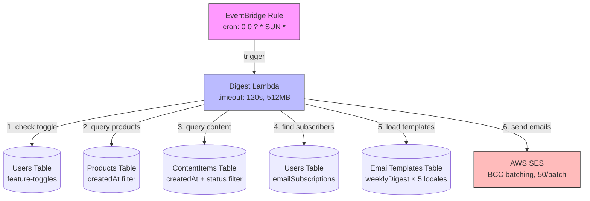

# Design Document: Weekly Digest Email

## Overview

本设计为积分商城系统添加每周摘要邮件功能。一个新的 Lambda 函数（Digest Lambda）由 EventBridge 定时规则在每周日 UTC 00:00 触发，扫描过去 7 天内新增的商品和已审核内容，按用户订阅偏好和语言分组，通过 SES 批量发送摘要邮件。

该功能完全复用现有的邮件基础设施：
- `sendBulkEmail` 函数（BCC 批量发送，每批最多 50 人，批间 100ms 延迟）
- `replaceVariables` 模板变量替换
- `getTemplate` + zh 回退机制
- `EmailTemplates` DynamoDB 表和模板编辑 UI
- Feature toggle 系统控制全局开关

新增组件：
- `packages/backend/src/digest/handler.ts` — Digest Lambda 入口
- `packages/backend/src/digest/query.ts` — 数据查询逻辑（纯函数，可测试）
- `packages/backend/src/digest/compose.ts` — 邮件内容组装逻辑（纯函数，可测试）
- CDK 中新增 Lambda + EventBridge Rule
- Feature toggle `emailWeeklyDigestEnabled`
- 新通知类型 `weeklyDigest` 及 5 种语言的默认模板

## Architecture



**执行流程：**

1. EventBridge 触发 Digest Lambda（空 payload）
2. 检查 `emailWeeklyDigestEnabled` toggle → 若 `false` 则跳过
3. 并行查询 Products 和 ContentItems 表（过去 7 天）
4. 若两个列表均为空 → 跳过发送，记录日志
5. 扫描 Users 表，筛选订阅用户（有 email + newProduct 或 newContent 订阅）
6. 按 locale 分组用户
7. 对每个 locale 组：
   a. 加载对应语言模板（回退到 zh）
   b. 按用户订阅偏好组装邮件内容（仅商品 / 仅内容 / 两者都有）
   c. 按内容变体再分组，使用 `sendBulkEmail` 批量发送
8. 记录执行摘要日志

## Components and Interfaces

### 1. Digest Query Module (`packages/backend/src/digest/query.ts`)

纯函数模块，负责从 DynamoDB 查询数据并过滤/排序。

```typescript
export interface DigestProduct {
  name: string;
  pointsCost: number;
  createdAt: string;
}

export interface DigestContentItem {
  title: string;
  authorName: string;
  createdAt: string;
}

export interface DigestSubscriber {
  email: string;
  nickname: string;
  locale: EmailLocale;
  wantsProducts: boolean;
  wantsContent: boolean;
}

/**
 * Query products created within the date range.
 * Returns products sorted by createdAt descending.
 */
export async function queryNewProducts(
  dynamoClient: DynamoDBDocumentClient,
  productsTable: string,
  since: string, // ISO date string
): Promise<DigestProduct[]>;

/**
 * Query approved content items created within the date range.
 * Returns items sorted by createdAt descending.
 */
export async function queryNewContent(
  dynamoClient: DynamoDBDocumentClient,
  contentItemsTable: string,
  since: string,
): Promise<DigestContentItem[]>;

/**
 * Scan users table for digest subscribers.
 * A subscriber has a valid email and at least one of
 * emailSubscriptions.newProduct or emailSubscriptions.newContent = true.
 */
export async function querySubscribers(
  dynamoClient: DynamoDBDocumentClient,
  usersTable: string,
): Promise<DigestSubscriber[]>;

/**
 * Pure function: filter products by date range.
 * Used internally and exported for testing.
 */
export function filterByDateRange(
  items: { createdAt: string }[],
  since: string,
  until: string,
): typeof items;

/**
 * Pure function: sort items by createdAt descending.
 */
export function sortByCreatedAtDesc<T extends { createdAt: string }>(items: T[]): T[];

/**
 * Pure function: identify subscribers from raw user records.
 */
export function identifySubscribers(
  users: Array<{
    email?: string;
    nickname?: string;
    locale?: string;
    emailSubscriptions?: { newProduct?: boolean; newContent?: boolean };
  }>,
): DigestSubscriber[];

/**
 * Pure function: group subscribers by locale.
 */
export function groupByLocale(
  subscribers: DigestSubscriber[],
): Map<EmailLocale, DigestSubscriber[]>;
```

### 2. Digest Compose Module (`packages/backend/src/digest/compose.ts`)

纯函数模块，负责组装邮件内容。

```typescript
export type DigestVariant = 'both' | 'productsOnly' | 'contentOnly';

export interface DigestEmailContent {
  subject: string;
  htmlBody: string;
}

/**
 * Determine which digest variant a subscriber should receive.
 */
export function getDigestVariant(subscriber: DigestSubscriber): DigestVariant;

/**
 * Format product list as HTML string for template insertion.
 * Returns locale-appropriate "no new products" message if list is empty.
 */
export function formatProductList(
  products: DigestProduct[],
  locale: EmailLocale,
): string;

/**
 * Format content list as HTML string for template insertion.
 * Returns locale-appropriate "no new content" message if list is empty.
 */
export function formatContentList(
  contentItems: DigestContentItem[],
  locale: EmailLocale,
): string;

/**
 * Compose the final email content by replacing template variables.
 */
export function composeDigestEmail(
  template: { subject: string; body: string },
  variables: {
    nickname: string;
    productList: string;
    contentList: string;
    weekStart: string;
    weekEnd: string;
  },
): DigestEmailContent;

/**
 * Determine if digest should be skipped (both lists empty).
 */
export function shouldSkipDigest(
  products: DigestProduct[],
  contentItems: DigestContentItem[],
): boolean;
```

### 3. Digest Handler (`packages/backend/src/digest/handler.ts`)

Lambda 入口，编排查询、组装和发送流程。

```typescript
/**
 * EventBridge-triggered handler.
 * Orchestrates the weekly digest email flow.
 */
export async function handler(event: unknown): Promise<void>;
```

### 4. Changes to Existing Modules

**`packages/backend/src/email/send.ts`**
- Add `'weeklyDigest'` to `NotificationType` union type

**`packages/backend/src/email/templates.ts`**
- Add `weeklyDigest` entry to `TEMPLATE_VARIABLE_MAP` with variables: `['nickname', 'productList', 'contentList', 'weekStart', 'weekEnd']`

**`packages/backend/src/email/seed.ts`**
- Add `weeklyDigestTemplates` for all 5 locales
- Add `weeklyDigest` to `ALL_TYPES` array
- Update `getDefaultTemplates()` to include the new templates (total: 35 templates = 7 types × 5 locales)

**`packages/backend/src/email/notifications.ts`**
- Add `weeklyDigest` to `TOGGLE_MAP`: `weeklyDigest: 'emailWeeklyDigestEnabled'`

**`packages/backend/src/settings/feature-toggles.ts`**
- Add `emailWeeklyDigestEnabled: boolean` to `FeatureToggles` interface (default: `false`)
- Add to `UpdateFeatureTogglesInput` interface
- Add to `DEFAULT_TOGGLES`
- Add to `getFeatureToggles()` read logic
- Add to `updateFeatureToggles()` write logic and validation

**`packages/backend/src/admin/handler.ts`**
- Add `'weeklyDigest'` to `VALID_NOTIFICATION_TYPES` array

**`packages/frontend/src/pages/admin/settings.tsx`**
- Add `emailWeeklyDigestEnabled` to `FeatureToggles` interface
- Add `'weeklyDigest'` to `NotificationType` union
- Add `weeklyDigest` entry to `NOTIFICATION_TYPE_LABELS`
- Add toggle row in email notifications section

**`packages/frontend/src/i18n/types.ts`**
- Add `weeklyDigestLabel` and `weeklyDigestDesc` to `admin.settings.email` section

**`packages/frontend/src/i18n/{zh,en,ja,ko,zh-TW}.ts`**
- Add translations for `weeklyDigestLabel` and `weeklyDigestDesc`

**`packages/cdk/lib/api-stack.ts`**
- Add Digest Lambda definition
- Add EventBridge Rule with `cron(0 0 ? * SUN *)`
- Grant table read permissions and SES permissions

## Data Models

### EmailTemplates Table — New Records

| templateId | locale | subject | body | updatedAt | updatedBy |
|---|---|---|---|---|---|
| weeklyDigest | zh | 📬 本周福利广场新鲜事，快来看看！ | (HTML template) | (ISO) | system |
| weeklyDigest | en | 📬 Your Weekly Benefits Plaza Digest | (HTML template) | (ISO) | system |
| weeklyDigest | ja | 📬 今週の福利広場ダイジェスト | (HTML template) | (ISO) | system |
| weeklyDigest | ko | 📬 이번 주 복지광장 다이제스트 | (HTML template) | (ISO) | system |
| weeklyDigest | zh-TW | 📬 本週福利廣場新鮮事，快來看看！ | (HTML template) | (ISO) | system |

**Template Variables:**
- `{{nickname}}` — 用户昵称
- `{{productList}}` — 新商品列表 HTML（或"本周无新商品"提示）
- `{{contentList}}` — 新内容列表 HTML（或"本周无新内容"提示）
- `{{weekStart}}` — 周期开始日期（如 2024-01-07）
- `{{weekEnd}}` — 周期结束日期（如 2024-01-14）

### Feature Toggles — New Field

| Field | Type | Default | Description |
|---|---|---|---|
| emailWeeklyDigestEnabled | boolean | false | 控制每周摘要邮件功能的全局开关 |

### Products Table Query Pattern

```
Scan with FilterExpression:
  createdAt >= :since
ProjectionExpression: #name, pointsCost, createdAt
```

### ContentItems Table Query Pattern

```
Scan with FilterExpression:
  createdAt >= :since AND #status = :approved
ProjectionExpression: title, authorName, createdAt, #status
```

### Users Table Subscriber Query Pattern

```
Scan with FilterExpression:
  attribute_exists(email) AND email <> :empty
  AND (emailSubscriptions.newProduct = :true OR emailSubscriptions.newContent = :true)
ProjectionExpression: email, nickname, locale, emailSubscriptions
```


## Correctness Properties

*A property is a characteristic or behavior that should hold true across all valid executions of a system — essentially, a formal statement about what the system should do. Properties serve as the bridge between human-readable specifications and machine-verifiable correctness guarantees.*

### Property 1: Product date filtering

*For any* set of product records with various `createdAt` timestamps, the `filterByDateRange` function SHALL return exactly those products whose `createdAt` falls within the specified date range (inclusive of `since`, exclusive of `until`), and no others.

**Validates: Requirements 2.1, 2.4**

### Property 2: Content date and status filtering

*For any* set of content item records with various `createdAt` timestamps and `status` values, the query logic SHALL return exactly those items whose `createdAt` falls within the past 7 days AND whose `status` equals `approved`, and no others.

**Validates: Requirements 3.1, 3.4**

### Property 3: Descending sort invariant

*For any* non-empty list of items with `createdAt` fields, after applying `sortByCreatedAtDesc`, every consecutive pair of items SHALL satisfy `items[i].createdAt >= items[i+1].createdAt`.

**Validates: Requirements 2.3, 3.3**

### Property 4: Skip empty digest

*For any* pair of product list and content list, `shouldSkipDigest` SHALL return `true` if and only if both lists have length zero. When at least one list is non-empty, it SHALL return `false`.

**Validates: Requirements 4.1, 4.2**

### Property 5: Subscriber identification and locale grouping

*For any* set of user records, `identifySubscribers` SHALL return exactly those users who have a non-empty `email` AND at least one of `emailSubscriptions.newProduct` or `emailSubscriptions.newContent` set to `true`. Furthermore, `groupByLocale` SHALL produce groups where every subscriber in a group shares the same locale value.

**Validates: Requirements 5.1, 5.5**

### Property 6: Per-user content personalization

*For any* subscriber, `getDigestVariant` SHALL return `'productsOnly'` when `wantsProducts=true` and `wantsContent=false`, `'contentOnly'` when `wantsProducts=false` and `wantsContent=true`, and `'both'` when both are `true`.

**Validates: Requirements 5.2, 5.3, 5.4**

### Property 7: Empty list fallback messages

*For any* locale, when `formatProductList` is called with an empty product array, the result SHALL be a non-empty string (the locale-appropriate fallback message). The same SHALL hold for `formatContentList` with an empty content array.

**Validates: Requirements 6.6, 6.7**

### Property 8: Template variable replacement completeness

*For any* template string containing `{{nickname}}`, `{{productList}}`, `{{contentList}}`, `{{weekStart}}`, and `{{weekEnd}}` placeholders, and any set of non-empty variable values, `composeDigestEmail` SHALL produce output containing no remaining `{{...}}` placeholder patterns.

**Validates: Requirements 7.3**

### Property 9: Toggle disables all processing

*For any* system state where `emailWeeklyDigestEnabled` is `false`, the digest handler SHALL not perform any DynamoDB scans for products, content, or subscribers, and SHALL not invoke any SES send operations.

**Validates: Requirements 8.2**

### Property 10: DynamoDB error prevents email sending

*For any* DynamoDB read error during product or content querying, the digest handler SHALL not invoke any SES send operations and SHALL terminate gracefully.

**Validates: Requirements 12.1**

### Property 11: SES batch error resilience

*For any* sequence of N email batches where batch K fails (0 ≤ K < N), all batches after K SHALL still be attempted. The total number of batch attempts SHALL equal N regardless of individual failures.

**Validates: Requirements 12.2**

## Error Handling

| Error Scenario | Handling Strategy | Recovery |
|---|---|---|
| Feature toggle read fails | Log error, treat as disabled, skip processing | Next scheduled run |
| Products table scan fails | Log error, terminate gracefully, no emails sent | Next scheduled run |
| ContentItems table scan fails | Log error, terminate gracefully, no emails sent | Next scheduled run |
| Users table scan fails | Log error, terminate gracefully, no emails sent | Next scheduled run |
| Template not found for locale | Fall back to `zh` locale template | Automatic |
| Template not found for `zh` either | Log error, skip that locale group | Next scheduled run |
| Individual SES batch fails | Log error with batch index, continue remaining batches | Partial delivery |
| Lambda timeout (120s) | Lambda platform terminates, CloudWatch logs available | Next scheduled run |
| No subscribers found | Log info message, skip sending | Next scheduled run |

**日志格式：**
- 开始：`[Digest] Starting weekly digest execution`
- Toggle 禁用：`[Digest] Feature disabled, skipping`
- 空摘要：`[Digest] No new products or content, skipping`
- 批次发送：`[Digest] Batch {i}/{total} sent ({count} recipients, locale: {locale})`
- 批次失败：`[Digest] Batch {i}/{total} failed: {error}`
- 执行摘要：`[Digest] Complete: {subscribers} subscribers, {sent} sent, {failed} failed, {products} products, {content} content items`

## Testing Strategy

### Property-Based Tests (using fast-check)

Property-based testing is appropriate for this feature because the core logic consists of pure functions (filtering, sorting, grouping, composing) with clear input/output behavior and large input spaces.

**Library:** `fast-check` (already available in the project via vitest)
**Minimum iterations:** 100 per property test
**Tag format:** `Feature: weekly-digest-email, Property {N}: {title}`

Tests will be placed in:
- `packages/backend/src/digest/query.property.test.ts` — Properties 1–5
- `packages/backend/src/digest/compose.property.test.ts` — Properties 6–8
- `packages/backend/src/digest/handler.property.test.ts` — Properties 9–11

### Unit Tests (example-based)

- `packages/backend/src/digest/query.test.ts`
  - Specific date boundary cases (exactly 7 days ago, 8 days ago)
  - Empty table results
  - Content with various status values (approved, pending, rejected)
  
- `packages/backend/src/digest/compose.test.ts`
  - Specific template rendering with known values
  - All 5 locale fallback messages
  - HTML output structure verification

- `packages/backend/src/digest/handler.test.ts`
  - Full handler flow with mocked DynamoDB and SES
  - Toggle disabled scenario
  - Empty digest skip scenario
  - Error scenarios (DynamoDB failure, SES failure)
  - Execution summary log verification

### Integration Points (example-based)

- Seed function produces correct number of templates (35 = 7 types × 5 locales)
- `weeklyDigest` is in `VALID_NOTIFICATION_TYPES`
- `weeklyDigest` is in `TEMPLATE_VARIABLE_MAP` with correct variables
- Feature toggle read/write includes `emailWeeklyDigestEnabled`
- CDK snapshot test for new Lambda and EventBridge Rule
