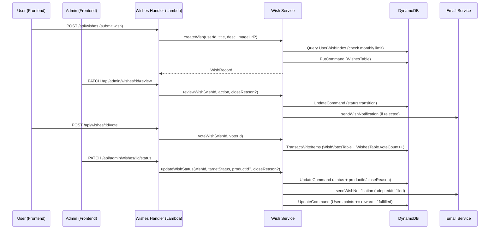
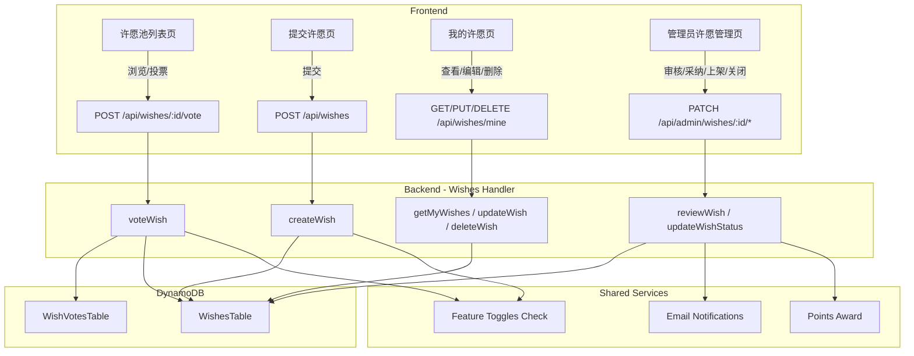
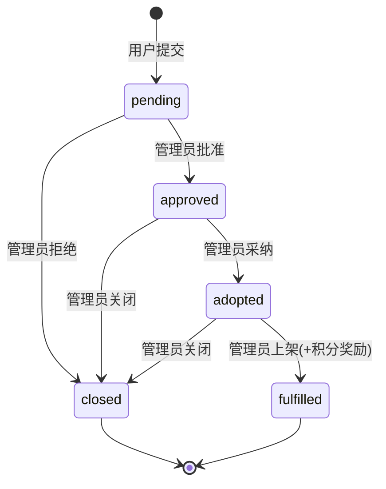

# Design Document: 许愿池（Wish Pool）

## Overview

许愿池是一个社区驱动的周边商品需求收集功能。用户提交许愿（标题 + 描述 + 可选图片），管理员审核后发布到社区，其他用户投票支持。管理员根据投票热度决定是否采纳上架，愿望实现后许愿者获得积分奖励。

### Key Design Decisions

1. **独立 Lambda Handler**：许愿池功能通过独立的 `wishes/handler.ts` 处理，包含用户端和管理端路由，避免 admin handler 过于臃胀。

2. **两表设计**：`WishesTable` 存储许愿记录，`WishVotesTable` 存储投票记录（wishId + voterId 复合键防重复）。投票操作使用 `TransactWriteItems` 原子写入投票记录并递增 voteCount。

3. **月度配额计算**：使用 `UserWishIndex` GSI 按 userId 查询，在应用层过滤当月记录计算已用配额。删除的许愿释放配额（物理删除）。

4. **Feature Toggle 集成**：复用现有 `feature-toggles` 机制，新增 `wishPoolEnabled`（boolean）和 `wishFulfilledRewardPoints`（正整数）两个字段。

5. **状态机设计**：许愿状态转换严格受控，仅允许预定义的转换路径。`closed` 是从多个状态可达的终态。

6. **通知复用**：复用现有 `email/notifications.ts` 模式，新增 `wishAdopted`、`wishFulfilled`、`wishRejected` 三种通知类型和对应邮件模板。

## Architecture



### Component Interaction



### Wish Status State Machine



## Components and Interfaces

### Backend: New Module — `packages/backend/src/wishes/`

#### `wishes/handler.ts` — Lambda Handler (路由分发)

| Method | Path | Auth | Description |
|--------|------|------|-------------|
| `POST` | `/api/wishes` | User | 提交许愿 |
| `GET` | `/api/wishes` | User/Public | 浏览许愿池列表 |
| `GET` | `/api/wishes/mine` | User | 我的许愿列表 |
| `POST` | `/api/wishes/:wishId/vote` | User | 投票 |
| `PUT` | `/api/wishes/:wishId` | User (Author) | 编辑许愿 |
| `DELETE` | `/api/wishes/:wishId` | User (Author) | 删除许愿 |
| `PATCH` | `/api/admin/wishes/:wishId/review` | Admin | 审核（approve/reject） |
| `PATCH` | `/api/admin/wishes/:wishId/status` | Admin | 状态管理（adopt/fulfill/close） |
| `GET` | `/api/admin/wishes` | Admin | 管理员许愿列表 |

#### `wishes/wish-service.ts` — Business Logic

```typescript
export interface CreateWishInput {
  userId: string;
  title: string;        // 1-50 chars
  description: string;  // 1-500 chars
  imageUrl?: string;
}

export interface CreateWishResult {
  success: boolean;
  wish?: WishRecord;
  error?: { code: string; message: string };
}

export interface VoteWishResult {
  success: boolean;
  error?: { code: string; message: string };
}

export interface UpdateWishStatusInput {
  wishId: string;
  targetStatus: WishStatus;
  operatorId: string;
  productId?: string;     // required when targetStatus = 'fulfilled'
  closeReason?: string;   // required when targetStatus = 'closed'
}

export interface UpdateWishStatusResult {
  success: boolean;
  error?: { code: string; message: string };
}

export interface ListWishesInput {
  status?: WishStatus[];
  sortBy: 'votes' | 'time';
  page: number;
  pageSize: number;
  currentUserId?: string;  // for marking voted status
}

export interface ListWishesResult {
  success: boolean;
  wishes?: WishListItem[];
  total?: number;
  error?: { code: string; message: string };
}

// Core functions
export async function createWish(input: CreateWishInput, ...): Promise<CreateWishResult>;
export async function voteWish(wishId: string, voterId: string, ...): Promise<VoteWishResult>;
export async function reviewWish(wishId: string, action: 'approve' | 'reject', closeReason: string | undefined, operatorId: string, ...): Promise<UpdateWishStatusResult>;
export async function updateWishStatus(input: UpdateWishStatusInput, ...): Promise<UpdateWishStatusResult>;
export async function listWishes(input: ListWishesInput, ...): Promise<ListWishesResult>;
export async function getMyWishes(userId: string, page: number, pageSize: number, ...): Promise<MyWishesResult>;
export async function updateWish(wishId: string, userId: string, updates: Partial<CreateWishInput>, ...): Promise<UpdateWishResult>;
export async function deleteWish(wishId: string, userId: string, ...): Promise<DeleteWishResult>;
export async function getMonthlyWishCount(userId: string, ...): Promise<number>;
```

#### `wishes/wish-validators.ts` — Input Validation

```typescript
export function validateWishTitle(title: string): boolean;    // 1-50 chars
export function validateWishDescription(desc: string): boolean; // 1-500 chars
export function validateCloseReason(reason: string): boolean;  // 1-200 chars

export const VALID_STATUS_TRANSITIONS: Record<WishStatus, WishStatus[]> = {
  pending: ['approved', 'closed'],
  approved: ['adopted', 'closed'],
  adopted: ['fulfilled', 'closed'],
  fulfilled: [],
  closed: [],
};

export function isValidStatusTransition(current: WishStatus, target: WishStatus): boolean;
```

### Shared: Type Updates

**File**: `packages/shared/src/types.ts`

```typescript
// ============================================================
// 许愿池（Wish Pool）相关类型定义
// ============================================================

/** 许愿状态 */
export type WishStatus = 'pending' | 'approved' | 'adopted' | 'fulfilled' | 'closed';

/** 许愿记录 */
export interface WishRecord {
  wishId: string;
  userId: string;
  title: string;
  description: string;
  imageUrl?: string;
  status: WishStatus;
  voteCount: number;
  productId?: string;
  closeReason?: string;
  priorityPurchase?: boolean;
  createdAt: string;
  updatedAt: string;
}

/** 许愿列表项（含投票状态） */
export interface WishListItem extends WishRecord {
  hasVoted?: boolean;  // 当前用户是否已投票
}

/** 我的许愿列表项 */
export interface MyWishListItem extends WishRecord {
  remainingWishes: number;  // 本月剩余可许愿次数
}
```

**File**: `packages/shared/src/errors.ts` — New error codes

```typescript
/** 许愿池每月提交上限已达 (400) */
MONTHLY_LIMIT_EXCEEDED: 'MONTHLY_LIMIT_EXCEEDED',
/** 已对该许愿投过票 (400) */
ALREADY_VOTED: 'ALREADY_VOTED',
/** 许愿状态不允许投票 (400) */
WISH_NOT_VOTABLE: 'WISH_NOT_VOTABLE',
/** 不能对自己的许愿投票 (400) */
CANNOT_VOTE_OWN_WISH: 'CANNOT_VOTE_OWN_WISH',
/** 许愿不可编辑（非 pending 状态）(400) */
WISH_NOT_EDITABLE: 'WISH_NOT_EDITABLE',
/** 许愿不可删除（非 pending 状态）(400) */
WISH_NOT_DELETABLE: 'WISH_NOT_DELETABLE',
/** 许愿不存在 (404) */
WISH_NOT_FOUND: 'WISH_NOT_FOUND',
```

### Feature Toggles Updates

**File**: `packages/backend/src/settings/feature-toggles.ts`

```typescript
// Add to FeatureToggles interface:
/** Whether the wish pool feature is enabled */
wishPoolEnabled: boolean;
/** Points awarded when a wish is fulfilled (positive integer, default 50) */
wishFulfilledRewardPoints: number;

// Add to DEFAULT_TOGGLES:
wishPoolEnabled: false,
wishFulfilledRewardPoints: 50,
```

### Email Notifications

**File**: `packages/backend/src/email/notifications.ts` — New functions

```typescript
export async function sendWishAdoptedEmail(ctx: NotificationContext, userId: string, wishTitle: string): Promise<void>;
export async function sendWishFulfilledEmail(ctx: NotificationContext, userId: string, wishTitle: string, productId: string): Promise<void>;
export async function sendWishRejectedEmail(ctx: NotificationContext, userId: string, wishTitle: string, closeReason: string): Promise<void>;
```

通知邮件模板类型新增：`wishAdopted`、`wishFulfilled`、`wishRejected`。

### Frontend Pages

| Page | Path | Description |
|------|------|-------------|
| 许愿池列表 | `/pages/wishes/index` | 浏览已通过许愿，投票 |
| 提交许愿 | `/pages/wishes/create` | 提交新许愿 |
| 我的许愿 | `/pages/wishes/mine` | 查看个人许愿列表 |
| 管理员许愿管理 | `/pages/admin/wishes` | 审核、采纳、上架、关闭 |

## Data Models

### WishesTable

| Field | Type | Description |
|-------|------|-------------|
| `wishId` | String (PK) | UUID，分区键 |
| `userId` | String | 许愿者 userId |
| `title` | String | 许愿标题（1-50 字符） |
| `description` | String | 许愿描述（1-500 字符） |
| `imageUrl` | String (optional) | 参考图片 URL |
| `status` | String | 许愿状态枚举 |
| `voteCount` | Number | 投票数，默认 0 |
| `productId` | String (optional) | 关联商品 ID（fulfilled 时设置） |
| `closeReason` | String (optional) | 关闭原因（closed 时设置） |
| `priorityPurchase` | Boolean (optional) | 优先购买权标记 |
| `createdAt` | String (ISO) | 创建时间 |
| `updatedAt` | String (ISO) | 更新时间 |

**GSI: StatusVoteIndex**
- Partition Key: `status`
- Sort Key: `voteCount`
- 用途：按状态筛选 + 按投票数排序（热度排序）

**GSI: UserWishIndex**
- Partition Key: `userId`
- Sort Key: `createdAt`
- 用途：我的许愿列表 + 月度配额计算

### WishVotesTable

| Field | Type | Description |
|-------|------|-------------|
| `wishId` | String (PK) | 许愿 ID，分区键 |
| `voterId` | String (SK) | 投票者 userId，排序键 |
| `createdAt` | String (ISO) | 投票时间 |

复合键 `wishId + voterId` 确保唯一性，防止重复投票。

### Transaction Design — 投票操作

使用 `TransactWriteItems` 原子操作：

1. **Put WishVotesTable**: 写入投票记录，ConditionExpression: `attribute_not_exists(wishId) AND attribute_not_exists(voterId)`（防重复）
2. **Update WishesTable**: `SET voteCount = voteCount + :one`，ConditionExpression: `#status = :approved`（仅 approved 状态可投票）

### Transaction Design — 许愿上架（fulfilled）

使用 `TransactWriteItems` 原子操作：

1. **Update WishesTable**: `SET #status = :fulfilled, productId = :pid, priorityPurchase = :true, updatedAt = :now`
2. **Update UsersTable**: `SET points = points + :reward`（发放积分奖励）
3. **Put PointsRecordsTable**: 创建积分记录（type = 'earn', source = '许愿池奖励'）

### Monthly Limit Calculation

查询 `UserWishIndex` GSI，按 userId 分区键查询，在应用层过滤 `createdAt` 在当月范围内的记录数。已删除的许愿（物理删除）自动不计入配额。

```typescript
function getMonthlyWishCount(userId: string): number {
  const now = new Date();
  const monthStart = `${now.getUTCFullYear()}-${String(now.getUTCMonth() + 1).padStart(2, '0')}-01T00:00:00.000Z`;
  // Query UserWishIndex with KeyConditionExpression: userId = :uid AND createdAt >= :monthStart
  // Return count
}
```

## Correctness Properties

*A property is a characteristic or behavior that should hold true across all valid executions of a system — essentially, a formal statement about what the system should do. Properties serve as the bridge between human-readable specifications and machine-verifiable correctness guarantees.*

### Property 1: Wish creation initial state

*For any* valid wish input (title 1-50 chars, description 1-500 chars), calling `createWish` SHALL produce a WishRecord with `status = 'pending'`, `voteCount = 0`, the provided `userId`, and a non-empty `createdAt` timestamp.

**Validates: Requirements 1.1, 1.6**

### Property 2: Input validation boundaries

*For any* string `title`, `validateWishTitle(title)` SHALL return `true` if and only if `title.trim().length` is between 1 and 50 inclusive. *For any* string `description`, `validateWishDescription(description)` SHALL return `true` if and only if `description.trim().length` is between 1 and 500 inclusive. *For any* string `closeReason`, `validateCloseReason(closeReason)` SHALL return `true` if and only if `closeReason.trim().length` is between 1 and 200 inclusive.

**Validates: Requirements 1.2, 2.3, 6.3**

### Property 3: Monthly limit enforcement

*For any* user, the monthly wish count SHALL equal the number of existing (non-deleted) WishRecords with that userId whose `createdAt` falls within the current UTC month. Wish submission SHALL be rejected with `MONTHLY_LIMIT_EXCEEDED` if and only if this count is >= 3. Deleting a pending wish SHALL decrease the count, thereby releasing quota.

**Validates: Requirements 1.4, 1.5, 5.4, 11.6**

### Property 4: Status transition validation

*For any* pair of WishStatus values `(current, target)`, `isValidStatusTransition(current, target)` SHALL return `true` if and only if the pair is one of: `(pending, approved)`, `(pending, closed)`, `(approved, adopted)`, `(approved, closed)`, `(adopted, fulfilled)`, `(adopted, closed)`. All other pairs SHALL return `false`.

**Validates: Requirements 2.2, 2.5, 6.1, 6.2, 6.3, 6.4, 6.5**

### Property 5: Admin authorization gate

*For any* user role, wish review and status management operations SHALL succeed if and only if the user has `Admin` or `SuperAdmin` role. For any other role, the operation SHALL return a `FORBIDDEN` error.

**Validates: Requirements 2.4**

### Property 6: Vote count consistency

*For any* wish, after any sequence of successful vote operations, the wish's `voteCount` SHALL equal the number of records in WishVotesTable with that `wishId`. Each successful vote SHALL increment `voteCount` by exactly 1.

**Validates: Requirements 3.1, 9.5, 9.6**

### Property 7: Duplicate vote prevention

*For any* wish and voter, if a vote record already exists for that `(wishId, voterId)` pair, a subsequent vote attempt SHALL be rejected with `ALREADY_VOTED` and the `voteCount` SHALL remain unchanged.

**Validates: Requirements 3.2, 3.3**

### Property 8: Voting preconditions

*For any* vote attempt, the operation SHALL succeed only when ALL of the following hold: (a) the wish has `status = 'approved'`, (b) the voter is not the wish author, and (c) no prior vote exists for this `(wishId, voterId)` pair. If (a) fails, return `WISH_NOT_VOTABLE`. If (b) fails, return `CANNOT_VOTE_OWN_WISH`. If (c) fails, return `ALREADY_VOTED`.

**Validates: Requirements 3.4, 3.5, 3.2**

### Property 9: Public list filtering and sorting

*For any* set of wishes in the database, the public list endpoint SHALL return only wishes with status in `['approved', 'adopted', 'fulfilled']`. When sorted by votes, results SHALL be in descending `voteCount` order. When sorted by time, results SHALL be in descending `createdAt` order. For each returned wish, if the requesting user has a vote record for that wish, `hasVoted` SHALL be `true`; otherwise `false`.

**Validates: Requirements 4.1, 4.2, 4.5**

### Property 10: My wishes ownership isolation

*For any* user querying their personal wish list, the result SHALL contain only WishRecords where `userId` matches the requesting user. Results SHALL be ordered by `createdAt` descending. The `remainingWishes` value SHALL equal `3 - (count of user's wishes in current UTC month)`.

**Validates: Requirements 5.1, 5.3, 5.4**

### Property 11: Points award on fulfillment

*For any* wish transitioning to `fulfilled` status, the wish author's `points` balance SHALL increase by exactly `wishFulfilledRewardPoints`, a PointsRecord with `type = 'earn'` and `amount = wishFulfilledRewardPoints` SHALL be created, and the wish's `priorityPurchase` SHALL be set to `true`.

**Validates: Requirements 7.3, 7.4**

### Property 12: Feature toggle gate

*For any* wish submission or vote attempt, when `wishPoolEnabled = false`, the operation SHALL be rejected with `FEATURE_DISABLED`. Read-only operations (list, my wishes) SHALL still succeed regardless of the toggle value. Admin status management operations SHALL also succeed regardless of the toggle value.

**Validates: Requirements 8.2, 4.6, 5.5, 6.7**

### Property 13: Edit/delete authorization

*For any* wish edit or delete attempt, the operation SHALL succeed if and only if: (a) the wish has `status = 'pending'`, AND (b) the requesting user's `userId` matches the wish's `userId`. If (a) fails, return `WISH_NOT_EDITABLE` or `WISH_NOT_DELETABLE`. If (b) fails, return `FORBIDDEN`.

**Validates: Requirements 11.1, 11.2, 11.3, 11.4, 11.5**

## Error Handling

### Backend Error Cases

| Scenario | Error Code | HTTP Status | Message |
|----------|-----------|-------------|---------|
| 许愿不存在 | `WISH_NOT_FOUND` | 404 | 许愿不存在 |
| 月度许愿上限已达 | `MONTHLY_LIMIT_EXCEEDED` | 400 | 本月许愿次数已达上限 |
| 已对该许愿投过票 | `ALREADY_VOTED` | 400 | 已对该许愿投过票 |
| 许愿状态不允许投票 | `WISH_NOT_VOTABLE` | 400 | 该许愿当前不可投票 |
| 不能对自己的许愿投票 | `CANNOT_VOTE_OWN_WISH` | 400 | 不能对自己的许愿投票 |
| 许愿不可编辑 | `WISH_NOT_EDITABLE` | 400 | 许愿不可编辑（仅 pending 状态可编辑） |
| 许愿不可删除 | `WISH_NOT_DELETABLE` | 400 | 许愿不可删除（仅 pending 状态可删除） |
| 状态转换无效 | `INVALID_STATUS_TRANSITION` | 400 | 状态转换无效 |
| 功能未开放 | `FEATURE_DISABLED` | 403 | 该功能当前未开放 |
| 非管理员 | `FORBIDDEN` | 403 | 需要管理员权限 |
| 标题格式无效 | `INVALID_WISH_TITLE` | 400 | 许愿标题格式无效（1-50 字符） |
| 描述格式无效 | `INVALID_WISH_DESCRIPTION` | 400 | 许愿描述格式无效（1-500 字符） |
| 关闭原因格式无效 | `INVALID_CLOSE_REASON` | 400 | 关闭原因格式无效（1-200 字符） |

### Graceful Degradation

- **Feature Toggle Off**: 提交和投票被拒绝，但列表浏览和管理操作正常工作。
- **通知发送失败**: 邮件发送失败不影响主业务流程（best-effort），错误仅记录日志。
- **积分发放失败**: 使用 TransactWriteItems 确保状态更新和积分发放的原子性。如果事务失败，整个操作回滚。
- **并发投票**: TransactWriteItems 的 ConditionExpression 防止重复投票和竞态条件。

### Race Condition Prevention

- **重复投票**: `WishVotesTable` 的 PutItem 使用 `attribute_not_exists(wishId) AND attribute_not_exists(voterId)` 条件，确保同一用户不能对同一许愿投两次票。
- **并发状态更新**: UpdateCommand 使用 `ConditionExpression: #status = :expectedStatus` 防止并发状态转换冲突。
- **月度配额竞态**: 查询配额和创建许愿不在同一事务中，极端情况下可能超出限制。可接受的风险（最多多一个许愿），因为配额是软限制。

## Testing Strategy

### Unit Tests (Example-Based)

Unit tests cover specific scenarios, edge cases, and integration points:

- **createWish with valid input** → returns wish with pending status
- **createWish with empty title** → returns validation error
- **createWish with wishPoolEnabled=false** → returns FEATURE_DISABLED
- **createWish at monthly limit** → returns MONTHLY_LIMIT_EXCEEDED
- **voteWish on own wish** → returns CANNOT_VOTE_OWN_WISH
- **voteWish on non-approved wish** → returns WISH_NOT_VOTABLE
- **voteWish duplicate** → returns ALREADY_VOTED
- **reviewWish approve** → status changes to approved
- **reviewWish reject without closeReason** → returns validation error
- **updateWishStatus fulfill without productId** → returns validation error
- **updateWishStatus invalid transition** → returns INVALID_STATUS_TRANSITION
- **updateWish by non-author** → returns FORBIDDEN
- **updateWish on approved wish** → returns WISH_NOT_EDITABLE
- **deleteWish releases monthly quota** → subsequent submission succeeds
- **listWishes excludes pending and closed** → only approved/adopted/fulfilled returned
- **listWishes marks hasVoted correctly** → voted wishes have hasVoted=true
- **getMyWishes returns only user's wishes** → other users' wishes excluded
- **Points awarded on fulfill** → user points increase by configured amount
- **Notification sent on adopt/fulfill/reject** → email service called with correct params

### Property-Based Tests

Property-based tests verify universal properties across many generated inputs. Each test runs a minimum of 100 iterations.

**Library**: `fast-check`

**Tests to implement**:

1. **Feature: wish-pool, Property 1: Wish creation initial state** — Generate random valid titles (1-50 chars) and descriptions (1-500 chars), verify created wish has status=pending and voteCount=0.

2. **Feature: wish-pool, Property 2: Input validation boundaries** — Generate random strings (0-200 chars), verify validation functions accept only strings within valid length ranges.

3. **Feature: wish-pool, Property 3: Monthly limit enforcement** — Generate random existing wish counts (0-5) with random dates across month boundaries, verify limit is enforced correctly based on current month count.

4. **Feature: wish-pool, Property 4: Status transition validation** — Generate all pairs of WishStatus values, verify isValidStatusTransition returns true only for the 6 allowed transitions.

5. **Feature: wish-pool, Property 5: Admin authorization gate** — Generate random user roles from ALL_ROLES, verify admin operations succeed only for Admin/SuperAdmin.

6. **Feature: wish-pool, Property 6: Vote count consistency** — Generate random sequences of vote operations (valid and invalid), verify voteCount always equals the number of successful votes.

7. **Feature: wish-pool, Property 7: Duplicate vote prevention** — Generate random (wishId, voterId) pairs, vote once, attempt again, verify second attempt fails and count unchanged.

8. **Feature: wish-pool, Property 8: Voting preconditions** — Generate random combinations of wish status, voter identity (author vs non-author), and prior vote existence, verify correct error code for each failure case.

9. **Feature: wish-pool, Property 9: Public list filtering and sorting** — Generate random sets of wishes with all statuses and random voteCount/createdAt, verify list returns only visible statuses in correct order.

10. **Feature: wish-pool, Property 10: My wishes ownership isolation** — Generate wishes from multiple random users, query as one user, verify only that user's wishes returned in descending time order.

11. **Feature: wish-pool, Property 11: Points award on fulfillment** — Generate random initial points balances and reward amounts, fulfill a wish, verify exact points increase and record creation.

12. **Feature: wish-pool, Property 12: Feature toggle gate** — Generate random valid inputs with wishPoolEnabled=false, verify submissions and votes rejected, reads still work.

13. **Feature: wish-pool, Property 13: Edit/delete authorization** — Generate random combinations of wish status and user identity (author vs non-author), verify edit/delete succeeds only for pending + author.

### Integration Tests

- End-to-end wish lifecycle: submit → approve → vote → adopt → fulfill
- Feature toggle integration: verify toggle read from DynamoDB
- Email notification delivery on status changes (mocked SES)
- TransactWriteItems atomicity for vote operations
- Admin list with status filtering and pagination

